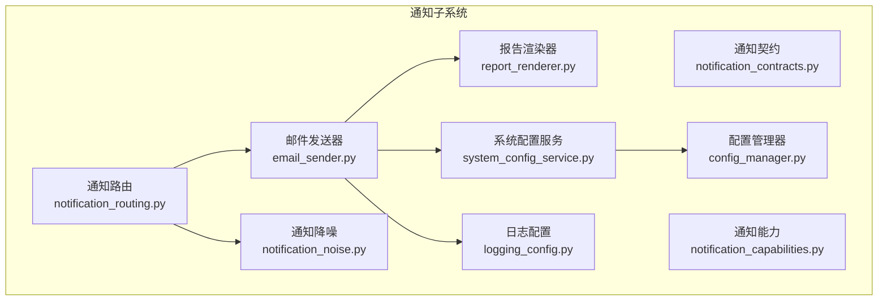
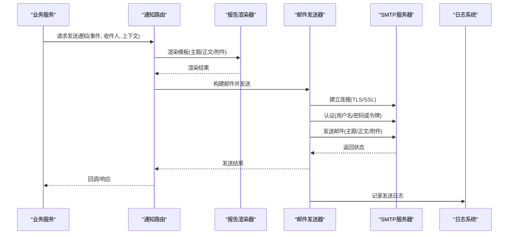
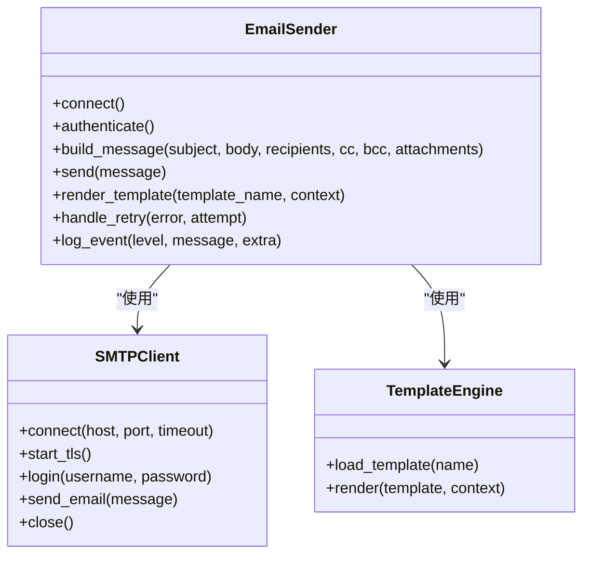
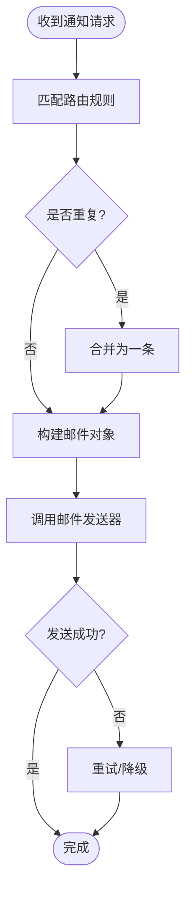
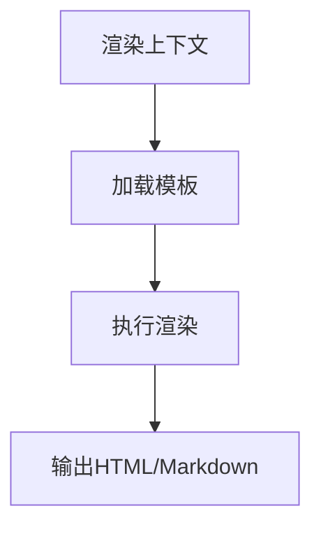
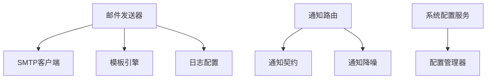

# 邮件通知配置

<cite>
**本文档引用的文件**   
- [email_sender.py](file://src/notification_sender/email_sender.py)
- [notification.py](file://src/notification.py)
- [notification_capabilities.py](file://src/notification_capabilities.py)
- [notification_contracts.py](file://src/notification_contracts.py)
- [notification_noise.py](file://src/notification_noise.py)
- [notification_routing.py](file://src/notification_routing.py)
- [system_config_service.py](file://src/services/system_config_service.py)
- [config_manager.py](file://src/core/config_manager.py)
- [logging_config.py](file://src/logging_config.py)
- [report_renderer.py](file://src/services/report_renderer.py)
- [templates/report_markdown.j2](file://templates/report_markdown.j2)
- [templates/report_brief.j2](file://templates/report_brief.j2)
- [templates/report_wechat.j2](file://templates/report_wechat.j2)
- [_macros.j2](file://templates/_macros.j2)
</cite>

## 目录
1. [简介](#简介)
2. [项目结构](#项目结构)
3. [核心组件](#核心组件)
4. [架构总览](#架构总览)
5. [详细组件分析](#详细组件分析)
6. [依赖关系分析](#依赖关系分析)
7. [性能考虑](#性能考虑)
8. [故障排查指南](#故障排查指南)
9. [结论](#结论)
10. [附录](#附录)

## 简介
本文件面向需要配置和使用“邮件通知渠道”的用户与开发者，提供从SMTP服务器设置、SSL/TLS加密、认证方式到主流邮箱服务（Gmail、Outlook、QQ邮箱、163邮箱等）的具体配置示例；同时说明邮件模板使用、HTML格式支持与附件添加方法，并给出内容格式化、主题生成与批量发送的实现方案。文档还包含发送失败处理策略、重试机制与日志记录建议，帮助在生产环境中稳定运行。

## 项目结构
邮件通知能力位于后端服务的通知子系统，主要涉及以下模块：
- 通知通道抽象与契约：定义统一接口与数据模型
- 邮件发送器实现：封装SMTP连接、TLS/SSL、认证、模板渲染与附件
- 通知路由与降噪：根据规则将消息路由至邮件通道，并进行去重与限流
- 报告渲染：基于Jinja2模板生成Markdown/HTML内容，供邮件正文使用
- 系统配置管理：集中管理SMTP凭据与通道开关
- 日志配置：统一日志输出，便于问题定位

图表来源
- [email_sender.py](file://src/notification_sender/email_sender.py)
- [notification.py](file://src/notification.py)
- [notification_capabilities.py](file://src/notification_capabilities.py)
- [notification_contracts.py](file://src/notification_contracts.py)
- [notification_noise.py](file://src/notification_noise.py)
- [notification_routing.py](file://src/notification_routing.py)
- [report_renderer.py](file://src/services/report_renderer.py)
- [system_config_service.py](file://src/services/system_config_service.py)
- [config_manager.py](file://src/core/config_manager.py)
- [logging_config.py](file://src/logging_config.py)

章节来源
- [email_sender.py](file://src/notification_sender/email_sender.py)
- [notification.py](file://src/notification.py)
- [notification_capabilities.py](file://src/notification_capabilities.py)
- [notification_contracts.py](file://src/notification_contracts.py)
- [notification_noise.py](file://src/notification_noise.py)
- [notification_routing.py](file://src/notification_routing.py)
- [report_renderer.py](file://src/services/report_renderer.py)
- [system_config_service.py](file://src/services/system_config_service.py)
- [config_manager.py](file://src/core/config_manager.py)
- [logging_config.py](file://src/logging_config.py)

## 核心组件
- 邮件发送器（EmailSender）
  - 负责SMTP连接建立、SSL/TLS协商、用户名密码或令牌认证
  - 支持纯文本与HTML正文、多收件人、抄送/密送、附件与内嵌图片
  - 支持模板渲染（Jinja2），可传入变量生成动态主题与正文
  - 内置重试与退避策略，异常分类与日志记录
- 通知契约与能力
  - 定义统一的发送接口与数据结构，屏蔽不同通道的差异
  - 暴露能力探测（如是否支持HTML、附件、批量发送）
- 通知路由与降噪
  - 根据事件类型、目标用户、优先级等规则选择邮件通道
  - 对重复告警进行合并与限流，避免邮件风暴
- 报告渲染器
  - 基于Jinja2模板引擎渲染Markdown/HTML报告
  - 提供常用宏与片段复用
- 系统配置服务与配置管理器
  - 集中读取与管理SMTP凭据、端口、加密方式、发件人、模板路径等
  - 支持热更新与环境变量覆盖
- 日志配置
  - 统一日志级别、输出位置与结构化字段，便于追踪发送链路

章节来源
- [email_sender.py](file://src/notification_sender/email_sender.py)
- [notification_capabilities.py](file://src/notification_capabilities.py)
- [notification_contracts.py](file://src/notification_contracts.py)
- [notification_noise.py](file://src/notification_noise.py)
- [notification_routing.py](file://src/notification_routing.py)
- [report_renderer.py](file://src/services/report_renderer.py)
- [system_config_service.py](file://src/services/system_config_service.py)
- [config_manager.py](file://src/core/config_manager.py)
- [logging_config.py](file://src/logging_config.py)

## 架构总览
邮件通知的整体流程如下：业务侧触发通知 -> 路由层选择邮件通道 -> 渲染报告内容 -> 构建邮件对象（主题、正文、附件）-> SMTP发送 -> 结果回传与日志记录。

图表来源
- [notification_routing.py](file://src/notification_routing.py)
- [report_renderer.py](file://src/services/report_renderer.py)
- [email_sender.py](file://src/notification_sender/email_sender.py)
- [logging_config.py](file://src/logging_config.py)

## 详细组件分析

### 邮件发送器（EmailSender）
- 功能要点
  - SMTP连接：支持端口、主机、超时、重试次数
  - 加密：STARTTLS与隐式SSL/TLS两种模式
  - 认证：用户名+密码、OAuth2令牌（视提供商支持）
  - 邮件构造：主题、正文（纯文本/HTML）、多收件人、抄送/密送、附件、内嵌图片
  - 模板渲染：通过Jinja2模板注入变量，生成主题与正文
  - 错误处理：网络异常、认证失败、权限限制、内容校验等异常分类
  - 重试机制：指数退避、最大重试次数、失败降级（如仅发送纯文本）
- 关键参数
  - 主机、端口、加密方式、发件人地址、认证凭据、模板路径、附件大小限制、并发限制
- 典型调用链
  - 构建邮件对象 -> 渲染模板 -> 连接SMTP -> 认证 -> 发送 -> 记录日志

图表来源
- [email_sender.py](file://src/notification_sender/email_sender.py)
- [report_renderer.py](file://src/services/report_renderer.py)

章节来源
- [email_sender.py](file://src/notification_sender/email_sender.py)
- [report_renderer.py](file://src/services/report_renderer.py)

### 通知契约与能力
- 统一接口
  - 发送接口：接收标准化消息体（主题、正文、收件人、附件、上下文）
  - 能力探测：是否支持HTML、附件、批量发送、模板渲染
- 数据结构
  - 消息体包含：类型、优先级、目标列表、内容、附件元数据、扩展字段
- 适配性
  - 通过契约屏蔽不同通道差异，便于扩展新通道

章节来源
- [notification_contracts.py](file://src/notification_contracts.py)
- [notification_capabilities.py](file://src/notification_capabilities.py)

### 通知路由与降噪
- 路由规则
  - 按事件类型、目标用户、渠道偏好、优先级选择邮件通道
  - 支持条件分支与默认回退
- 降噪策略
  - 去重：相同内容与时间窗口的告警合并
  - 限流：单位时间内最大发送数
  - 静默：维护时段或用户自定义免打扰

图表来源
- [notification_routing.py](file://src/notification_routing.py)
- [notification_noise.py](file://src/notification_noise.py)
- [email_sender.py](file://src/notification_sender/email_sender.py)

章节来源
- [notification_routing.py](file://src/notification_routing.py)
- [notification_noise.py](file://src/notification_noise.py)

### 报告渲染器（模板与HTML）
- 模板引擎
  - 使用Jinja2加载模板文件，支持宏、循环、条件语句
  - 模板路径由配置管理，支持多语言与主题切换
- 模板文件
  - report_markdown.j2：Markdown报告模板
  - report_brief.j2：简报模板
  - report_wechat.j2：微信适配模板（可用于HTML预览）
  - _macros.j2：通用宏与片段
- 渲染流程
  - 输入上下文（标题、摘要、指标、图表链接等）-> 渲染模板 -> 输出HTML/Markdown

图表来源
- [report_renderer.py](file://src/services/report_renderer.py)
- [templates/report_markdown.j2](file://templates/report_markdown.j2)
- [templates/report_brief.j2](file://templates/report_brief.j2)
- [templates/report_wechat.j2](file://templates/report_wechat.j2)
- [templates/_macros.j2](file://templates/_macros.j2)

章节来源
- [report_renderer.py](file://src/services/report_renderer.py)
- [templates/report_markdown.j2](file://templates/report_markdown.j2)
- [templates/report_brief.j2](file://templates/report_brief.j2)
- [templates/report_wechat.j2](file://templates/report_wechat.j2)
- [templates/_macros.j2](file://templates/_macros.j2)

### 系统配置与服务
- 配置项
  - SMTP主机、端口、加密方式（STARTTLS/SSL）
  - 发件人地址、认证凭据（用户名/密码/令牌）
  - 模板路径、附件大小限制、并发与重试参数
- 管理服务
  - 读取环境变量与配置文件，提供运行时查询与更新
  - 校验配置合法性，提供默认值与安全提示

章节来源
- [system_config_service.py](file://src/services/system_config_service.py)
- [config_manager.py](file://src/core/config_manager.py)

### 日志配置
- 统一日志
  - 记录连接、认证、发送、失败原因与重试过程
  - 结构化字段：事件类型、收件人、主题、耗时、错误码
- 输出位置
  - 控制台、文件、外部日志系统（可选）

章节来源
- [logging_config.py](file://src/logging_config.py)

## 依赖关系分析
- 组件耦合
  - 邮件发送器依赖SMTP客户端与模板引擎
  - 路由层依赖通知契约与降噪模块
  - 配置服务依赖配置管理器与环境变量
- 外部依赖
  - SMTP服务器（各邮箱提供商）
  - Jinja2模板引擎
  - 日志框架

图表来源
- [email_sender.py](file://src/notification_sender/email_sender.py)
- [notification_contracts.py](file://src/notification_contracts.py)
- [notification_noise.py](file://src/notification_noise.py)
- [notification_routing.py](file://src/notification_routing.py)
- [system_config_service.py](file://src/services/system_config_service.py)
- [config_manager.py](file://src/core/config_manager.py)
- [logging_config.py](file://src/logging_config.py)

章节来源
- [email_sender.py](file://src/notification_sender/email_sender.py)
- [notification_contracts.py](file://src/notification_contracts.py)
- [notification_noise.py](file://src/notification_noise.py)
- [notification_routing.py](file://src/notification_routing.py)
- [system_config_service.py](file://src/services/system_config_service.py)
- [config_manager.py](file://src/core/config_manager.py)
- [logging_config.py](file://src/logging_config.py)

## 性能考虑
- 连接池与复用
  - 复用SMTP连接减少握手开销，合理设置超时与空闲回收
- 并发控制
  - 限制并发发送数，避免被服务商限流或封禁
- 模板渲染优化
  - 预编译模板、缓存渲染结果（短时效）
- 附件处理
  - 压缩与裁剪图片，限制单封邮件大小
- 重试与退避
  - 指数退避与最大重试次数，失败快速回退到纯文本

[本节为通用指导，不直接分析具体文件]

## 故障排查指南
- 常见问题
  - 认证失败：检查用户名/密码或令牌、授权码、应用专用密码
  - 连接超时：核对主机与端口、防火墙与代理设置
  - TLS/SSL错误：确认加密方式与证书有效性
  - 内容被拒：检查主题与正文长度、附件大小与类型
- 诊断步骤
  - 查看日志中的错误码与堆栈
  - 启用调试模式，打印SMTP交互
  - 逐步缩小范围（最小化正文与附件）
- 重试与降级
  - 自动重试后仍失败，降级为纯文本或延迟重试
  - 记录失败详情并告警运维

章节来源
- [logging_config.py](file://src/logging_config.py)
- [email_sender.py](file://src/notification_sender/email_sender.py)

## 结论
邮件通知渠道通过统一的契约与路由机制，结合灵活的模板渲染与稳健的SMTP实现，能够稳定支撑多种邮箱服务提供商的配置与使用。配合降噪、重试与完善的日志记录，可在生产环境中保障通知的及时性与可靠性。

[本节为总结性内容，不直接分析具体文件]

## 附录

### 主流邮箱服务配置示例（SMTP）
以下为常见邮箱的SMTP服务器、端口与加密方式参考。请根据实际环境在系统配置中填写对应参数。

- Gmail
  - SMTP服务器：smtp.gmail.com
  - 端口：587（STARTTLS）或 465（SSL）
  - 认证：用户名+应用专用密码或OAuth2（推荐）
  - 注意事项：开启“允许安全性较低的应用”或使用应用专用密码；企业账号需管理员授权

- Outlook / Microsoft 365
  - SMTP服务器：smtp.office365.com
  - 端口：587（STARTTLS）
  - 认证：用户名+密码或OAuth2（企业环境推荐）
  - 注意事项：现代身份验证默认启用；旧版应用密码可能受限

- QQ邮箱
  - SMTP服务器：smtp.qq.com
  - 端口：465（SSL）或 587（STARTTLS）
  - 认证：用户名+授权码（需在邮箱设置中生成）
  - 注意事项：必须使用授权码而非登录密码

- 163邮箱（网易）
  - SMTP服务器：smtp.163.com
  - 端口：465（SSL）或 587（STARTTLS）
  - 认证：用户名+授权码（需在邮箱设置中开启SMTP并生成）
  - 注意事项：部分企业域名需管理员开通SMTP服务

[本节为通用配置参考，不直接分析具体文件]

### 邮件模板与HTML支持
- 模板文件
  - report_markdown.j2：用于生成Markdown报告，适合邮件正文或附件
  - report_brief.j2：简报模板，适合快速阅读
  - report_wechat.j2：微信适配模板，常用于HTML预览
  - _macros.j2：通用宏与片段，提升模板复用性
- HTML支持
  - 模板渲染可直接输出HTML，邮件正文支持富文本
  - 注意兼容性：避免复杂CSS与脚本，确保跨客户端显示一致
- 附件与内嵌图片
  - 支持PDF、CSV、图片等附件
  - 内嵌图片建议使用Base64或外链，注意体积与加载速度

章节来源
- [templates/report_markdown.j2](file://templates/report_markdown.j2)
- [templates/report_brief.j2](file://templates/report_brief.j2)
- [templates/report_wechat.j2](file://templates/report_wechat.j2)
- [templates/_macros.j2](file://templates/_macros.j2)
- [report_renderer.py](file://src/services/report_renderer.py)

### 内容格式化、主题生成与批量发送
- 内容格式化
  - 使用模板变量注入标题、摘要、指标与图表链接
  - 统一日期、数字与货币格式，确保可读性
- 主题生成
  - 基于事件类型与关键信息动态生成主题，避免过长
  - 支持前缀（如【告警】、【日报】）增强识别度
- 批量发送
  - 收件人列表去重与分组
  - 控制并发与速率，避免触发服务商限流
  - 分批次发送与失败重试，保证成功率

章节来源
- [notification_routing.py](file://src/notification_routing.py)
- [notification_noise.py](file://src/notification_noise.py)
- [email_sender.py](file://src/notification_sender/email_sender.py)

### 发送失败处理策略、重试机制与日志记录
- 失败分类
  - 网络异常、认证失败、权限限制、内容校验失败、服务商限流
- 重试策略
  - 指数退避、最大重试次数、失败降级（如仅发送纯文本）
- 日志记录
  - 记录连接、认证、发送、失败原因与重试过程
  - 结构化字段便于检索与分析

章节来源
- [email_sender.py](file://src/notification_sender/email_sender.py)
- [logging_config.py](file://src/logging_config.py)