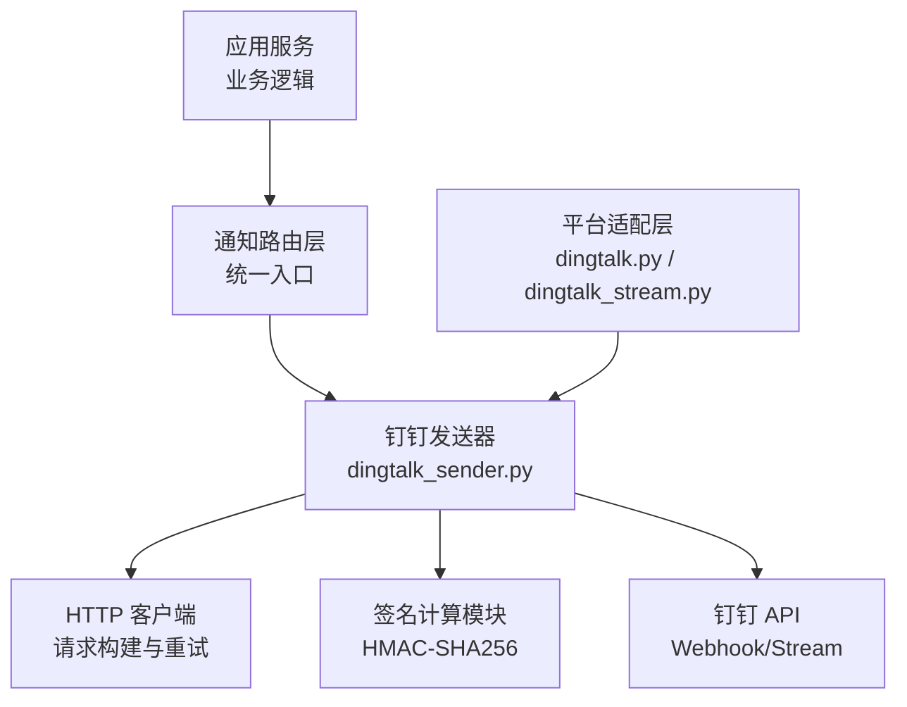
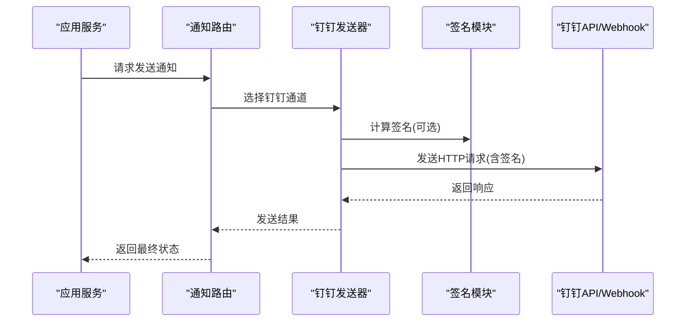
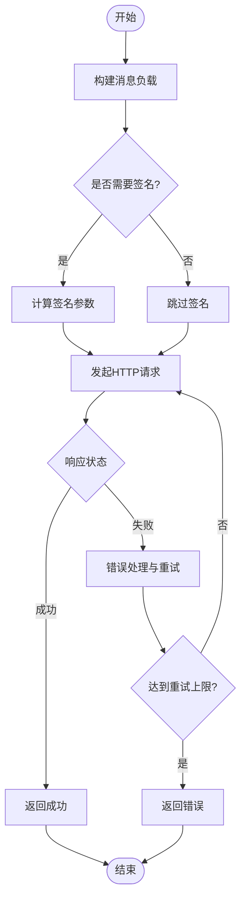
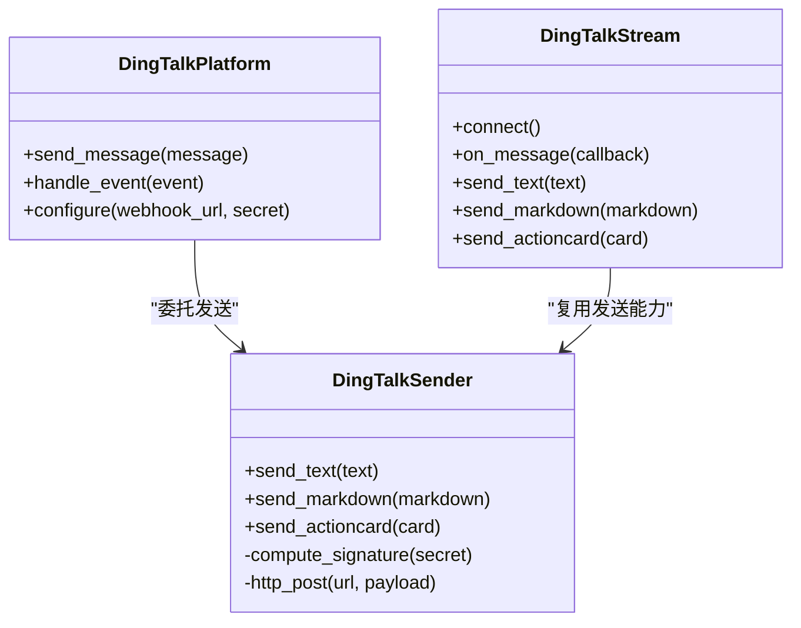
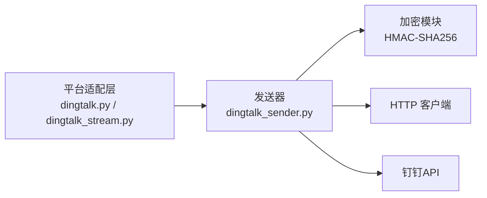

# 钉钉通知配置

<cite>
**本文引用的文件**   
- [dingtalk_sender.py](file://src/notification_sender/dingtalk_sender.py)
- [dingtalk.py](file://bot/platforms/dingtalk.py)
- [dingtalk_stream.py](file://bot/platforms/dingtalk_stream.py)
- [notifications.md](file://docs/notifications.md)
- [dingding-bot-config.md](file://docs/bot/dingding-bot-config.md)
- [test_dingtalk_sender.py](file://tests/test_dingtalk_sender.py)
</cite>

## 目录
1. [简介](#简介)
2. [项目结构](#项目结构)
3. [核心组件](#核心组件)
4. [架构总览](#架构总览)
5. [详细组件分析](#详细组件分析)
6. [依赖关系分析](#依赖关系分析)
7. [性能考虑](#性能考虑)
8. [故障排查指南](#故障排查指南)
9. [结论](#结论)
10. [附录](#附录)

## 简介
本文件面向需要在系统中接入“钉钉”作为通知渠道的开发者与运维人员，提供从机器人 Webhook 配置、签名验证设置到消息格式规范的完整说明。文档同时给出 Python 初始化发送器、环境变量配置以及发送文本、Markdown、ActionCard 等类型消息的实践指引，并总结字符限制、图片上传与附件支持要点，最后提供常见错误处理与调试技巧（如签名失败、网络超时等）。

## 项目结构
与钉钉通知相关的代码主要分布在以下位置：
- 通知发送器实现：src/notification_sender/dingtalk_sender.py
- 机器人平台适配：bot/platforms/dingtalk.py、bot/platforms/dingtalk_stream.py
- 文档与配置示例：docs/notifications.md、docs/bot/dingding-bot-config.md
- 测试用例：tests/test_dingtalk_sender.py

图表来源 
- [dingtalk_sender.py](file://src/notification_sender/dingtalk_sender.py)
- [dingtalk.py](file://bot/platforms/dingtalk.py)
- [dingtalk_stream.py](file://bot/platforms/dingtalk_stream.py)

章节来源
- [dingtalk_sender.py](file://src/notification_sender/dingtalk_sender.py)
- [dingtalk.py](file://bot/platforms/dingtalk.py)
- [dingtalk_stream.py](file://bot/platforms/dingtalk_stream.py)
- [notifications.md](file://docs/notifications.md)
- [dingding-bot-config.md](file://docs/bot/dingding-bot-config.md)

## 核心组件
- 钉钉发送器（dingtalk_sender.py）
  - 负责构造 HTTP 请求、签名计算、消息体组装、重试与错误处理。
  - 支持多种消息类型（文本、Markdown、ActionCard 等），并提供统一的发送接口。
- 平台适配层（dingtalk.py、dingtalk_stream.py）
  - 封装钉钉机器人两种接入方式：Webhook 与 Stream。
  - 提供事件回调、消息收发能力，便于在 Bot 场景下使用。
- 文档与配置（notifications.md、dingding-bot-config.md）
  - 提供环境配置项说明、Webhook 获取方法、签名密钥配置与最佳实践。

章节来源
- [dingtalk_sender.py](file://src/notification_sender/dingtalk_sender.py)
- [dingtalk.py](file://bot/platforms/dingtalk.py)
- [dingtalk_stream.py](file://bot/platforms/dingtalk_stream.py)
- [notifications.md](file://docs/notifications.md)
- [dingding-bot-config.md](file://docs/bot/dingding-bot-config.md)

## 架构总览
钉钉通知的整体流程如下：
- 上层业务触发通知需求，调用统一通知接口。
- 通知路由选择钉钉通道，进入钉钉发送器。
- 发送器根据消息类型生成对应 JSON 负载，计算签名（如需），发起 HTTP 请求。
- 若启用 Stream 模式，则通过长连接进行双向通信。
- 返回结果经路由层回传至调用方。

图表来源 
- [dingtalk_sender.py](file://src/notification_sender/dingtalk_sender.py)
- [dingtalk.py](file://bot/platforms/dingtalk.py)
- [dingtalk_stream.py](file://bot/platforms/dingtalk_stream.py)

## 详细组件分析

### 钉钉发送器（dingtalk_sender.py）
- 职责
  - 构建不同消息类型的 JSON 负载（文本、Markdown、ActionCard 等）。
  - 计算签名参数（如开启签名校验），拼接 URL 或 Header。
  - 管理 HTTP 请求生命周期（超时、重试、错误码处理）。
  - 统一对外暴露 send_* 方法，屏蔽底层差异。
- 关键数据流
  - 输入：消息类型、内容、目标地址、签名密钥、超时与重试策略。
  - 处理：签名计算、JSON 序列化、HTTP 请求、响应解析。
  - 输出：成功/失败状态及错误信息。
- 错误处理
  - 网络异常：捕获超时、连接错误，按策略重试或降级。
  - 业务错误：根据钉钉返回码判断是否重试或告警。
  - 签名失败：记录详细日志，提示检查密钥与时钟同步。

图表来源 
- [dingtalk_sender.py](file://src/notification_sender/dingtalk_sender.py)

章节来源
- [dingtalk_sender.py](file://src/notification_sender/dingtalk_sender.py)
- [test_dingtalk_sender.py](file://tests/test_dingtalk_sender.py)

### 平台适配层（dingtalk.py、dingtalk_stream.py）
- Webhook 模式（dingtalk.py）
  - 基于 HTTP POST 向机器人 Webhook 地址发送消息。
  - 适用于单向通知场景，简单可靠。
- Stream 模式（dingtalk_stream.py）
  - 建立长连接，支持事件回调与双向通信。
  - 适合需要接收用户指令、实时交互的 Bot 场景。
- 与发送器的集成
  - 平台适配层可复用发送器的消息构建与签名能力，统一封装为平台级接口。

图表来源 
- [dingtalk.py](file://bot/platforms/dingtalk.py)
- [dingtalk_stream.py](file://bot/platforms/dingtalk_stream.py)
- [dingtalk_sender.py](file://src/notification_sender/dingtalk_sender.py)

章节来源
- [dingtalk.py](file://bot/platforms/dingtalk.py)
- [dingtalk_stream.py](file://bot/platforms/dingtalk_stream.py)
- [dingtalk_sender.py](file://src/notification_sender/dingtalk_sender.py)

### 文档与配置（notifications.md、dingding-bot-config.md）
- 环境变量与配置项
  - 钉钉 Webhook 地址、签名密钥、超时与重试参数等。
- 机器人创建与权限
  - 在钉钉开放平台创建机器人，获取 Webhook 地址与密钥。
  - 按需开启所需权限（如消息发送、事件订阅）。
- 安全建议
  - 使用环境变量存储敏感信息，避免硬编码。
  - 定期轮换密钥，限制访问 IP 白名单。

章节来源
- [notifications.md](file://docs/notifications.md)
- [dingding-bot-config.md](file://docs/bot/dingding-bot-config.md)

## 依赖关系分析
- 内部依赖
  - 发送器依赖签名计算与 HTTP 客户端。
  - 平台适配层依赖发送器以复用消息构建与发送逻辑。
- 外部依赖
  - 钉钉开放平台 API（Webhook/Stream）。
  - 标准库加密模块（用于 HMAC-SHA256）。
- 潜在风险
  - 循环依赖：确保平台适配层不反向依赖发送器之外的其他模块。
  - 外部 API 变更：对钉钉 API 版本升级保持兼容。

图表来源 
- [dingtalk.py](file://bot/platforms/dingtalk.py)
- [dingtalk_stream.py](file://bot/platforms/dingtalk_stream.py)
- [dingtalk_sender.py](file://src/notification_sender/dingtalk_sender.py)

章节来源
- [dingtalk.py](file://bot/platforms/dingtalk.py)
- [dingtalk_stream.py](file://bot/platforms/dingtalk_stream.py)
- [dingtalk_sender.py](file://src/notification_sender/dingtalk_sender.py)

## 性能考虑
- 连接池与超时
  - 合理设置连接池大小与超时时间，避免资源耗尽。
- 重试策略
  - 针对瞬时错误采用指数退避重试，避免雪崩。
- 消息体积
  - 控制 Markdown 与 ActionCard 的体积，减少网络传输开销。
- 并发发送
  - 在高并发场景下使用异步或线程池提升吞吐。

[本节为通用指导，无需特定文件引用]

## 故障排查指南
- 签名验证失败
  - 检查密钥是否正确、URL 是否包含正确的签名参数。
  - 确认服务器时钟与钉钉服务端同步。
- 网络超时
  - 调整超时阈值，增加重试次数。
  - 检查防火墙与代理设置。
- 消息格式错误
  - 核对消息类型字段与必填项。
  - 使用测试用例或最小化负载定位问题。
- 调试技巧
  - 开启详细日志，记录请求与响应。
  - 使用本地 Mock 钉钉 API 进行联调。

章节来源
- [test_dingtalk_sender.py](file://tests/test_dingtalk_sender.py)
- [notifications.md](file://docs/notifications.md)

## 结论
通过统一的发送器与平台适配层，系统能够稳定、灵活地对接钉钉通知渠道。遵循本文的配置与安全建议，结合完善的错误处理与调试手段，可有效保障通知服务的可靠性与可维护性。

[本节为总结性内容，无需特定文件引用]

## 附录
- 环境变量清单
  - DINGTALK_WEBHOOK_URL：机器人 Webhook 地址
  - DINGTALK_SECRET：签名密钥
  - DINGTALK_TIMEOUT：请求超时秒数
  - DINGTALK_RETRIES：最大重试次数
- 消息类型速查
  - 文本：纯文本消息
  - Markdown：富文本格式
  - ActionCard：卡片式交互消息
- 图片与附件
  - 优先使用外链图片，避免大附件直接上传。
  - 如需上传附件，遵循钉钉官方 API 规范。

[本节为补充信息，无需特定文件引用]