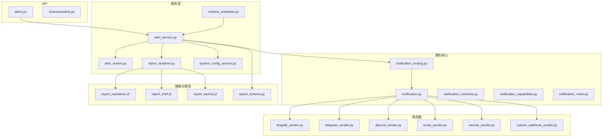
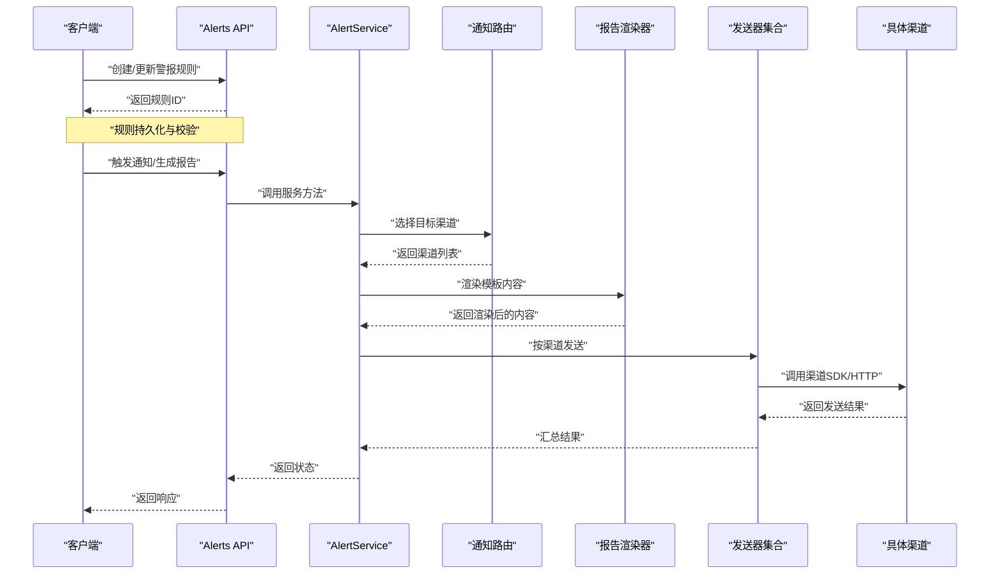
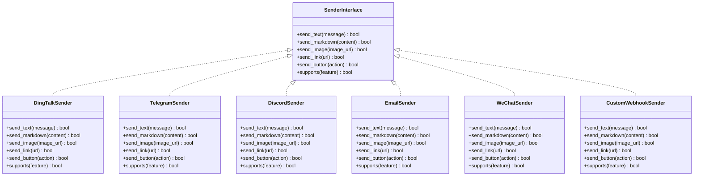
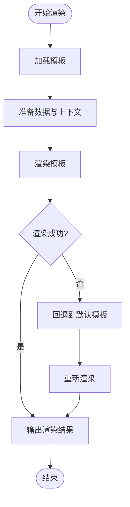
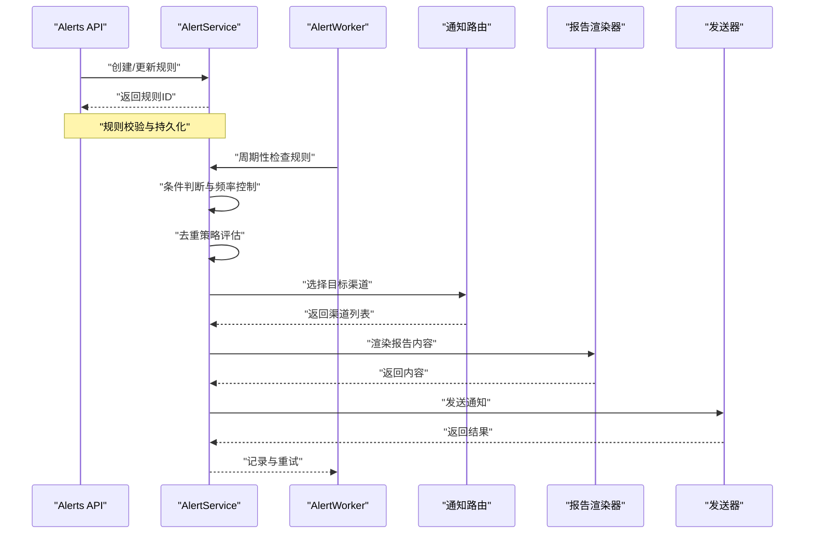
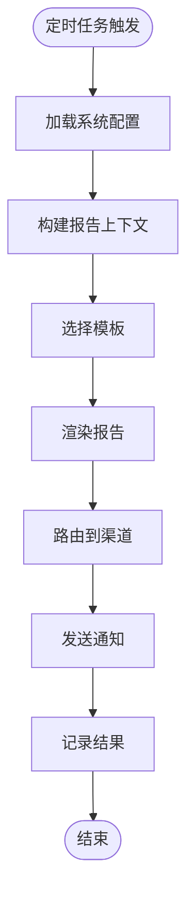
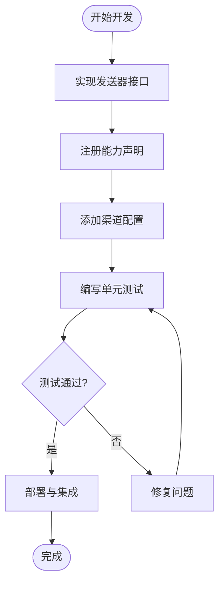
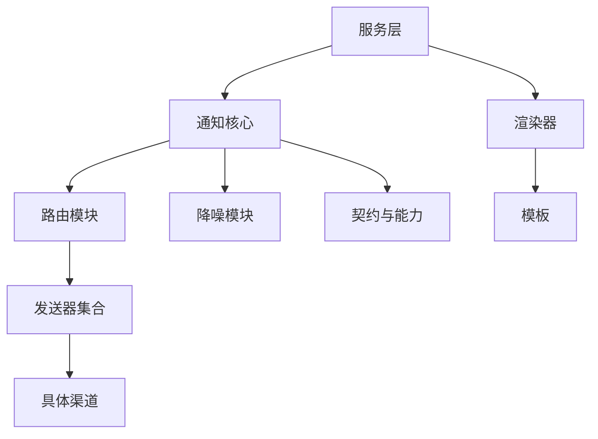

# 通知系统

<cite>
**本文引用的文件**   
- [src/notification.py](file://src/notification.py)
- [src/notification_capabilities.py](file://src/notification_capabilities.py)
- [src/notification_contracts.py](file://src/notification_contracts.py)
- [src/notification_noise.py](file://src/notification_noise.py)
- [src/notification_routing.py](file://src/notification_routing.py)
- [src/services/report_renderer.py](file://src/services/report_renderer.py)
- [src/services/runtime_scheduler.py](file://src/services/runtime_scheduler.py)
- [src/services/alert_service.py](file://src/services/alert_service.py)
- [src/services/alert_worker.py](file://src/services/alert_worker.py)
- [src/services/system_config_service.py](file://src/services/system_config_service.py)
- [src/schemas/report_schema.py](file://src/schemas/report_schema.py)
- [templates/report_markdown.j2](file://templates/report_markdown.j2)
- [templates/report_brief.j2](file://templates/report_brief.j2)
- [templates/report_wechat.j2](file://templates/report_wechat.j2)
- [api/v1/endpoints/alerts.py](file://api/v1/endpoints/alerts.py)
- [api/v1/schemas/alerts.py](file://api/v1/schemas/alerts.py)
- [bot/platforms/dingtalk.py](file://bot/platforms/dingtalk.py)
- [bot/platforms/discord.py](file://bot/platforms/discord.py)
- [src/notification_sender/dingtalk_sender.py](file://src/notification_sender/dingtalk_sender.py)
- [src/notification_sender/telegram_sender.py](file://src/notification_sender/telegram_sender.py)
- [src/notification_sender/discord_sender.py](file://src/notification_sender/discord_sender.py)
- [src/notification_sender/email_sender.py](file://src/notification_sender/email_sender.py)
- [src/notification_sender/wechat_sender.py](file://src/notification_sender/wechat_sender.py)
- [src/notification_sender/custom_webhook_sender.py](file://src/notification_sender/custom_webhook_sender.py)
- [tests/test_notification.py](file://tests/test_notification.py)
- [tests/test_notification_sender.py](file://tests/test_notification_sender.py)
- [tests/test_alert_worker.py](file://tests/test_alert_worker.py)
- [tests/test_report_renderer.py](file://tests/test_report_renderer.py)
</cite>

## 目录
1. [简介](#简介)
2. [项目结构](#项目结构)
3. [核心组件](#核心组件)
4. [架构总览](#架构总览)
5. [详细组件分析](#详细组件分析)
6. [依赖关系分析](#依赖关系分析)
7. [性能考量](#性能考量)
8. [故障排查指南](#故障排查指南)
9. [结论](#结论)
10. [附录](#附录)

## 简介
本文件为 Daily Stock Analysis 的通知系统技术文档，聚焦多渠道通知架构、统一发送接口、渠道适配器抽象、消息模板系统、警报规则与触发机制、报告生成与分发流程、自定义渠道开发指南以及内容格式化选项（Markdown、图片嵌入、交互按钮等）。读者可据此快速理解系统设计与实现要点，并安全扩展新的通知渠道。

## 项目结构
通知系统相关代码主要分布在以下模块：
- 通知核心与路由：src/notification*.py
- 通知发送器：src/notification_sender/*
- 服务层：src/services/report_renderer.py, alert_service.py, alert_worker.py, runtime_scheduler.py, system_config_service.py
- 数据模型与模板：src/schemas/report_schema.py, templates/*.j2
- API 暴露：api/v1/endpoints/alerts.py, api/v1/schemas/alerts.py
- Bot 平台适配：bot/platforms/*
- 测试用例：tests/test_notification*.py, tests/test_alert_worker.py, tests/test_report_renderer.py

图表来源
- [api/v1/endpoints/alerts.py](file://api/v1/endpoints/alerts.py)
- [api/v1/schemas/alerts.py](file://api/v1/schemas/alerts.py)
- [src/services/alert_service.py](file://src/services/alert_service.py)
- [src/services/alert_worker.py](file://src/services/alert_worker.py)
- [src/services/report_renderer.py](file://src/services/report_renderer.py)
- [src/services/runtime_scheduler.py](file://src/services/runtime_scheduler.py)
- [src/services/system_config_service.py](file://src/services/system_config_service.py)
- [src/notification.py](file://src/notification.py)
- [src/notification_routing.py](file://src/notification_routing.py)
- [src/notification_contracts.py](file://src/notification_contracts.py)
- [src/notification_capabilities.py](file://src/notification_capabilities.py)
- [src/notification_noise.py](file://src/notification_noise.py)
- [src/notification_sender/dingtalk_sender.py](file://src/notification_sender/dingtalk_sender.py)
- [src/notification_sender/telegram_sender.py](file://src/notification_sender/telegram_sender.py)
- [src/notification_sender/discord_sender.py](file://src/notification_sender/discord_sender.py)
- [src/notification_sender/email_sender.py](file://src/notification_sender/email_sender.py)
- [src/notification_sender/wechat_sender.py](file://src/notification_sender/wechat_sender.py)
- [src/notification_sender/custom_webhook_sender.py](file://src/notification_sender/custom_webhook_sender.py)
- [src/schemas/report_schema.py](file://src/schemas/report_schema.py)
- [templates/report_markdown.j2](file://templates/report_markdown.j2)
- [templates/report_brief.j2](file://templates/report_brief.j2)
- [templates/report_wechat.j2](file://templates/report_wechat.j2)

章节来源
- [api/v1/endpoints/alerts.py](file://api/v1/endpoints/alerts.py)
- [src/services/alert_service.py](file://src/services/alert_service.py)
- [src/services/report_renderer.py](file://src/services/report_renderer.py)
- [src/notification.py](file://src/notification.py)
- [src/notification_routing.py](file://src/notification_routing.py)
- [src/notification_contracts.py](file://src/notification_contracts.py)
- [src/notification_capabilities.py](file://src/notification_capabilities.py)
- [src/notification_noise.py](file://src/notification_noise.py)
- [src/schemas/report_schema.py](file://src/schemas/report_schema.py)
- [templates/report_markdown.j2](file://templates/report_markdown.j2)
- [templates/report_brief.j2](file://templates/report_brief.j2)
- [templates/report_wechat.j2](file://templates/report_wechat.j2)

## 核心组件
- 统一发送接口与契约
  - 通过统一的发送器接口定义不同渠道的发送能力，屏蔽底层差异，便于扩展与维护。
  - 支持的能力维度包括文本、富文本（Markdown）、图片、链接、按钮等。
- 渠道适配器抽象
  - 每个渠道一个发送器实现，遵循统一契约；配置项由系统配置服务统一管理。
- 消息模板系统
  - 使用模板引擎渲染报告内容，支持多种输出格式（Markdown、简报、微信专用等）。
- 路由与降噪
  - 根据上下文与策略将通知路由到合适的渠道，并通过去重与频率控制降低噪音。
- 警报服务与工作流
  - 提供规则定义、条件判断、触发执行、结果分发与重试等完整链路。
- 报告渲染与调度
  - 定时任务驱动报告生成与分发，结合模板与数据源完成内容定制。

章节来源
- [src/notification_contracts.py](file://src/notification_contracts.py)
- [src/notification_capabilities.py](file://src/notification_capabilities.py)
- [src/notification.py](file://src/notification.py)
- [src/notification_routing.py](file://src/notification_routing.py)
- [src/notification_noise.py](file://src/notification_noise.py)
- [src/services/alert_service.py](file://src/services/alert_service.py)
- [src/services/report_renderer.py](file://src/services/report_renderer.py)
- [src/services/runtime_scheduler.py](file://src/services/runtime_scheduler.py)
- [src/schemas/report_schema.py](file://src/schemas/report_schema.py)

## 架构总览
下图展示从 API 到通知发送的端到端流程，包含路由、模板渲染、渠道适配与发送。

图表来源
- [api/v1/endpoints/alerts.py](file://api/v1/endpoints/alerts.py)
- [src/services/alert_service.py](file://src/services/alert_service.py)
- [src/notification_routing.py](file://src/notification_routing.py)
- [src/services/report_renderer.py](file://src/services/report_renderer.py)
- [src/notification.py](file://src/notification.py)
- [src/notification_sender/dingtalk_sender.py](file://src/notification_sender/dingtalk_sender.py)
- [src/notification_sender/telegram_sender.py](file://src/notification_sender/telegram_sender.py)
- [src/notification_sender/discord_sender.py](file://src/notification_sender/discord_sender.py)
- [src/notification_sender/email_sender.py](file://src/notification_sender/email_sender.py)
- [src/notification_sender/wechat_sender.py](file://src/notification_sender/wechat_sender.py)
- [src/notification_sender/custom_webhook_sender.py](file://src/notification_sender/custom_webhook_sender.py)

## 详细组件分析

### 统一发送接口与渠道适配器
- 设计要点
  - 定义统一的发送器接口，涵盖文本、富文本、图片、链接、按钮等能力。
  - 各渠道实现独立发送器，封装认证、限流、错误处理与重试。
  - 通过能力探测与声明，动态决定可用功能。
- 关键文件
  - 接口与能力：src/notification_contracts.py, src/notification_capabilities.py
  - 发送器实现：src/notification_sender/*
  - 路由与选择：src/notification_routing.py

图表来源
- [src/notification_contracts.py](file://src/notification_contracts.py)
- [src/notification_capabilities.py](file://src/notification_capabilities.py)
- [src/notification_sender/dingtalk_sender.py](file://src/notification_sender/dingtalk_sender.py)
- [src/notification_sender/telegram_sender.py](file://src/notification_sender/telegram_sender.py)
- [src/notification_sender/discord_sender.py](file://src/notification_sender/discord_sender.py)
- [src/notification_sender/email_sender.py](file://src/notification_sender/email_sender.py)
- [src/notification_sender/wechat_sender.py](file://src/notification_sender/wechat_sender.py)
- [src/notification_sender/custom_webhook_sender.py](file://src/notification_sender/custom_webhook_sender.py)

章节来源
- [src/notification_contracts.py](file://src/notification_contracts.py)
- [src/notification_capabilities.py](file://src/notification_capabilities.py)
- [src/notification_sender/dingtalk_sender.py](file://src/notification_sender/dingtalk_sender.py)
- [src/notification_sender/telegram_sender.py](file://src/notification_sender/telegram_sender.py)
- [src/notification_sender/discord_sender.py](file://src/notification_sender/discord_sender.py)
- [src/notification_sender/email_sender.py](file://src/notification_sender/email_sender.py)
- [src/notification_sender/wechat_sender.py](file://src/notification_sender/wechat_sender.py)
- [src/notification_sender/custom_webhook_sender.py](file://src/notification_sender/custom_webhook_sender.py)

### 消息模板系统与报告渲染
- 设计要点
  - 使用模板引擎渲染报告内容，支持 Markdown、简报、微信专用格式等。
  - 模板变量由数据模型与上下文注入，确保内容与渠道匹配。
  - 渲染失败时回退到默认模板或降级内容。
- 关键文件
  - 渲染器：src/services/report_renderer.py
  - 模板：templates/report_markdown.j2, templates/report_brief.j2, templates/report_wechat.j2
  - 数据模型：src/schemas/report_schema.py

图表来源
- [src/services/report_renderer.py](file://src/services/report_renderer.py)
- [templates/report_markdown.j2](file://templates/report_markdown.j2)
- [templates/report_brief.j2](file://templates/report_brief.j2)
- [templates/report_wechat.j2](file://templates/report_wechat.j2)
- [src/schemas/report_schema.py](file://src/schemas/report_schema.py)

章节来源
- [src/services/report_renderer.py](file://src/services/report_renderer.py)
- [templates/report_markdown.j2](file://templates/report_markdown.j2)
- [templates/report_brief.j2](file://templates/report_brief.j2)
- [templates/report_wechat.j2](file://templates/report_wechat.j2)
- [src/schemas/report_schema.py](file://src/schemas/report_schema.py)

### 警报规则与触发机制
- 设计要点
  - 规则定义包含条件判断（阈值、时间窗口、指标组合）、频率控制（最小间隔、周期）与去重策略（键值、滑动窗口）。
  - 触发后进入工作流：评估、过滤、路由、渲染、发送、记录。
  - 支持异步执行与重试，保证可靠性。
- 关键文件
  - 服务与工作者：src/services/alert_service.py, src/services/alert_worker.py
  - API 与模型：api/v1/endpoints/alerts.py, api/v1/schemas/alerts.py
  - 路由与降噪：src/notification_routing.py, src/notification_noise.py

图表来源
- [api/v1/endpoints/alerts.py](file://api/v1/endpoints/alerts.py)
- [api/v1/schemas/alerts.py](file://api/v1/schemas/alerts.py)
- [src/services/alert_service.py](file://src/services/alert_service.py)
- [src/services/alert_worker.py](file://src/services/alert_worker.py)
- [src/notification_routing.py](file://src/notification_routing.py)
- [src/notification_noise.py](file://src/notification_noise.py)
- [src/services/report_renderer.py](file://src/services/report_renderer.py)

章节来源
- [api/v1/endpoints/alerts.py](file://api/v1/endpoints/alerts.py)
- [api/v1/schemas/alerts.py](file://api/v1/schemas/alerts.py)
- [src/services/alert_service.py](file://src/services/alert_service.py)
- [src/services/alert_worker.py](file://src/services/alert_worker.py)
- [src/notification_routing.py](file://src/notification_routing.py)
- [src/notification_noise.py](file://src/notification_noise.py)
- [src/services/report_renderer.py](file://src/services/report_renderer.py)

### 报告生成与分发流程
- 设计要点
  - 定时任务驱动报告生成与分发，结合模板与数据源完成内容定制。
  - 支持多语言与主题切换，确保内容符合用户偏好。
  - 分发阶段按渠道能力进行内容适配与优化。
- 关键文件
  - 调度器：src/services/runtime_scheduler.py
  - 渲染器：src/services/report_renderer.py
  - 模板：templates/*.j2
  - 配置服务：src/services/system_config_service.py

图表来源
- [src/services/runtime_scheduler.py](file://src/services/runtime_scheduler.py)
- [src/services/report_renderer.py](file://src/services/report_renderer.py)
- [templates/report_markdown.j2](file://templates/report_markdown.j2)
- [templates/report_brief.j2](file://templates/report_brief.j2)
- [templates/report_wechat.j2](file://templates/report_wechat.j2)
- [src/services/system_config_service.py](file://src/services/system_config_service.py)

章节来源
- [src/services/runtime_scheduler.py](file://src/services/runtime_scheduler.py)
- [src/services/report_renderer.py](file://src/services/report_renderer.py)
- [templates/report_markdown.j2](file://templates/report_markdown.j2)
- [templates/report_brief.j2](file://templates/report_brief.j2)
- [templates/report_wechat.j2](file://templates/report_wechat.j2)
- [src/services/system_config_service.py](file://src/services/system_config_service.py)

### 自定义通知渠道开发指南
- 步骤概览
  - 实现统一发送器接口，覆盖文本、富文本、图片、链接、按钮等方法。
  - 在能力声明中注册新渠道支持的特性。
  - 添加渠道配置项，并在系统配置服务中管理。
  - 编写单元测试验证发送逻辑与错误处理。
- 参考实现
  - 现有发送器：钉钉、Telegram、Discord、邮件、企业微信、自定义 Webhook。
  - 测试用例：tests/test_notification_sender.py

图表来源
- [src/notification_contracts.py](file://src/notification_contracts.py)
- [src/notification_capabilities.py](file://src/notification_capabilities.py)
- [src/notification_sender/custom_webhook_sender.py](file://src/notification_sender/custom_webhook_sender.py)
- [tests/test_notification_sender.py](file://tests/test_notification_sender.py)

章节来源
- [src/notification_contracts.py](file://src/notification_contracts.py)
- [src/notification_capabilities.py](file://src/notification_capabilities.py)
- [src/notification_sender/custom_webhook_sender.py](file://src/notification_sender/custom_webhook_sender.py)
- [tests/test_notification_sender.py](file://tests/test_notification_sender.py)

### 通知内容格式化选项
- Markdown 支持
  - 模板与发送器均支持 Markdown 语法，用于结构化展示数据与图表。
- 图片嵌入
  - 支持直接嵌入图片 URL 或附件，渠道需具备相应能力。
- 交互式按钮
  - 部分渠道支持按钮动作（如确认、跳转），需在能力声明中启用。
- 渠道差异
  - 不同渠道对富文本与交互的支持程度不同，需在路由阶段进行适配。

章节来源
- [src/notification_capabilities.py](file://src/notification_capabilities.py)
- [src/notification_sender/dingtalk_sender.py](file://src/notification_sender/dingtalk_sender.py)
- [src/notification_sender/telegram_sender.py](file://src/notification_sender/telegram_sender.py)
- [src/notification_sender/discord_sender.py](file://src/notification_sender/discord_sender.py)
- [src/notification_sender/email_sender.py](file://src/notification_sender/email_sender.py)
- [src/notification_sender/wechat_sender.py](file://src/notification_sender/wechat_sender.py)
- [src/notification_sender/custom_webhook_sender.py](file://src/notification_sender/custom_webhook_sender.py)

## 依赖关系分析
- 组件耦合
  - 通知核心模块与发送器解耦，通过接口与能力声明进行通信。
  - 服务层依赖路由与渲染器，保持职责清晰。
- 外部依赖
  - 各渠道 SDK 或 HTTP 接口，需处理认证、限流与错误。
- 循环依赖
  - 通过分层与接口隔离避免循环依赖。

图表来源
- [src/notification.py](file://src/notification.py)
- [src/notification_routing.py](file://src/notification_routing.py)
- [src/notification_noise.py](file://src/notification_noise.py)
- [src/notification_contracts.py](file://src/notification_contracts.py)
- [src/notification_capabilities.py](file://src/notification_capabilities.py)
- [src/services/report_renderer.py](file://src/services/report_renderer.py)
- [src/services/alert_service.py](file://src/services/alert_service.py)
- [src/services/alert_worker.py](file://src/services/alert_worker.py)

章节来源
- [src/notification.py](file://src/notification.py)
- [src/notification_routing.py](file://src/notification_routing.py)
- [src/notification_noise.py](file://src/notification_noise.py)
- [src/notification_contracts.py](file://src/notification_contracts.py)
- [src/notification_capabilities.py](file://src/notification_capabilities.py)
- [src/services/report_renderer.py](file://src/services/report_renderer.py)
- [src/services/alert_service.py](file://src/services/alert_service.py)
- [src/services/alert_worker.py](file://src/services/alert_worker.py)

## 性能考量
- 并发与异步
  - 使用异步工作者处理警报评估与发送，提高吞吐。
- 缓存与预热
  - 模板与配置预加载，减少冷启动延迟。
- 限流与重试
  - 针对渠道限制实施限流与指数退避重试。
- 资源优化
  - 图片与富文本按需渲染，避免不必要的计算。

[本节为通用指导，不直接分析具体文件]

## 故障排查指南
- 常见问题
  - 渠道认证失败：检查配置与服务端密钥。
  - 模板渲染错误：验证模板语法与变量完整性。
  - 发送超时：检查网络与渠道限流策略。
  - 重复通知：调整去重键与频率控制参数。
- 诊断工具
  - 日志与监控：查看发送器与工作者的日志输出。
  - 单元测试：运行测试用例定位问题。

章节来源
- [tests/test_notification.py](file://tests/test_notification.py)
- [tests/test_notification_sender.py](file://tests/test_notification_sender.py)
- [tests/test_alert_worker.py](file://tests/test_alert_worker.py)
- [tests/test_report_renderer.py](file://tests/test_report_renderer.py)

## 结论
Daily Stock Analysis 的通知系统通过统一接口、渠道适配器抽象、模板渲染与智能路由，实现了灵活、可扩展的多渠道通知能力。警报规则与工作流保障了及时性与准确性，模板与格式化选项提升了用户体验。开发者可基于现有架构快速扩展新渠道，满足多样化业务需求。

[本节为总结性内容，不直接分析具体文件]

## 附录
- 支持的通知渠道
  - 钉钉、Telegram、Discord、邮件、企业微信、自定义 Webhook 等。
- 配置与管理
  - 通过系统配置服务集中管理渠道参数与行为策略。
- 最佳实践
  - 合理设置频率与去重，避免通知风暴。
  - 使用 Markdown 与图片增强可读性。
  - 针对渠道特性进行内容适配。

[本节为补充信息，不直接分析具体文件]