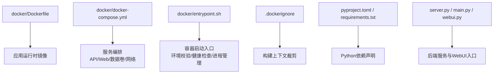
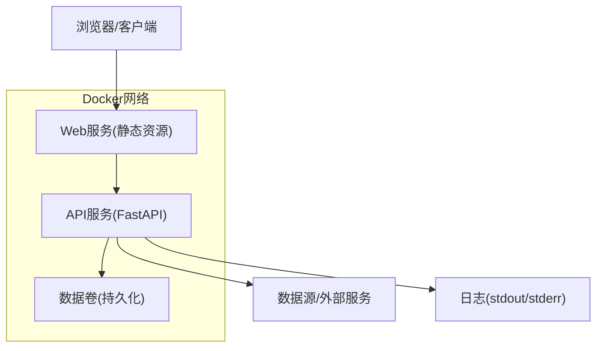
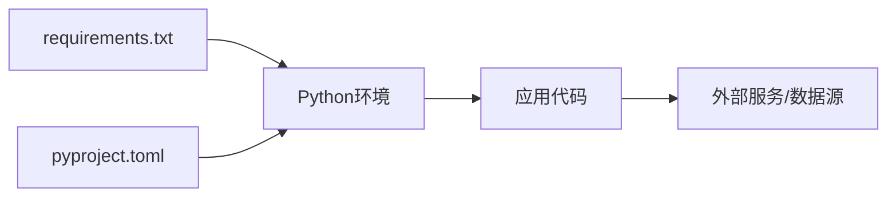

# Docker容器化部署

<cite>
**本文引用的文件**   
- [Dockerfile](file://docker/Dockerfile)
- [docker-compose.yml](file://docker/docker-compose.yml)
- [entrypoint.sh](file://docker/entrypoint.sh)
- [.dockerignore](file://.dockerignore)
- [pyproject.toml](file://pyproject.toml)
- [requirements.txt](file://requirements.txt)
- [server.py](file://server.py)
- [main.py](file://main.py)
- [webui.py](file://webui.py)
- [DEPLOY.md](file://docs/DEPLOY.md)
- [DEPLOY_EN.md](file://docs/DEPLOY_EN.md)
</cite>

## 目录
1. [简介](#简介)
2. [项目结构](#项目结构)
3. [核心组件](#核心组件)
4. [架构总览](#架构总览)
5. [详细组件分析](#详细组件分析)
6. [依赖关系分析](#依赖关系分析)
7. [性能考虑](#性能考虑)
8. [故障排除指南](#故障排除指南)
9. [结论](#结论)
10. [附录](#附录)

## 简介
本文件面向需要在本地、测试与生产环境中使用Docker进行容器化部署的读者，系统说明镜像构建流程、多阶段构建优化、依赖管理策略，以及基于docker-compose的服务编排、网络与数据卷配置、环境变量注入。文档还涵盖容器启动流程与入口脚本职责，提供开发、测试、生产环境的差异化配置示例，并给出监控与健康检查的配置方法，以及常见问题的排查步骤。

## 项目结构
本项目将容器化相关资源集中在 docker 目录下，包含镜像构建定义、服务编排与容器入口脚本；应用层由Python后端（FastAPI）与Web前端组成，通过统一端口对外提供服务。根目录包含依赖声明与主进程入口，便于在容器内外保持一致的运行方式。

**图示来源** 
- [Dockerfile](file://docker/Dockerfile)
- [docker-compose.yml](file://docker/docker-compose.yml)
- [entrypoint.sh](file://docker/entrypoint.sh)
- [.dockerignore](file://.dockerignore)
- [pyproject.toml](file://pyproject.toml)
- [requirements.txt](file://requirements.txt)
- [server.py](file://server.py)
- [main.py](file://main.py)
- [webui.py](file://webui.py)

**章节来源**
- [Dockerfile](file://docker/Dockerfile)
- [docker-compose.yml](file://docker/docker-compose.yml)
- [entrypoint.sh](file://docker/entrypoint.sh)
- [.dockerignore](file://.dockerignore)
- [pyproject.toml](file://pyproject.toml)
- [requirements.txt](file://requirements.txt)
- [server.py](file://server.py)
- [main.py](file://main.py)
- [webui.py](file://webui.py)

## 核心组件
- 镜像构建：通过Dockerfile定义基础镜像、依赖安装、静态资源拷贝与运行用户等；结合.dockerignore减少构建上下文体积，提升构建速度与安全面。
- 依赖管理：Python依赖通过requirements.txt或pyproject.toml声明，建议在构建阶段缓存依赖层以加速重复构建。
- 服务编排：docker-compose.yml定义API服务、Web服务、数据卷挂载、网络隔离与环境变量注入，支持不同环境覆盖。
- 启动入口：entrypoint.sh负责环境变量校验、依赖初始化、健康检查探针与进程守护，确保容器稳定运行。

**章节来源**
- [Dockerfile](file://docker/Dockerfile)
- [requirements.txt](file://requirements.txt)
- [pyproject.toml](file://pyproject.toml)
- [docker-compose.yml](file://docker/docker-compose.yml)
- [entrypoint.sh](file://docker/entrypoint.sh)

## 架构总览
下图展示容器化后的服务交互与数据流向：客户端访问Web界面，请求经反向代理或直接路由到API服务；API服务调用业务逻辑与外部数据源；持久化数据通过数据卷挂载到宿主机；日志输出到标准输出以便收集。

**图示来源** 
- [docker-compose.yml](file://docker/docker-compose.yml)
- [server.py](file://server.py)
- [webui.py](file://webui.py)

## 详细组件分析

### Dockerfile 构建配置与多阶段优化
- 基础镜像选择：建议使用轻量级Python镜像（如slim变体），降低镜像体积。
- 依赖安装：优先安装系统依赖，再复制依赖清单并安装Python依赖，利用Docker层缓存机制。
- 多阶段构建：可将构建阶段与运行阶段分离，构建阶段安装编译工具与依赖，运行阶段仅包含必要运行时文件，显著减小最终镜像大小。
- 安全加固：创建非root用户运行应用，限制文件系统权限；最小化暴露端口。
- 健康检查：在镜像中集成健康检查命令，供编排器或运行时使用。

建议关注以下要点：
- 分层缓存顺序：先复制依赖清单，再复制源码，确保依赖变更时不重建上层。
- 构建参数：可通过ARG传入版本或开关，实现灵活构建。
- 清理工作：在单RUN指令内完成下载、安装与清理，避免多余层。

**章节来源**
- [Dockerfile](file://docker/Dockerfile)

### docker-compose.yml 编排配置
- 服务定义：为API与Web分别定义服务，设置镜像、端口映射、环境变量、依赖关系与重启策略。
- 网络设置：默认桥接网络隔离服务间通信，可按需自定义网络以实现更细粒度控制。
- 数据卷挂载：将数据库文件、缓存、日志等持久化到宿主机路径，保证数据可恢复与调试便利。
- 环境变量：通过.env文件或compose中的environment字段注入配置，区分不同环境。
- 健康检查：为关键服务添加healthcheck，配合depends_on条件启动。

典型配置项包括：
- ports：映射容器端口到宿主机。
- volumes：挂载数据目录与配置文件。
- environment：注入API密钥、数据库连接串、日志级别等。
- restart：设置失败自动重启策略。
- depends_on：按依赖顺序启动服务。

**章节来源**
- [docker-compose.yml](file://docker/docker-compose.yml)

### 入口脚本 entrypoint.sh 的作用
- 环境变量校验：检查必需的环境变量是否已设置，缺失则报错退出，避免运行时异常。
- 依赖初始化：执行必要的初始化任务，如迁移、索引构建、缓存预热等。
- 健康检查：提供健康检查命令，返回HTTP状态码或进程状态。
- 进程管理：根据运行模式启动相应进程（如API服务器、后台任务），并处理信号以确保优雅关闭。
- 日志与调试：输出启动日志，便于问题定位。

**章节来源**
- [entrypoint.sh](file://docker/entrypoint.sh)

### 应用入口与运行方式
- server.py：后端API服务入口，通常基于FastAPI，监听指定端口并提供REST接口。
- main.py：可能作为CLI或调度入口，用于触发定时任务或批处理作业。
- webui.py：Web前端打包后的静态资源服务入口，或用于本地开发时的热重载。

在容器中，这些入口通过ENTRYPOINT或CMD指定，并由entrypoint.sh统一管理生命周期。

**章节来源**
- [server.py](file://server.py)
- [main.py](file://main.py)
- [webui.py](file://webui.py)

### 构建上下文裁剪 .dockerignore
- 排除不必要的文件与目录，如.git、tests、node_modules、venv、*.log等，减少构建上下文体积。
- 提高构建速度与安全性，避免敏感信息泄露。

**章节来源**
- [.dockerignore](file://.dockerignore)

## 依赖关系分析
- Python依赖：requirements.txt与pyproject.toml共同描述依赖，建议在生产构建中使用锁定文件（如requirements.lock）确保一致性。
- 系统依赖：某些Python包需要系统库（如C扩展），应在Dockerfile中提前安装。
- 外部服务：API可能依赖数据库、缓存、消息队列或第三方API，需在compose中声明网络与凭据。

**图示来源** 
- [requirements.txt](file://requirements.txt)
- [pyproject.toml](file://pyproject.toml)
- [server.py](file://server.py)

**章节来源**
- [requirements.txt](file://requirements.txt)
- [pyproject.toml](file://pyproject.toml)
- [server.py](file://server.py)

## 性能考虑
- 镜像体积：采用多阶段构建与精简基础镜像，减少攻击面与传输时间。
- 构建缓存：合理分层，优先缓存依赖层，避免重复安装。
- 资源限制：在compose中设置CPU与内存上限，防止资源争用。
- 并发与线程：调整WSGI/ASGI服务器的worker数量与线程数，匹配容器资源。
- 数据I/O：使用本地SSD挂载数据卷，减少磁盘IO瓶颈。
- 健康检查：缩短检查间隔与超时时间，快速发现并恢复异常。

[本节为通用指导，无需特定文件引用]

## 故障排除指南
常见问题与解决思路：
- 启动失败：检查环境变量是否齐全，查看容器日志；确认依赖安装成功；验证端口未被占用。
- 网络连接：确认容器网络配置正确，外部服务域名解析正常；检查防火墙与安全组规则。
- 数据卷权限：确保挂载目录权限正确，应用以合适用户写入；必要时在entrypoint中修复权限。
- 健康检查失败：检查健康检查端点可达性；确认服务已完全初始化后再响应健康检查。
- 性能问题：监控CPU/内存使用，调整worker数量与资源限制；分析慢查询与外部调用延迟。

建议操作：
- 使用docker logs查看错误堆栈。
- 进入容器内部执行诊断命令（如curl、ping、python -c）。
- 临时禁用健康检查或依赖条件，逐步定位问题。

**章节来源**
- [entrypoint.sh](file://docker/entrypoint.sh)
- [docker-compose.yml](file://docker/docker-compose.yml)

## 结论
通过合理的Dockerfile设计、docker-compose编排与entrypoint脚本管理，可实现从开发到生产的统一容器化部署。遵循分层缓存、多阶段构建、最小权限原则与环境隔离，能够显著提升构建效率、运行稳定性与安全性。配合健康检查与监控，可在复杂环境中快速定位与恢复问题。

[本节为总结，无需特定文件引用]

## 附录

### 不同环境部署示例
- 开发环境：启用热重载、详细日志、本地数据卷；可使用docker-compose up --build快速迭代。
- 测试环境：固定依赖版本、启用断言与覆盖率、隔离网络；使用CI流水线构建镜像并推送仓库。
- 生产环境：只读镜像、最小权限、资源限制、健康检查与自动重启；通过环境变量或密钥管理服务注入敏感配置。

参考文档：
- [DEPLOY.md](file://docs/DEPLOY.md)
- [DEPLOY_EN.md](file://docs/DEPLOY_EN.md)

**章节来源**
- [DEPLOY.md](file://docs/DEPLOY.md)
- [DEPLOY_EN.md](file://docs/DEPLOY_EN.md)

### 监控与健康检查配置方法
- 健康检查：在compose中为服务添加healthcheck，定义命令、间隔、超时与重试次数。
- 指标采集：集成Prometheus exporter或语言内置指标，暴露/metrics端点。
- 日志收集：将stdout/stderr输出到集中式日志系统（如ELK、Loki）。
- 告警规则：基于健康检查失败率、错误日志关键字、资源使用阈值设置告警。

**章节来源**
- [docker-compose.yml](file://docker/docker-compose.yml)
- [entrypoint.sh](file://docker/entrypoint.sh)