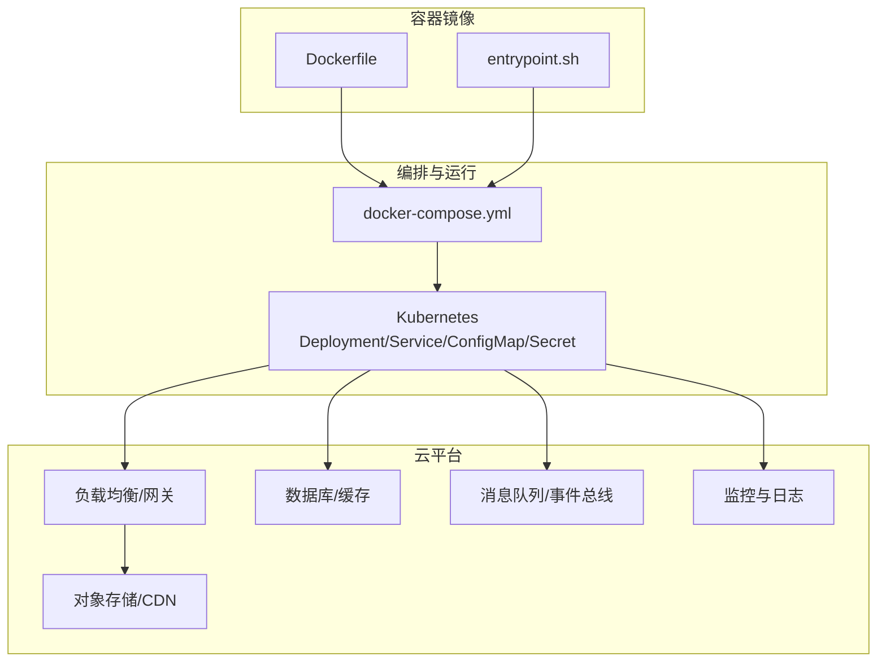
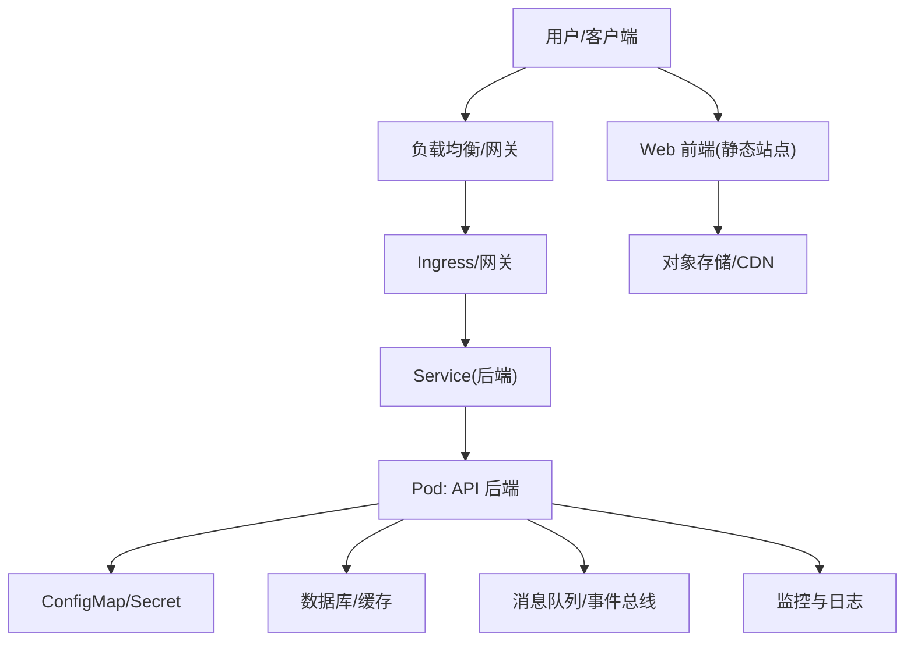

# 云原生部署

<cite>
**本文引用的文件**   
- [Dockerfile](file://docker/Dockerfile)
- [docker-compose.yml](file://docker/docker-compose.yml)
- [entrypoint.sh](file://docker/entrypoint.sh)
- [DEPLOY.md](file://docs/DEPLOY.md)
- [DEPLOY_EN.md](file://docs/DEPLOY_EN.md)
- [deploy-webui-cloud.md](file://docs/deploy-webui-cloud.md)
- [main.py](file://main.py)
- [server.py](file://server.py)
- [pyproject.toml](file://pyproject.toml)
- [requirements.txt](file://requirements.txt)
</cite>

## 目录
1. [简介](#简介)
2. [项目结构](#项目结构)
3. [核心组件](#核心组件)
4. [架构总览](#架构总览)
5. [详细组件分析](#详细组件分析)
6. [依赖关系分析](#依赖关系分析)
7. [性能与弹性伸缩](#性能与弹性伸缩)
8. [故障排查指南](#故障排查指南)
9. [结论](#结论)
10. [附录](#附录)

## 简介
本文件面向希望在 Kubernetes 及主流云平台（AWS、阿里云、腾讯云等）上以云原生方式部署该项目的工程师与运维人员。文档围绕容器化与编排展开，涵盖：
- Kubernetes 资源定义要点（Deployment、Service、ConfigMap、Secret）
- 滚动更新、蓝绿部署与灰度发布策略
- 云平台服务集成（负载均衡、对象存储、消息队列、数据库、监控日志）
- 无服务器方案（函数计算与容器服务）
- 弹性伸缩（基于 CPU/内存或自定义指标）
- 监控与日志最佳实践
- 成本优化建议

说明：仓库未包含现成的 Kubernetes YAML 清单，但提供了 Docker 构建与运行配置以及部署文档，可据此生成并落地到任意 K8s 集群或云平台托管服务。

## 项目结构
本项目采用前后端分离与多应用形态：
- API 后端：Python FastAPI 应用，提供 REST 接口与业务逻辑
- Web 前端：React/Vite 静态站点，通过 CDN 或对象存储分发
- 桌面客户端：Electron 打包产物
- 容器化：Dockerfile 与 docker-compose 用于本地与 CI/CD 环境
- 文档：部署指南与平台集成说明

图表来源
- [Dockerfile](file://docker/Dockerfile)
- [docker-compose.yml](file://docker/docker-compose.yml)
- [entrypoint.sh](file://docker/entrypoint.sh)

章节来源
- [Dockerfile](file://docker/Dockerfile)
- [docker-compose.yml](file://docker/docker-compose.yml)
- [entrypoint.sh](file://docker/entrypoint.sh)
- [DEPLOY.md](file://docs/DEPLOY.md)
- [DEPLOY_EN.md](file://docs/DEPLOY_EN.md)
- [deploy-webui-cloud.md](file://docs/deploy-webui-cloud.md)

## 核心组件
- 应用入口与进程模型
  - 后端主入口与服务器启动脚本定义了应用的运行方式与端口暴露，便于容器化与编排。
- 容器镜像构建
  - Dockerfile 描述基础镜像、依赖安装、代码复制与启动命令；entrypoint.sh 负责环境变量注入、健康检查与优雅退出。
- 编排与运行
  - docker-compose 用于本地开发联调；在 K8s 中对应 Deployment、Service、ConfigMap、Secret。
- 前端静态站点
  - 通过对象存储+CDN 或 Ingress/Nginx 提供服务，与后端 API 分离部署。

章节来源
- [main.py](file://main.py)
- [server.py](file://server.py)
- [Dockerfile](file://docker/Dockerfile)
- [entrypoint.sh](file://docker/entrypoint.sh)
- [docker-compose.yml](file://docker/docker-compose.yml)

## 架构总览
下图展示从用户请求到后端处理、外部依赖与观测系统的端到端路径，适用于 K8s 与云平台托管场景。

图表来源
- [docker-compose.yml](file://docker/docker-compose.yml)
- [Dockerfile](file://docker/Dockerfile)
- [entrypoint.sh](file://docker/entrypoint.sh)

## 详细组件分析

### Kubernetes 资源设计要点
- Deployment
  - 使用镜像标签或镜像摘要固定版本，开启滚动更新策略（maxSurge/maxUnavailable），设置就绪探针与健康检查，合理配置副本数与资源限制。
- Service
  - ClusterIP 暴露内部服务；对外通过 Ingress 或 LoadBalancer 暴露 HTTP/HTTPS。
- ConfigMap
  - 存放非敏感配置（如日志级别、功能开关、第三方服务地址）。
- Secret
  - 存放敏感信息（密钥、令牌、连接串），通过环境变量或挂载卷注入。
- 存储与数据持久化
  - 使用 PVC 挂载共享存储；对无状态服务避免 Pod 内写盘。
- 安全与网络
  - 启用 NetworkPolicy 限制入出流量；为 Pod 分配最小权限的 ServiceAccount。

章节来源
- [DEPLOY.md](file://docs/DEPLOY.md)
- [DEPLOY_EN.md](file://docs/DEPLOY_EN.md)
- [docker-compose.yml](file://docker/docker-compose.yml)

### 滚动更新、蓝绿部署与灰度发布
- 滚动更新
  - 通过 Deployment 的 rollingUpdate 策略实现零停机升级；配合就绪探针确保新实例先就绪再淘汰旧实例。
- 蓝绿部署
  - 维护两套相同环境的 Deployment（blue/green），通过切换 Service 或 Ingress 路由完成快速回滚。
- 灰度发布
  - 基于权重或 Header/URL 规则进行流量切分；结合金丝雀发布逐步放量，观察错误率与延迟后全量或回滚。

章节来源
- [DEPLOY.md](file://docs/DEPLOY.md)
- [DEPLOY_EN.md](file://docs/DEPLOY_EN.md)

### 云平台服务集成（AWS、阿里云、腾讯云）
- 通用模式
  - 将应用容器化后部署到托管 K8s（EKS、ACK、TKE），通过 Ingress/ALB/NLB 暴露服务，使用托管数据库与缓存，对象存储承载静态资源。
- AWS
  - 使用 EKS + ALB Ingress Controller；Secrets 使用 Secrets Manager 或 SSM Parameter Store；日志接入 CloudWatch；监控使用 Prometheus/Grafana。
- 阿里云
  - 使用 ACK + ALB/SLB Ingress；Secrets 使用 KMS/密钥管理服务；日志接入 SLS；监控使用 ARMS/Prometheus。
- 腾讯云
  - 使用 TKE + CLB Ingress；Secrets 使用 KMS；日志接入 CLS；监控使用 Prometheus/TKE 监控。

章节来源
- [deploy-webui-cloud.md](file://docs/deploy-webui-cloud.md)
- [DEPLOY.md](file://docs/DEPLOY.md)
- [DEPLOY_EN.md](file://docs/DEPLOY_EN.md)

### 无服务器架构方案
- 函数计算（Serverless Functions）
  - 将异步任务或短生命周期处理封装为函数（如 AWS Lambda、阿里云 FC、腾讯云 SCF），由事件驱动触发，按调用量计费。
- 容器服务（Serverless Containers）
  - 使用 KEDA 或平台提供的 Serverless 容器（如 AWS Fargate、阿里云 ECS on ARM/Fargate、腾讯云 TKE Serverless）按需扩缩容。
- 适用场景
  - 批处理、定时任务、事件消费、峰值突增负载；与 K8s 微服务混合部署，提升资源利用率。

章节来源
- [DEPLOY.md](file://docs/DEPLOY.md)
- [DEPLOY_EN.md](file://docs/DEPLOY_EN.md)

### 弹性伸缩配置方法
- 水平 Pod 自动扩缩容（HPA）
  - 基于 CPU/内存或自定义指标（QPS、延迟、队列长度）自动调整副本数；设置合理的 requests/limits 与目标利用率。
- 垂直 Pod 自动扩缩容（VPA）
  - 推荐用于调优阶段，生产环境谨慎使用以避免频繁重启。
- 集群级自动扩缩容（CA）
  - 根据节点资源压力自动增减节点，保障调度空间。
- 事件驱动扩缩容（KEDA）
  - 基于消息队列长度、HTTP 请求速率等事件源触发扩缩容。

章节来源
- [DEPLOY.md](file://docs/DEPLOY.md)
- [DEPLOY_EN.md](file://docs/DEPLOY_EN.md)

### 监控与日志集成最佳实践
- 指标采集
  - 使用 Prometheus 抓取应用与 K8s 指标，Grafana 可视化；关键指标包括 QPS、错误率、P95/P99 延迟、CPU/内存、GC 停顿、线程池占用。
- 日志收集
  - 统一输出 JSON 结构化日志；使用 Filebeat/Fluent Bit 采集至 Elasticsearch/OpenSearch/CLS/SLS/CloudWatch。
- 链路追踪
  - 集成 OpenTelemetry，跨服务追踪请求链路，定位瓶颈与异常。
- 告警
  - 基于阈值与异常检测规则设置告警，通知渠道包括邮件、企业微信、钉钉、Slack。

章节来源
- [DEPLOY.md](file://docs/DEPLOY.md)
- [DEPLOY_EN.md](file://docs/DEPLOY_EN.md)

### 成本优化建议
- 资源规划
  - 合理设置 requests/limits，避免过度预留；利用 Spot/抢占式实例承载非关键负载。
- 自动伸缩
  - 启用 HPA/KEDA，降低空闲资源浪费；夜间或低峰期缩小规模。
- 存储与网络
  - 冷热数据分层，归档冷数据到低成本存储；减少跨可用区流量。
- 镜像与依赖
  - 精简镜像层、复用基础镜像、使用多阶段构建；定期清理无用依赖。
- 观测与治理
  - 通过监控与日志发现低效查询与热点，优化 SQL 与缓存命中率。

章节来源
- [DEPLOY.md](file://docs/DEPLOY.md)
- [DEPLOY_EN.md](file://docs/DEPLOY_EN.md)

## 依赖关系分析
- 运行时依赖
  - Python 应用依赖由 pyproject.toml 与 requirements.txt 管理；Dockerfile 负责构建镜像时安装依赖。
- 进程模型
  - main.py 与 server.py 定义应用入口与监听端口，entrypoint.sh 负责启动参数与环境变量注入。
- 编排依赖
  - docker-compose 定义服务间依赖与端口映射；迁移到 K8s 后由 Deployment/Service/ConfigMap/Secret 替代。

图表来源
- [pyproject.toml](file://pyproject.toml)
- [requirements.txt](file://requirements.txt)
- [Dockerfile](file://docker/Dockerfile)
- [entrypoint.sh](file://docker/entrypoint.sh)
- [docker-compose.yml](file://docker/docker-compose.yml)

章节来源
- [pyproject.toml](file://pyproject.toml)
- [requirements.txt](file://requirements.txt)
- [Dockerfile](file://docker/Dockerfile)
- [entrypoint.sh](file://docker/entrypoint.sh)
- [docker-compose.yml](file://docker/docker-compose.yml)

## 性能与弹性伸缩
- 应用层
  - 合理设置并发模型（异步/线程池）、连接池大小、超时与重试策略；避免阻塞 IO。
- 容器层
  - 设置合适的 CPU/Memory requests/limits，启用 OOM 保护；使用就绪探针避免流量进入未就绪实例。
- 编排层
  - 使用 HPA/KEDA 实现弹性；结合 CA 保证节点容量；Ingress 层启用限流与熔断。
- 数据层
  - 读写分离、缓存命中、分页与批量操作；慢查询分析与索引优化。

章节来源
- [DEPLOY.md](file://docs/DEPLOY.md)
- [DEPLOY_EN.md](file://docs/DEPLOY_EN.md)

## 故障排查指南
- 启动失败
  - 检查镜像构建产物、环境变量注入、依赖安装是否完整；查看 entrypoint.sh 日志与容器标准输出。
- 健康检查不通过
  - 确认就绪探针与存活探针配置；验证依赖服务可达性与鉴权。
- 扩容不生效
  - 检查 HPA 指标采集、资源 requests/limits 设置、节点容量与调度约束。
- 性能抖动
  - 分析 CPU/内存、GC 停顿、锁竞争、IO 等待；结合链路追踪定位热点。
- 日志与指标
  - 统一结构化日志格式；确认采集链路正常；设置关键告警阈值。

章节来源
- [DEPLOY.md](file://docs/DEPLOY.md)
- [DEPLOY_EN.md](file://docs/DEPLOY_EN.md)

## 结论
通过将应用容器化并在 Kubernetes 或云平台托管服务上编排，可实现高可用、弹性伸缩与可观测的云原生部署。结合滚动更新、蓝绿与灰度发布策略，可在保证稳定性的前提下持续交付。借助监控与日志体系，能够快速定位问题并优化性能与成本。

## 附录
- 参考文档
  - 部署指南与平台集成说明见 docs 目录下的 DEPLOY.md、DEPLOY_EN.md、deploy-webui-cloud.md。
- 镜像与运行
  - 构建镜像与运行脚本位于 docker/Dockerfile、docker/entrypoint.sh、docker/docker-compose.yml。
- 应用入口
  - 后端入口与服务器启动脚本见 main.py、server.py。
- 依赖管理
  - 依赖声明见 pyproject.toml、requirements.txt。