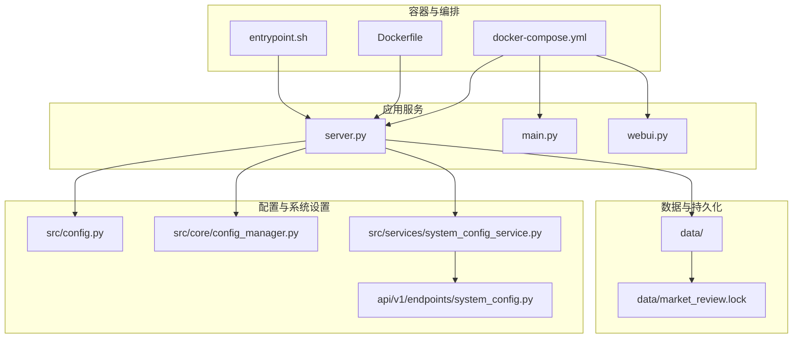
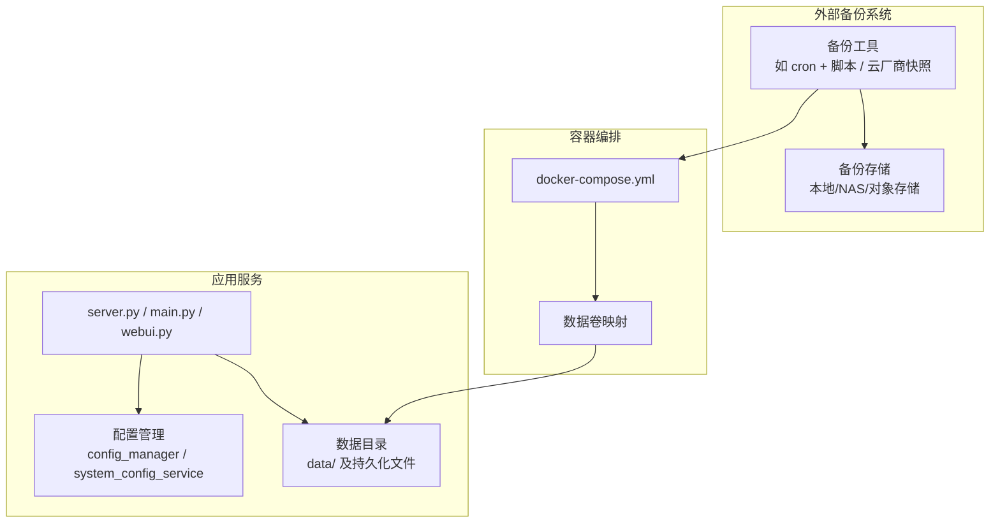
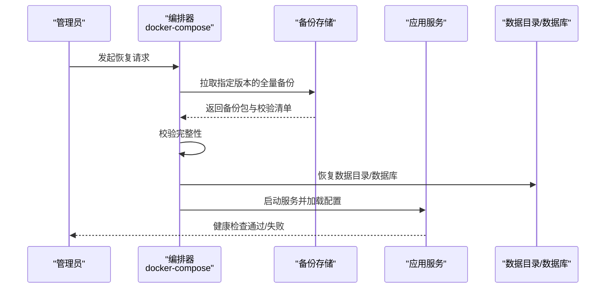
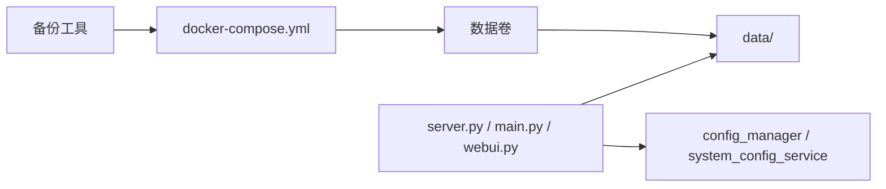

# 备份与恢复

<cite>
**本文引用的文件**   
- [docker-compose.yml](file://daily_stock_analysis/docker/docker-compose.yml)
- [Dockerfile](file://daily_stock_analysis/docker/Dockerfile)
- [entrypoint.sh](file://daily_stock_analysis/docker/entrypoint.sh)
- [server.py](file://daily_stock_analysis/server.py)
- [main.py](file://daily_stock_analysis/main.py)
- [webui.py](file://daily_stock_analysis/webui.py)
- [pyproject.toml](file://daily_stock_analysis/pyproject.toml)
- [requirements.txt](file://daily_stock_analysis/requirements.txt)
- [src/storage.py](file://daily_stock_analysis/src/storage.py)
- [src/config.py](file://daily_stock_analysis/src/config.py)
- [src/core/config_manager.py](file://daily_stock_analysis/src/core/config_manager.py)
- [src/services/system_config_service.py](file://daily_stock_analysis/src/services/system_config_service.py)
- [api/v1/endpoints/system_config.py](file://daily_stock_analysis/api/v1/endpoints/system_config.py)
- [data/market_review.lock](file://daily_stock_analysis/data/market_review.lock)
</cite>

## 目录
1. [简介](#简介)
2. [项目结构](#项目结构)
3. [核心组件](#核心组件)
4. [架构总览](#架构总览)
5. [详细组件分析](#详细组件分析)
6. [依赖关系分析](#依赖关系分析)
7. [性能考虑](#性能考虑)
8. [故障排查指南](#故障排查指南)
9. [结论](#结论)
10. [附录](#附录)

## 简介
本文件面向“每日股票分析”项目的备份与灾难恢复（DR）实践，覆盖数据备份策略、增量与全量备份实施、恢复流程（单表恢复、完整系统恢复、跨环境迁移）、备份验证与完整性检查、RTO/RPO定义与落地，以及备份存储最佳实践（异地备份、加密存储、访问控制）。文档基于仓库中的容器化部署、配置管理、持久化路径与脚本进行设计，确保可操作且可审计。

## 项目结构
从备份视角看，关键目录与文件包括：
- 容器编排与镜像构建：docker/docker-compose.yml、docker/Dockerfile、docker/entrypoint.sh
- 应用入口与服务：server.py、main.py、webui.py
- 配置与运行时：src/config.py、src/core/config_manager.py、src/services/system_config_service.py、api/v1/endpoints/system_config.py
- 数据存储与锁文件：data/market_review.lock（示例持久化位置）
- 依赖与环境：pyproject.toml、requirements.txt

图表来源
- [docker-compose.yml](file://daily_stock_analysis/docker/docker-compose.yml)
- [Dockerfile](file://daily_stock_analysis/docker/Dockerfile)
- [entrypoint.sh](file://daily_stock_analysis/docker/entrypoint.sh)
- [server.py](file://daily_stock_analysis/server.py)
- [main.py](file://daily_stock_analysis/main.py)
- [webui.py](file://daily_stock_analysis/webui.py)
- [src/config.py](file://daily_stock_analysis/src/config.py)
- [src/core/config_manager.py](file://daily_stock_analysis/src/core/config_manager.py)
- [src/services/system_config_service.py](file://daily_stock_analysis/src/services/system_config_service.py)
- [api/v1/endpoints/system_config.py](file://daily_stock_analysis/api/v1/endpoints/system_config.py)
- [data/market_review.lock](file://daily_stock_analysis/data/market_review.lock)

章节来源
- [docker-compose.yml](file://daily_stock_analysis/docker/docker-compose.yml)
- [Dockerfile](file://daily_stock_analysis/docker/Dockerfile)
- [entrypoint.sh](file://daily_stock_analysis/docker/entrypoint.sh)
- [server.py](file://daily_stock_analysis/server.py)
- [main.py](file://daily_stock_analysis/main.py)
- [webui.py](file://daily_stock_analysis/webui.py)
- [src/config.py](file://daily_stock_analysis/src/config.py)
- [src/core/config_manager.py](file://daily_stock_analysis/src/core/config_manager.py)
- [src/services/system_config_service.py](file://daily_stock_analysis/src/services/system_config_service.py)
- [api/v1/endpoints/system_config.py](file://daily_stock_analysis/api/v1/endpoints/system_config.py)
- [data/market_review.lock](file://daily_stock_analysis/data/market_review.lock)

## 核心组件
- 容器编排层：通过 docker-compose 管理服务、网络、卷挂载与启动顺序；是备份/恢复的边界与触发点。
- 应用服务层：server.py、main.py、webui.py 提供运行态能力；配置加载与系统设置接口由 config_manager 与 system_config_service 暴露。
- 配置管理层：集中读取环境变量与配置文件，支持运行时更新与校验。
- 数据持久化层：业务数据与中间结果写入 data/ 等目录；锁文件用于并发控制。

章节来源
- [server.py](file://daily_stock_analysis/server.py)
- [main.py](file://daily_stock_analysis/main.py)
- [webui.py](file://daily_stock_analysis/webui.py)
- [src/config.py](file://daily_stock_analysis/src/config.py)
- [src/core/config_manager.py](file://daily_stock_analysis/src/core/config_manager.py)
- [src/services/system_config_service.py](file://daily_stock_analysis/src/services/system_config_service.py)
- [api/v1/endpoints/system_config.py](file://daily_stock_analysis/api/v1/endpoints/system_config.py)

## 架构总览
下图展示备份与恢复在系统中的角色与交互：编排层负责卷挂载与生命周期；应用层提供配置与数据读写；外部备份工具对卷或数据库执行快照/导出；恢复时按顺序回滚并校验一致性。

图表来源
- [docker-compose.yml](file://daily_stock_analysis/docker/docker-compose.yml)
- [server.py](file://daily_stock_analysis/server.py)
- [src/core/config_manager.py](file://daily_stock_analysis/src/core/config_manager.py)
- [src/services/system_config_service.py](file://daily_stock_analysis/src/services/system_config_service.py)

## 详细组件分析

### 备份策略与自动化方案
- 备份范围
  - 数据库：若使用外部数据库，采用数据库原生备份工具（如 mysqldump/pg_dump）或云厂商快照；若为嵌入式存储，则对数据目录做一致性快照。
  - 配置文件：应用配置、密钥、策略文件（如 strategies/*.yaml）、模板与报告输出目录。
  - 用户数据：用户上传、缓存、日志与报告产物。
- 备份类型
  - 全量备份：定期（建议每日）对数据目录与配置目录打包归档。
  - 增量备份：基于上次全量的差异（文件或数据库事务日志），缩短窗口与存储占用。
- 频率与保留
  - 全量：每日一次，保留 N 天（例如 7~14 天）。
  - 增量：每小时或每交易日多次，保留 M 天（例如 3~7 天）。
  - 归档：将历史全量转冷存储（对象存储），长期保留合规所需周期。
- 自动化实现要点
  - 使用 cron 或编排平台任务调度备份脚本。
  - 备份前停止写或进入只读模式（数据库级），或使用一致性快照（文件系统/云盘快照）。
  - 备份后生成校验文件（如 SHA-256 清单），并上传至远程存储。
  - 失败重试与告警通知。

章节来源
- [docker-compose.yml](file://daily_stock_analysis/docker/docker-compose.yml)
- [entrypoint.sh](file://daily_stock_analysis/docker/entrypoint.sh)
- [src/core/config_manager.py](file://daily_stock_analysis/src/core/config_manager.py)
- [src/services/system_config_service.py](file://daily_stock_analysis/src/services/system_config_service.py)

### 增量与全量备份的实施方法
- 全量备份流程
  - 锁定数据源（数据库事务快照或文件系统只读）。
  - 打包数据目录与配置目录。
  - 计算校验和并记录元数据（时间戳、版本、大小、哈希）。
  - 传输到远程存储并清理本地临时文件。
- 增量备份流程
  - 对比上次全量/增量的变更集（文件时间戳或数据库 binlog/WAL）。
  - 仅传输变更部分，合并索引以加速恢复。
- 存储空间管理
  - 分层存储：热（SSD）、温（HDD）、冷（对象存储）。
  - 生命周期策略：自动删除过期增量，压缩归档全量。
  - 配额与监控：容量阈值告警、重复率统计。

章节来源
- [docker-compose.yml](file://daily_stock_analysis/docker/docker-compose.yml)
- [entrypoint.sh](file://daily_stock_analysis/docker/entrypoint.sh)

### 数据恢复流程
- 单表/单文件恢复
  - 定位目标备份（按时间戳/版本号）。
  - 校验备份完整性（哈希比对）。
  - 隔离环境导入（避免污染生产）。
  - 验证数据一致性与业务可用性。
- 完整系统恢复
  - 准备基础设施（主机/容器/网络/存储）。
  - 恢复配置与密钥（从安全渠道获取）。
  - 恢复数据库与数据目录（先全量，再回放增量）。
  - 启动服务并执行健康检查。
- 跨环境迁移
  - 环境差异处理（端口、域名、凭据、路径）。
  - 数据脱敏与字段映射。
  - 灰度切换与回滚预案。

图表来源
- [docker-compose.yml](file://daily_stock_analysis/docker/docker-compose.yml)
- [entrypoint.sh](file://daily_stock_analysis/docker/entrypoint.sh)
- [server.py](file://daily_stock_analysis/server.py)

### 备份验证与完整性检查
- 校验手段
  - 文件级：SHA-256/MD5 校验清单。
  - 数据库级：一致性校验（如 checksum 表、行计数、抽样比对）。
  - 应用级：启动后执行最小数据集查询与业务用例冒烟测试。
- 自动化演练
  - 定期在隔离环境执行恢复演练，记录 RTO/RPO 指标。
  - 演练报告纳入审计与改进闭环。

章节来源
- [entrypoint.sh](file://daily_stock_analysis/docker/entrypoint.sh)
- [src/core/config_manager.py](file://daily_stock_analysis/src/core/config_manager.py)

### 灾难恢复预案（RTO/RPO）
- 目标定义
  - RPO：最大允许的数据丢失时长（例如 15 分钟）。
  - RTO：最大允许的恢复耗时（例如 2 小时）。
- 实施要点
  - 根据 RPO 选择增量频率（如 WAL/binlog 实时同步）。
  - 根据 RTO 优化恢复路径（预构建恢复脚本、并行恢复、就近存储）。
  - 明确责任人、沟通流程与升级机制。
- 演练与度量
  - 每季度至少一次端到端演练，记录实际 RTO/RPO 并持续优化。

章节来源
- [docker-compose.yml](file://daily_stock_analysis/docker/docker-compose.yml)
- [entrypoint.sh](file://daily_stock_analysis/docker/entrypoint.sh)

### 备份存储最佳实践
- 异地备份
  - 多地域复制（主备/双活），跨可用区/跨云厂商。
- 加密存储
  - 传输中 TLS，静态加密（KMS 管理密钥）。
- 访问控制
  - 最小权限原则，细粒度 IAM 策略，审计日志开启。
- 版本与不可变
  - 启用对象存储版本控制与 WORM 策略，防篡改。

章节来源
- [docker-compose.yml](file://daily_stock_analysis/docker/docker-compose.yml)

## 依赖关系分析
备份与恢复涉及的模块耦合如下：
- 编排层依赖卷映射与启动顺序，决定备份边界与恢复顺序。
- 应用层依赖配置管理与数据目录，恢复时需保证配置与数据一致。
- 外部备份工具需与编排层协调（停机/快照/只读）以减少不一致风险。

图表来源
- [docker-compose.yml](file://daily_stock_analysis/docker/docker-compose.yml)
- [server.py](file://daily_stock_analysis/server.py)
- [src/core/config_manager.py](file://daily_stock_analysis/src/core/config_manager.py)
- [src/services/system_config_service.py](file://daily_stock_analysis/src/services/system_config_service.py)

章节来源
- [docker-compose.yml](file://daily_stock_analysis/docker/docker-compose.yml)
- [server.py](file://daily_stock_analysis/server.py)
- [src/core/config_manager.py](file://daily_stock_analysis/src/core/config_manager.py)
- [src/services/system_config_service.py](file://daily_stock_analysis/src/services/system_config_service.py)

## 性能考虑
- 备份窗口：避开交易高峰，采用增量与并行传输。
- I/O 影响：使用只读快照或数据库一致性导出，降低对在线服务的影响。
- 存储吞吐：冷热分层、压缩与去重，减少带宽与成本。
- 恢复速度：就近存储、并行解压与导入、预热常用数据。

[本节为通用指导，不直接分析具体文件]

## 故障排查指南
- 常见问题
  - 备份失败：检查磁盘空间、权限、网络连通性、数据库连接与锁状态。
  - 恢复失败：确认备份完整性、版本匹配、依赖服务就绪。
  - 数据不一致：核对校验清单、抽样比对、业务用例回归。
- 诊断步骤
  - 查看编排日志与容器状态。
  - 检查 entrypoint 初始化逻辑与配置加载。
  - 验证数据目录权限与锁文件状态。
- 应急措施
  - 回滚到上一稳定版本。
  - 切换到备用站点或只读模式保障基本功能。

章节来源
- [entrypoint.sh](file://daily_stock_analysis/docker/entrypoint.sh)
- [src/core/config_manager.py](file://daily_stock_analysis/src/core/config_manager.py)
- [data/market_review.lock](file://daily_stock_analysis/data/market_review.lock)

## 结论
通过明确的备份策略、自动化流水线与严格的恢复演练，可在满足 RTO/RPO 的前提下保障业务连续性。结合异地备份、加密与访问控制，形成纵深防御体系。建议持续完善监控与审计，定期演练并迭代预案。

[本节为总结性内容，不直接分析具体文件]

## 附录
- 术语
  - 全量备份：一次性完整拷贝所有数据。
  - 增量备份：仅备份自上次备份以来的变化。
  - RTO：恢复时间目标。
  - RPO：恢复点目标。
- 参考路径
  - 配置管理：src/config.py、src/core/config_manager.py、src/services/system_config_service.py、api/v1/endpoints/system_config.py
  - 数据与锁：data/market_review.lock
  - 编排与启动：docker/docker-compose.yml、docker/Dockerfile、docker/entrypoint.sh
  - 应用入口：server.py、main.py、webui.py
  - 依赖与环境：pyproject.toml、requirements.txt

[本节为补充信息，不直接分析具体文件]