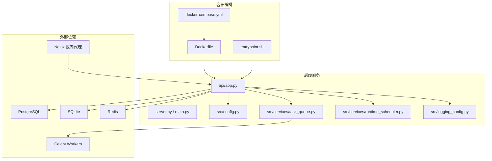
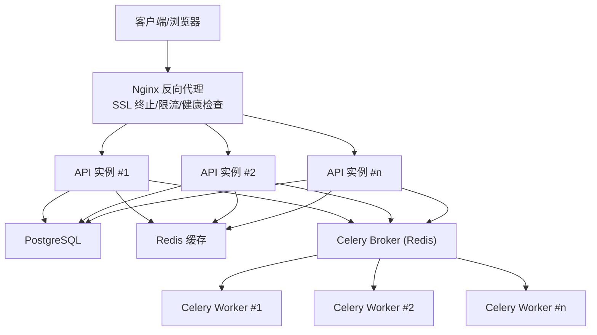
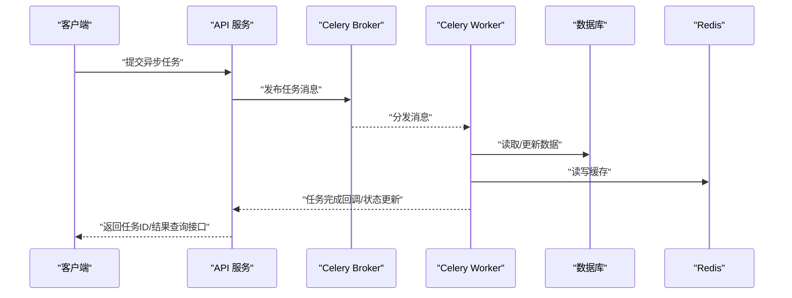
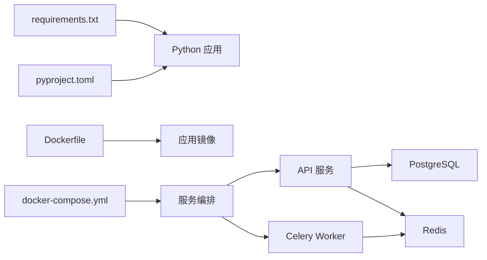

# 生产环境部署

<cite>
**本文档引用的文件**   
- [docker-compose.yml](file://daily_stock_analysis/docker/docker-compose.yml)
- [Dockerfile](file://daily_stock_analysis/docker/Dockerfile)
- [entrypoint.sh](file://daily_stock_analysis/docker/entrypoint.sh)
- [DEPLOY.md](file://daily_stock_analysis/docs/DEPLOY.md)
- [DEPLOY_EN.md](file://daily_stock_analysis/docs/DEPLOY_EN.md)
- [server.py](file://daily_stock_analysis/server.py)
- [main.py](file://daily_stock_analysis/main.py)
- [pyproject.toml](file://daily_stock_analysis/pyproject.toml)
- [requirements.txt](file://daily_stock_analysis/requirements.txt)
- [api/app.py](file://daily_stock_analysis/api/app.py)
- [src/config.py](file://daily_stock_analysis/src/config.py)
- [src/services/task_queue.py](file://daily_stock_analysis/src/services/task_queue.py)
- [src/services/runtime_scheduler.py](file://daily_stock_analysis/src/services/runtime_scheduler.py)
- [src/logging_config.py](file://daily_stock_analysis/src/logging_config.py)
</cite>

## 目录
1. [简介](#简介)
2. [项目结构](#项目结构)
3. [核心组件](#核心组件)
4. [架构总览](#架构总览)
5. [详细组件分析](#详细组件分析)
6. [依赖关系分析](#依赖关系分析)
7. [性能考虑](#性能考虑)
8. [故障排查指南](#故障排查指南)
9. [结论](#结论)
10. [附录](#附录)

## 简介
本文件面向生产环境，提供 daily_stock_analysis 项目的完整部署指南。内容覆盖服务器环境要求、数据库（PostgreSQL/SQLite）与连接池配置、缓存 Redis（含集群与持久化）、消息队列 Celery（Worker 进程管理与调度）、负载均衡与高可用（Nginx 反向代理与多实例）、以及安全加固（防火墙、SSL 证书、访问控制）。文档同时给出基于 Docker Compose 的一键部署方案与关键配置要点，确保在真实生产环境中稳定运行。

## 项目结构
项目采用前后端分离与模块化设计：
- API 服务：FastAPI 应用，位于 api/ 与 server.py/main.py 入口
- 业务逻辑：src/ 下包含配置、服务层、任务队列、调度器等
- 前端：apps/dsa-web（Web UI），apps/dsa-desktop（桌面客户端）
- 容器化：docker/ 目录包含 Dockerfile、docker-compose.yml 与 entrypoint.sh
- 文档：docs/ 包含部署说明与使用指南

图表来源
- [docker-compose.yml](file://daily_stock_analysis/docker/docker-compose.yml)
- [Dockerfile](file://daily_stock_analysis/docker/Dockerfile)
- [entrypoint.sh](file://daily_stock_analysis/docker/entrypoint.sh)
- [api/app.py](file://daily_stock_analysis/api/app.py)
- [server.py](file://daily_stock_analysis/server.py)
- [main.py](file://daily_stock_analysis/main.py)
- [src/config.py](file://daily_stock_analysis/src/config.py)
- [src/services/task_queue.py](file://daily_stock_analysis/src/services/task_queue.py)
- [src/services/runtime_scheduler.py](file://daily_stock_analysis/src/services/runtime_scheduler.py)
- [src/logging_config.py](file://daily_stock_analysis/src/logging_config.py)

章节来源
- [docker-compose.yml](file://daily_stock_analysis/docker/docker-compose.yml)
- [Dockerfile](file://daily_stock_analysis/docker/Dockerfile)
- [entrypoint.sh](file://daily_stock_analysis/docker/entrypoint.sh)
- [DEPLOY.md](file://daily_stock_analysis/docs/DEPLOY.md)
- [DEPLOY_EN.md](file://daily_stock_analysis/docs/DEPLOY_EN.md)

## 核心组件
- API 服务：基于 FastAPI，提供 RESTful 接口，统一路由与中间件管理
- 配置中心：集中式配置加载与环境变量注入
- 任务队列：Celery Worker 异步处理耗时任务（如数据拉取、报告生成）
- 运行时调度：定时任务与周期性策略执行
- 日志系统：结构化日志与分级输出，便于生产监控与排障
- 容器化：Docker 镜像构建与 Compose 编排，简化部署流程

章节来源
- [api/app.py](file://daily_stock_analysis/api/app.py)
- [src/config.py](file://daily_stock_analysis/src/config.py)
- [src/services/task_queue.py](file://daily_stock_analysis/src/services/task_queue.py)
- [src/services/runtime_scheduler.py](file://daily_stock_analysis/src/services/runtime_scheduler.py)
- [src/logging_config.py](file://daily_stock_analysis/src/logging_config.py)

## 架构总览
生产环境推荐架构如下：
- Nginx 作为反向代理，负责 SSL 终止、静态资源缓存与请求分发
- 多个 API 实例水平扩展，共享同一数据库与缓存
- Celery Worker 独立部署，通过 Redis Broker 接收任务
- PostgreSQL 主从或托管服务，启用 WAL 与备份策略
- Redis 集群模式用于高可用与持久化

图表来源
- [docker-compose.yml](file://daily_stock_analysis/docker/docker-compose.yml)
- [api/app.py](file://daily_stock_analysis/api/app.py)
- [src/services/task_queue.py](file://daily_stock_analysis/src/services/task_queue.py)

## 详细组件分析

### 服务器环境与硬件规格
- 操作系统：推荐 Ubuntu 22.04 LTS 或 Debian 12；内核版本需支持 cgroup v2
- CPU：建议 4 核起，计算密集型任务（如回测、报告渲染）建议 8 核+
- 内存：建议 8GB 起，若启用 Redis 持久化与较大缓存，建议 16GB+
- 存储：SSD 优先，数据库与日志分区隔离；预留至少 50GB 可用空间
- 网络：开放 80/443（HTTP/HTTPS），内网端口 5432（PostgreSQL）、6379（Redis）、5672/15672（RabbitMQ，可选）

章节来源
- [DEPLOY.md](file://daily_stock_analysis/docs/DEPLOY.md)
- [DEPLOY_EN.md](file://daily_stock_analysis/docs/DEPLOY_EN.md)

### 数据库部署配置（PostgreSQL/SQLite）
- PostgreSQL：
  - 版本：14+，启用 WAL 与自动清理（autovacuum）
  - 连接池：使用 PgBouncer 或应用侧连接池，最大连接数按并发估算
  - 性能调优：shared_buffers、work_mem、maintenance_work_mem 按内存比例设置
  - 备份：每日全量 + 增量 WAL，异地副本
- SQLite：
  - 适用场景：小规模或开发测试；生产不推荐高并发写入
  - 文件权限：只读挂载与写路径分离，避免锁竞争
  - 迁移：建议使用迁移工具（如 Alembic）管理 schema 变更

章节来源
- [src/config.py](file://daily_stock_analysis/src/config.py)
- [DEPLOY.md](file://daily_stock_analysis/docs/DEPLOY.md)

### 缓存系统 Redis（集群与持久化）
- 部署模式：单机（开发/小流量）或集群（生产高可用）
- 持久化：启用 AOF 与 RDB 双持久化，定期快照与追加日志
- 内存策略：maxmemory 与淘汰策略（allkeys-lru）
- 安全：绑定内网 IP，禁用危险命令，设置密码与 TLS 加密

章节来源
- [docker-compose.yml](file://daily_stock_analysis/docker/docker-compose.yml)
- [DEPLOY.md](file://daily_stock_analysis/docs/DEPLOY.md)

### 消息队列 Celery（Worker 进程管理与调度）
- Broker：推荐使用 Redis 或 RabbitMQ；生产建议 RabbitMQ 提升稳定性
- Worker 进程：根据 CPU 核数与任务类型调整 concurrency 与 prefetch
- 调度：结合 APScheduler 或系统 cron 触发定时任务
- 监控：启用 Flower 或 Prometheus 指标采集

图表来源
- [src/services/task_queue.py](file://daily_stock_analysis/src/services/task_queue.py)
- [src/services/runtime_scheduler.py](file://daily_stock_analysis/src/services/runtime_scheduler.py)

章节来源
- [src/services/task_queue.py](file://daily_stock_analysis/src/services/task_queue.py)
- [src/services/runtime_scheduler.py](file://daily_stock_analysis/src/services/runtime_scheduler.py)

### 负载均衡与高可用（Nginx + 多实例）
- Nginx 配置：
  - upstream 定义多个 API 实例
  - 健康检查与故障转移
  - 静态资源缓存与压缩
- 多实例部署：
  - 无状态设计，会话外置到 Redis
  - 环境变量隔离（端口、日志路径）
- 高可用：
  - 多节点部署 + 负载均衡
  - 数据库主从与读写分离
  - Redis 集群与哨兵模式

章节来源
- [docker-compose.yml](file://daily_stock_analysis/docker/docker-compose.yml)
- [DEPLOY.md](file://daily_stock_analysis/docs/DEPLOY.md)

### 安全加固措施
- 防火墙规则：仅开放必要端口，限制来源 IP
- SSL 证书：使用 Let's Encrypt 或企业 CA，强制 HTTPS
- 访问控制：API 鉴权（JWT/OAuth2）、CORS 白名单、速率限制
- 敏感信息：环境变量管理，密钥轮换，最小权限原则

章节来源
- [DEPLOY.md](file://daily_stock_analysis/docs/DEPLOY.md)
- [DEPLOY_EN.md](file://daily_stock_analysis/docs/DEPLOY_EN.md)

## 依赖关系分析
- 运行时依赖：Python 版本与第三方库由 pyproject.toml/requirements.txt 管理
- 容器依赖：Dockerfile 定义基础镜像与安装步骤
- 服务依赖：API 依赖数据库、缓存、消息队列；Worker 依赖 Broker 与共享库

图表来源
- [requirements.txt](file://daily_stock_analysis/requirements.txt)
- [pyproject.toml](file://daily_stock_analysis/pyproject.toml)
- [Dockerfile](file://daily_stock_analysis/docker/Dockerfile)
- [docker-compose.yml](file://daily_stock_analysis/docker/docker-compose.yml)

章节来源
- [requirements.txt](file://daily_stock_analysis/requirements.txt)
- [pyproject.toml](file://daily_stock_analysis/pyproject.toml)
- [Dockerfile](file://daily_stock_analysis/docker/Dockerfile)
- [docker-compose.yml](file://daily_stock_analysis/docker/docker-compose.yml)

## 性能考虑
- API 服务：
  - 启用 Gunicorn/Uvicorn 多进程与线程池
  - 数据库连接池大小按并发与延迟目标调优
  - 缓存热点数据，减少重复计算
- Celery Worker：
  - 按任务类型拆分队列，避免阻塞
  - 调整 worker 并发与内存上限
- 存储：
  - 数据库索引优化与慢查询分析
  - 日志轮转与归档，避免磁盘占满

[本节为通用指导，无需特定文件引用]

## 故障排查指南
- 日志定位：
  - 应用日志：结构化输出，按级别过滤
  - 数据库日志：慢查询与连接错误
  - 缓存日志：连接失败与内存告警
- 常见问题：
  - 数据库连接超时：检查连接池与网络延迟
  - Redis 连接失败：认证、网络与安全组
  - Worker 任务堆积：检查 Broker 与 Worker 资源
- 监控告警：
  - 指标采集：CPU、内存、QPS、错误率
  - 告警阈值：基于历史基线与业务峰值

章节来源
- [src/logging_config.py](file://daily_stock_analysis/src/logging_config.py)
- [DEPLOY.md](file://daily_stock_analysis/docs/DEPLOY.md)

## 结论
通过合理的架构设计与容器化部署，daily_stock_analysis 可在生产环境中实现高可用、可扩展与易维护。建议在生产环境优先采用 PostgreSQL + Redis 集群 + Celery Worker 的解耦架构，并通过 Nginx 实现负载均衡与 SSL 终止。持续监控与自动化运维是保障稳定性的关键。

[本节为总结性内容，无需特定文件引用]

## 附录
- 快速启动：使用 docker-compose up -d 一键部署
- 环境变量：参考 DEPLOY.md 中的配置项清单
- 健康检查：/health 接口与 Nginx 探针
- 备份恢复：数据库与缓存数据的定期备份与演练

章节来源
- [DEPLOY.md](file://daily_stock_analysis/docs/DEPLOY.md)
- [DEPLOY_EN.md](file://daily_stock_analysis/docs/DEPLOY_EN.md)
- [docker-compose.yml](file://daily_stock_analysis/docker/docker-compose.yml)