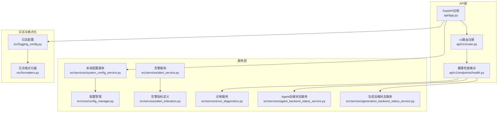
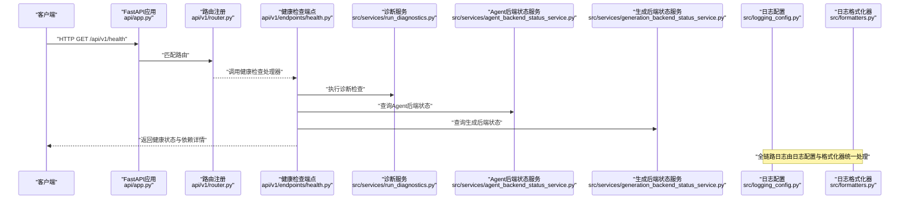
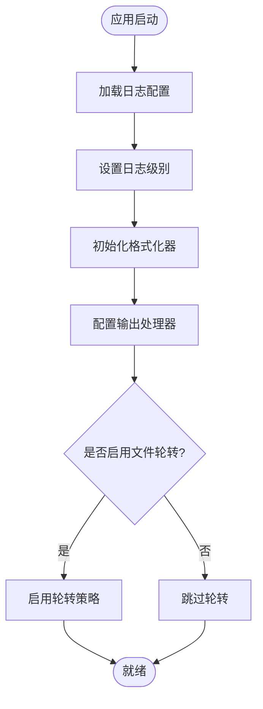
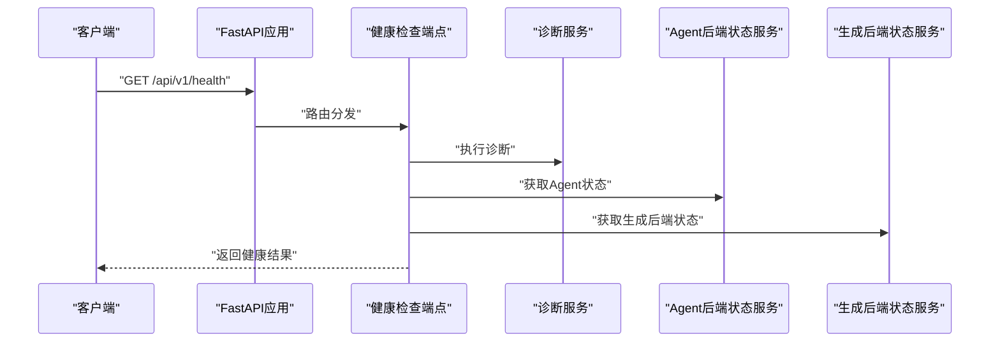
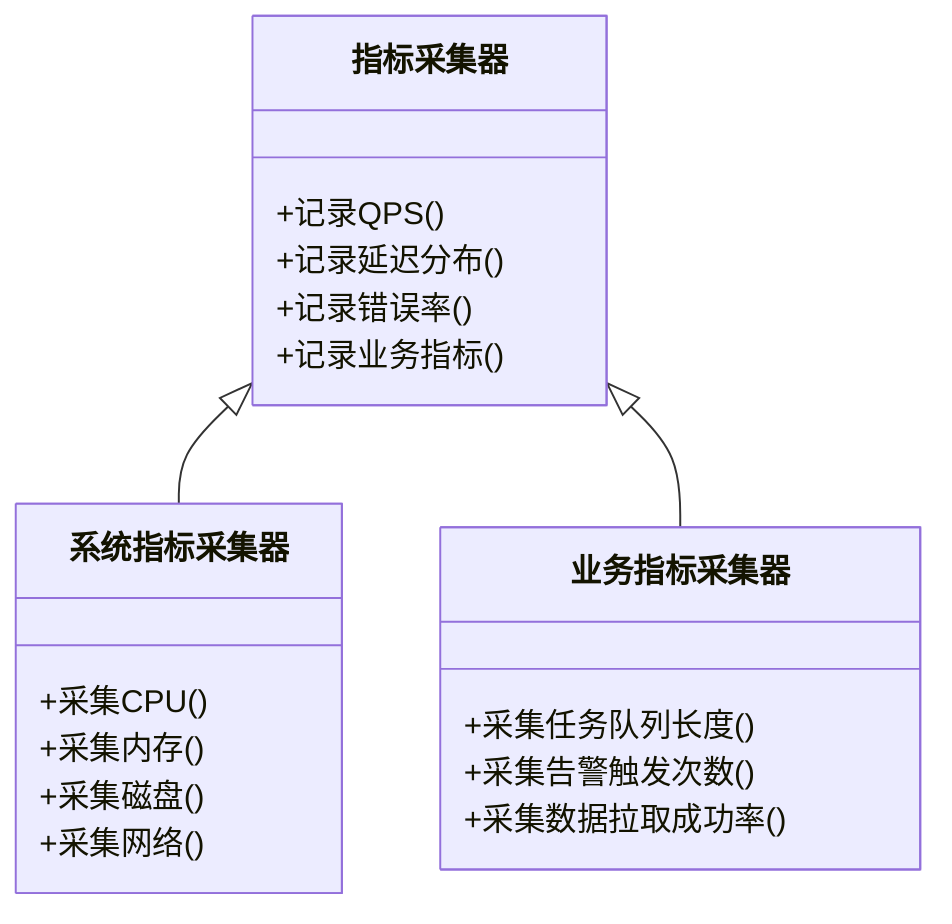
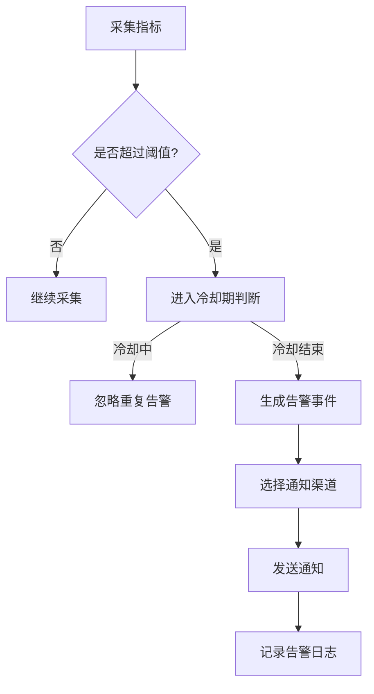
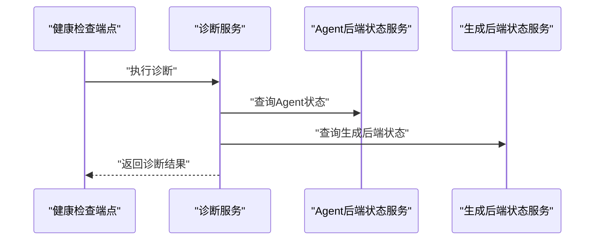
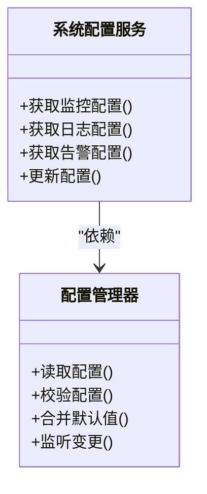
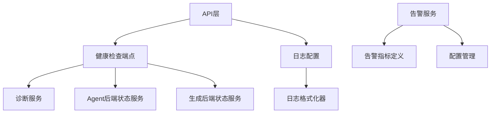

# 监控与日志

<cite>
**本文引用的文件**   
- [logging_config.py](file://src/logging_config.py)
- [formatters.py](file://src/formatters.py)
- [health.py](file://api/v1/endpoints/health.py)
- [router.py](file://api/v1/router.py)
- [app.py](file://api/app.py)
- [config_manager.py](file://src/core/config_manager.py)
- [system_config_service.py](file://src/services/system_config_service.py)
- [alert_indicators.py](file://src/services/alert_indicators.py)
- [alert_service.py](file://src/services/alert_service.py)
- [run_diagnostics.py](file://src/services/run_diagnostics.py)
- [agent_backend_status_service.py](file://src/services/agent_backend_status_service.py)
- [generation_backend_status_service.py](file://src/services/generation_backend_status_service.py)
- [test_logging_config.py](file://tests/test_logging_config.py)
- [test_api_health.py](file://tests/test_api_health.py)
</cite>

## 目录
1. [简介](#简介)
2. [项目结构](#项目结构)
3. [核心组件](#核心组件)
4. [架构总览](#架构总览)
5. [详细组件分析](#详细组件分析)
6. [依赖关系分析](#依赖关系分析)
7. [性能考虑](#性能考虑)
8. [故障排查指南](#故障排查指南)
9. [结论](#结论)
10. [附录](#附录)

## 简介
本文件面向“监控与日志”子系统，系统性说明日志配置、结构化日志输出、健康检查端点、性能指标采集与告警规则配置，以及日志分析工具（如 ELK Stack、Grafana）的集成方式。文档基于仓库中的实际实现进行梳理，帮助读者快速理解并正确配置与使用相关能力。

## 项目结构
与监控与日志相关的代码主要分布在以下位置：
- 日志配置与格式化：src/logging_config.py、src/formatters.py
- 健康检查端点：api/v1/endpoints/health.py，路由注册在 api/v1/router.py，应用入口在 api/app.py
- 系统配置与服务：src/core/config_manager.py、src/services/system_config_service.py
- 告警与指标：src/services/alert_indicators.py、src/services/alert_service.py
- 诊断与健康探测：src/services/run_diagnostics.py、src/services/agent_backend_status_service.py、src/services/generation_backend_status_service.py
- 测试用例：tests/test_logging_config.py、tests/test_api_health.py

**图表来源** 
- [app.py](file://api/app.py)
- [router.py](file://api/v1/router.py)
- [health.py](file://api/v1/endpoints/health.py)
- [config_manager.py](file://src/core/config_manager.py)
- [system_config_service.py](file://src/services/system_config_service.py)
- [alert_indicators.py](file://src/services/alert_indicators.py)
- [alert_service.py](file://src/services/alert_service.py)
- [run_diagnostics.py](file://src/services/run_diagnostics.py)
- [agent_backend_status_service.py](file://src/services/agent_backend_status_service.py)
- [generation_backend_status_service.py](file://src/services/generation_backend_status_service.py)
- [logging_config.py](file://src/logging_config.py)
- [formatters.py](file://src/formatters.py)

**章节来源**
- [app.py](file://api/app.py)
- [router.py](file://api/v1/router.py)
- [health.py](file://api/v1/endpoints/health.py)
- [logging_config.py](file://src/logging_config.py)
- [formatters.py](file://src/formatters.py)
- [config_manager.py](file://src/core/config_manager.py)
- [system_config_service.py](file://src/services/system_config_service.py)
- [alert_indicators.py](file://src/services/alert_indicators.py)
- [alert_service.py](file://src/services/alert_service.py)
- [run_diagnostics.py](file://src/services/run_diagnostics.py)
- [agent_backend_status_service.py](file://src/services/agent_backend_status_service.py)
- [generation_backend_status_service.py](file://src/services/generation_backend_status_service.py)

## 核心组件
- 日志配置与格式化
  - 日志级别设置：通过配置项控制根日志器与各模块日志器的级别，支持运行时调整。
  - 输出格式：提供结构化JSON格式化器，统一时间戳、级别、模块名、请求上下文等关键字段。
  - 文件轮转：按大小或时间策略对日志文件进行轮转，避免磁盘占用过大。
- 健康检查端点
  - 应用健康：返回进程存活、关键依赖可达性、最近错误计数等。
  - 依赖服务状态：检测数据库、缓存、外部API、消息队列等依赖的健康状态。
- 性能指标收集
  - 应用指标：QPS、延迟分布、错误率、并发数等。
  - 系统指标：CPU、内存、磁盘、网络等。
  - 业务指标：任务队列长度、告警触发次数、数据拉取成功率等。
- 告警规则
  - 阈值配置：针对关键指标设定阈值与冷却时间。
  - 通知渠道：支持多种通知通道（Webhook、邮件、IM等）。

**章节来源**
- [logging_config.py](file://src/logging_config.py)
- [formatters.py](file://src/formatters.py)
- [health.py](file://api/v1/endpoints/health.py)
- [alert_indicators.py](file://src/services/alert_indicators.py)
- [alert_service.py](file://src/services/alert_service.py)

## 架构总览
下图展示了监控与日志子系统在整体架构中的位置与交互关系：API层暴露健康检查与配置接口；服务层负责指标采集、告警判定与诊断；日志子系统为全链路提供统一的日志输出与格式化能力。

**图表来源** 
- [app.py](file://api/app.py)
- [router.py](file://api/v1/router.py)
- [health.py](file://api/v1/endpoints/health.py)
- [run_diagnostics.py](file://src/services/run_diagnostics.py)
- [agent_backend_status_service.py](file://src/services/agent_backend_status_service.py)
- [generation_backend_status_service.py](file://src/services/generation_backend_status_service.py)
- [logging_config.py](file://src/logging_config.py)
- [formatters.py](file://src/formatters.py)

## 详细组件分析

### 日志配置与格式化
- 日志级别设置
  - 支持全局与模块级级别配置，便于在生产环境降低噪音、在调试时提升细节。
  - 可通过环境变量或配置文件动态调整，无需重启服务。
- 输出格式化
  - 结构化JSON输出：包含时间戳、级别、模块、请求ID、用户信息等关键字段，便于集中式日志平台解析。
  - 可选人类可读格式用于本地开发调试。
- 文件轮转策略
  - 按文件大小或时间周期进行轮转，保留固定数量的历史文件，自动清理旧日志。
  - 支持压缩归档，减少存储占用。

**图表来源** 
- [logging_config.py](file://src/logging_config.py)
- [formatters.py](file://src/formatters.py)

**章节来源**
- [logging_config.py](file://src/logging_config.py)
- [formatters.py](file://src/formatters.py)
- [test_logging_config.py](file://tests/test_logging_config.py)

### 健康检查端点
- 功能概述
  - 返回应用健康状态、依赖服务状态、最近错误统计、运行时长等。
  - 支持细粒度依赖检查（数据库、缓存、外部API、消息队列等）。
- 使用方式
  - HTTP GET /api/v1/health
  - 响应体包含各依赖的状态码与耗时信息，便于上游负载均衡与健康探针使用。
- 配置项
  - 可配置检查超时、重试次数、忽略某些非关键依赖等。

**图表来源** 
- [health.py](file://api/v1/endpoints/health.py)
- [run_diagnostics.py](file://src/services/run_diagnostics.py)
- [agent_backend_status_service.py](file://src/services/agent_backend_status_service.py)
- [generation_backend_status_service.py](file://src/services/generation_backend_status_service.py)

**章节来源**
- [health.py](file://api/v1/endpoints/health.py)
- [test_api_health.py](file://tests/test_api_health.py)

### 性能指标收集
- 应用指标
  - QPS、P50/P95/P99延迟、错误率、活跃连接数等。
  - 通过中间件或装饰器埋点，统一上报到指标后端。
- 系统指标
  - CPU、内存、磁盘I/O、网络I/O等，通常由操作系统或容器平台采集。
- 业务指标
  - 任务队列长度、告警触发次数、数据拉取成功率、模型调用成功率等。
- 配置要点
  - 采样频率、聚合窗口、标签维度（如模块、方法、资源ID）。
  - 与日志关联：通过请求ID将指标与日志串联，便于问题定位。

[此图为概念性类图，不直接映射具体源码文件]

**章节来源**
- [alert_indicators.py](file://src/services/alert_indicators.py)
- [alert_service.py](file://src/services/alert_service.py)

### 告警规则配置
- 指标阈值
  - 为关键指标（如错误率、延迟、队列长度）设置阈值与冷却时间，避免抖动导致误报。
- 通知渠道
  - 支持Webhook、邮件、即时通讯等多种渠道，可按规则选择不同通知策略。
- 规则示例
  - 当错误率超过阈值持续N分钟，触发告警并通过指定渠道通知。
  - 当任务队列长度超过阈值且持续增长，触发升级告警。

**图表来源** 
- [alert_indicators.py](file://src/services/alert_indicators.py)
- [alert_service.py](file://src/services/alert_service.py)

**章节来源**
- [alert_indicators.py](file://src/services/alert_indicators.py)
- [alert_service.py](file://src/services/alert_service.py)

### 诊断与健康探测
- 诊断服务
  - 提供统一的诊断流程，包括依赖可达性、资源使用、最近错误摘要等。
- 后端状态服务
  - Agent后端与生成后端的状态监控，包括连接池、失败率、延迟等。
- 使用场景
  - 健康检查端点调用诊断服务，返回综合健康状态。
  - 定时任务周期性执行诊断，记录趋势与异常。

**图表来源** 
- [health.py](file://api/v1/endpoints/health.py)
- [run_diagnostics.py](file://src/services/run_diagnostics.py)
- [agent_backend_status_service.py](file://src/services/agent_backend_status_service.py)
- [generation_backend_status_service.py](file://src/services/generation_backend_status_service.py)

**章节来源**
- [run_diagnostics.py](file://src/services/run_diagnostics.py)
- [agent_backend_status_service.py](file://src/services/agent_backend_status_service.py)
- [generation_backend_status_service.py](file://src/services/generation_backend_status_service.py)

### 系统配置与服务
- 配置管理
  - 集中管理监控与日志相关配置，支持热更新与环境隔离。
- 系统配置服务
  - 提供配置的读取、校验、默认值合并等功能，确保配置一致性。

**图表来源** 
- [config_manager.py](file://src/core/config_manager.py)
- [system_config_service.py](file://src/services/system_config_service.py)

**章节来源**
- [config_manager.py](file://src/core/config_manager.py)
- [system_config_service.py](file://src/services/system_config_service.py)

## 依赖关系分析
监控与日志子系统与其他模块的依赖关系如下：
- API层依赖健康检查端点与路由注册。
- 健康检查端点依赖诊断服务与后端状态服务。
- 日志配置与格式化器被API层与应用入口引用。
- 告警服务依赖指标定义与配置管理服务。

**图表来源** 
- [app.py](file://api/app.py)
- [router.py](file://api/v1/router.py)
- [health.py](file://api/v1/endpoints/health.py)
- [run_diagnostics.py](file://src/services/run_diagnostics.py)
- [agent_backend_status_service.py](file://src/services/agent_backend_status_service.py)
- [generation_backend_status_service.py](file://src/services/generation_backend_status_service.py)
- [logging_config.py](file://src/logging_config.py)
- [formatters.py](file://src/formatters.py)
- [alert_service.py](file://src/services/alert_service.py)
- [alert_indicators.py](file://src/services/alert_indicators.py)
- [config_manager.py](file://src/core/config_manager.py)

**章节来源**
- [app.py](file://api/app.py)
- [router.py](file://api/v1/router.py)
- [health.py](file://api/v1/endpoints/health.py)
- [logging_config.py](file://src/logging_config.py)
- [formatters.py](file://src/formatters.py)
- [alert_service.py](file://src/services/alert_service.py)
- [alert_indicators.py](file://src/services/alert_indicators.py)
- [config_manager.py](file://src/core/config_manager.py)

## 性能考虑
- 日志写入开销
  - 使用异步写入与批量落盘，减少IO阻塞。
  - 合理设置日志级别，避免生产环境输出过多DEBUG信息。
- 指标采集频率
  - 根据业务负载调整采样频率，避免高频采集影响主流程。
- 健康检查超时
  - 为依赖检查设置合理超时，避免健康检查拖慢请求。
- 文件轮转策略
  - 按大小与时间双策略轮转，平衡检索效率与存储成本。

[本节为通用指导，不直接分析具体文件]

## 故障排查指南
- 日志问题
  - 检查日志级别是否正确设置，确认格式化器是否生效。
  - 查看轮转策略是否导致日志丢失或覆盖。
- 健康检查失败
  - 检查依赖服务的可达性与响应时间。
  - 查看诊断服务输出的错误摘要与堆栈信息。
- 告警误报或漏报
  - 核对阈值与冷却时间配置。
  - 检查通知渠道连通性与权限。

**章节来源**
- [test_logging_config.py](file://tests/test_logging_config.py)
- [test_api_health.py](file://tests/test_api_health.py)

## 结论
本监控与日志子系统通过统一的日志配置与格式化、健壮的健康检查端点、灵活的指标采集与告警机制，为系统的稳定运行提供了坚实基础。建议在生产环境中结合ELK Stack与Grafana构建完整的日志分析与可视化体系，以实现端到端的可观测性。

[本节为总结性内容，不直接分析具体文件]

## 附录
- ELK Stack集成建议
  - Filebeat采集应用日志，Elasticsearch存储，Kibana可视化。
  - 使用结构化JSON字段进行索引设计，便于查询与分析。
- Grafana集成建议
  - 对接Prometheus或时序数据库，展示应用与系统指标。
  - 配置告警规则与通知渠道，实现闭环监控。

[本节为概念性内容，不直接分析具体文件]