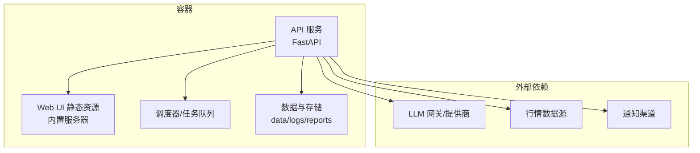
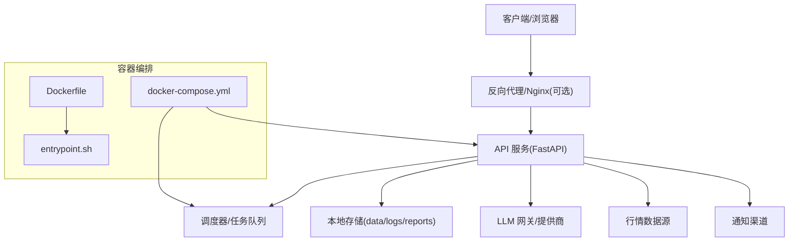
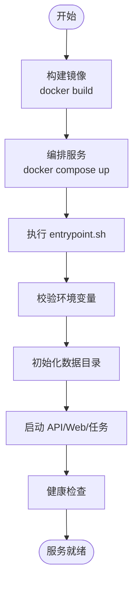
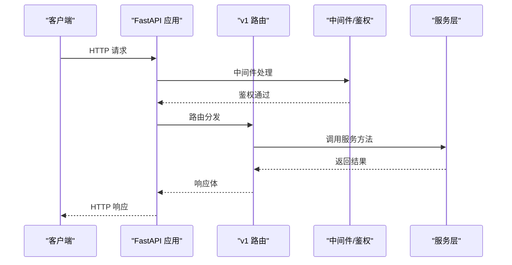
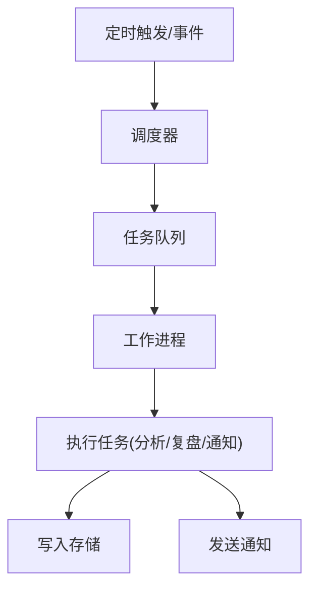
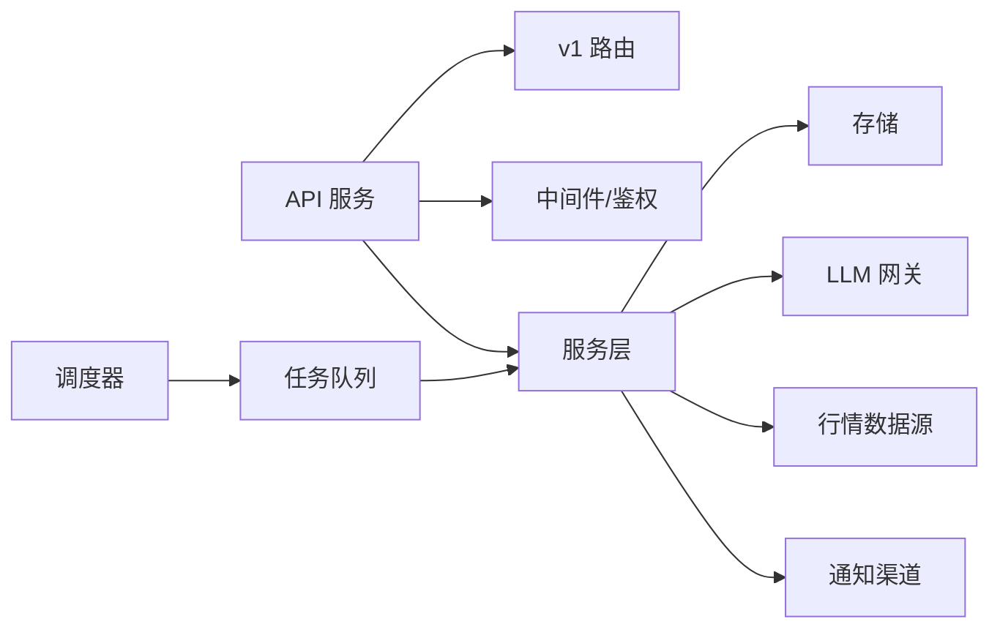

# 部署指南

<cite>
**本文引用的文件**   
- [Dockerfile](file://daily_stock_analysis/docker/Dockerfile)
- [docker-compose.yml](file://daily_stock_analysis/docker/docker-compose.yml)
- [entrypoint.sh](file://daily_stock_analysis/docker/entrypoint.sh)
- [DEPLOY.md](file://daily_stock_analysis/docs/DEPLOY.md)
- [DEPLOY_EN.md](file://daily_stock_analysis/docs/DEPLOY_EN.md)
- [full-guide.md](file://daily_stock_analysis/docs/full-guide.md)
- [deploy-webui-cloud.md](file://daily_stock_analysis/docs/deploy-webui-cloud.md)
- [zeabur-deployment.md](file://daily_stock_analysis/docs/docker/zeabur-deployment.md)
- [pyproject.toml](file://daily_stock_analysis/pyproject.toml)
- [requirements.txt](file://daily_stock_analysis/requirements.txt)
- [main.py](file://daily_stock_analysis/main.py)
- [server.py](file://daily_stock_analysis/server.py)
- [webui.py](file://daily_stock_analysis/webui.py)
- [app.py](file://daily_stock_analysis/api/app.py)
- [router.py](file://daily_stock_analysis/api/v1/router.py)
- [config_manager.py](file://daily_stock_analysis/src/core/config_manager.py)
- [logging_config.py](file://daily_stock_analysis/src/logging_config.py)
- [scheduler.py](file://daily_stock_analysis/src/scheduler.py)
- [runtime_scheduler_service.py](file://daily_stock_analysis/src/services/runtime_scheduler_service.py)
- [task_queue.py](file://daily_stock_analysis/src/services/task_queue.py)
- [storage.py](file://daily_stock_analysis/src/storage.py)
- [market_review_runtime.py](file://daily_stock_analysis/src/core/market_review_runtime.py)
- [run_diagnostics_p1.md](file://daily_stock_analysis/docs/run-diagnostics-p1.md)
- [run-diagnostics-p2.md](file://daily_stock_analysis/docs/run-diagnostics-p2.md)
- [.github/workflows/ci.yml](file://daily_stock_analysis/.github/workflows/ci.yml)
- [.github/workflows/release.yml](file://daily_stock_analysis/.github/workflows/release.yml)
- [ci_gate.sh](file://daily_stock_analysis/scripts/ci_gate.sh)
</cite>

## 目录
1. [简介](#简介)
2. [项目结构](#项目结构)
3. [核心组件](#核心组件)
4. [架构总览](#架构总览)
5. [详细组件分析](#详细组件分析)
6. [依赖关系分析](#依赖关系分析)
7. [性能考量](#性能考量)
8. [故障排查指南](#故障排查指南)
9. [结论](#结论)
10. [附录](#附录)

## 简介
本指南面向生产环境，提供 Daily Stock Analysis 的完整容器化部署方案。内容涵盖镜像构建、容器编排、服务依赖管理、单机与集群/云原生部署、监控与日志、备份与灾难恢复、以及自动化与持续集成（GitHub Actions）等关键主题。文档以仓库现有配置为依据，确保可落地执行。

## 项目结构
Daily Stock Analysis 采用前后端分离与多进程架构：
- API 后端：基于 FastAPI，路由集中在 v1 模块，应用入口在 api/app.py。
- Web 前端：SPA 静态资源由后端统一托管，启动脚本见 webui.py。
- 后台任务与调度：包含定时任务、市场复盘、告警与队列处理。
- 数据与存储：本地缓存、报告与日志输出到 data/logs/reports 等目录。
- 容器化：Dockerfile 定义镜像，docker-compose.yml 编排服务，entrypoint.sh 负责启动。

图表来源
- [app.py](file://daily_stock_analysis/api/app.py)
- [router.py](file://daily_stock_analysis/api/v1/router.py)
- [scheduler.py](file://daily_stock_analysis/src/scheduler.py)
- [runtime_scheduler_service.py](file://daily_stock_analysis/src/services/runtime_scheduler_service.py)
- [storage.py](file://daily_stock_analysis/src/storage.py)

章节来源
- [Dockerfile](file://daily_stock_analysis/docker/Dockerfile)
- [docker-compose.yml](file://daily_stock_analysis/docker/docker-compose.yml)
- [entrypoint.sh](file://daily_stock_analysis/docker/entrypoint.sh)
- [app.py](file://daily_stock_analysis/api/app.py)
- [router.py](file://daily_stock_analysis/api/v1/router.py)
- [scheduler.py](file://daily_stock_analysis/src/scheduler.py)
- [runtime_scheduler_service.py](file://daily_stock_analysis/src/services/runtime_scheduler_service.py)
- [storage.py](file://daily_stock_analysis/src/storage.py)

## 核心组件
- 应用入口与路由
  - 主入口：main.py、server.py、webui.py 分别承担 CLI、服务端与 Web 前端打包/运行职责。
  - API 应用：api/app.py 初始化 FastAPI 应用，挂载中间件与路由；api/v1/router.py 聚合业务路由。
- 配置与运行时
  - 配置管理：src/core/config_manager.py 集中读取环境变量与配置文件。
  - 日志：src/logging_config.py 统一日志格式与输出目标。
- 调度与任务
  - 调度器：src/scheduler.py 与 src/services/runtime_scheduler_service.py 协同实现定时任务与事件驱动。
  - 任务队列：src/services/task_queue.py 提供异步任务处理能力。
- 数据存储
  - 存储抽象：src/storage.py 封装本地文件与缓存读写，配合 data 目录持久化。
  - 市场复盘：src/core/market_review_runtime.py 驱动每日复盘流程。

章节来源
- [main.py](file://daily_stock_analysis/main.py)
- [server.py](file://daily_stock_analysis/server.py)
- [webui.py](file://daily_stock_analysis/webui.py)
- [app.py](file://daily_stock_analysis/api/app.py)
- [router.py](file://daily_stock_analysis/api/v1/router.py)
- [config_manager.py](file://daily_stock_analysis/src/core/config_manager.py)
- [logging_config.py](file://daily_stock_analysis/src/logging_config.py)
- [scheduler.py](file://daily_stock_analysis/src/scheduler.py)
- [runtime_scheduler_service.py](file://daily_stock_analysis/src/services/runtime_scheduler_service.py)
- [task_queue.py](file://daily_stock_analysis/src/services/task_queue.py)
- [storage.py](file://daily_stock_analysis/src/storage.py)
- [market_review_runtime.py](file://daily_stock_analysis/src/core/market_review_runtime.py)

## 架构总览
系统以容器为核心单元，通过 docker-compose 编排 API、Web 与后台任务，外部依赖包括 LLM 网关、行情数据源与通知渠道。镜像构建由 Dockerfile 定义，启动脚本 entrypoint.sh 注入环境变量并拉起服务。

图表来源
- [docker-compose.yml](file://daily_stock_analysis/docker/docker-compose.yml)
- [Dockerfile](file://daily_stock_analysis/docker/Dockerfile)
- [entrypoint.sh](file://daily_stock_analysis/docker/entrypoint.sh)
- [app.py](file://daily_stock_analysis/api/app.py)

## 详细组件分析

### 容器镜像与编排
- 镜像构建
  - Dockerfile 定义基础镜像、依赖安装、代码复制与健康检查。
  - requirements.txt 与 pyproject.toml 声明 Python 依赖与元信息。
- 容器编排
  - docker-compose.yml 定义服务、端口映射、卷挂载与环境变量。
  - entrypoint.sh 负责校验环境变量、准备运行时目录并启动主进程。
- 典型命令
  - 构建镜像：docker build -t daily-stock-analysis .
  - 启动服务：docker compose up -d
  - 查看日志：docker compose logs -f
  - 停止服务：docker compose down

图表来源
- [Dockerfile](file://daily_stock_analysis/docker/Dockerfile)
- [docker-compose.yml](file://daily_stock_analysis/docker/docker-compose.yml)
- [entrypoint.sh](file://daily_stock_analysis/docker/entrypoint.sh)

章节来源
- [Dockerfile](file://daily_stock_analysis/docker/Dockerfile)
- [docker-compose.yml](file://daily_stock_analysis/docker/docker-compose.yml)
- [entrypoint.sh](file://daily_stock_analysis/docker/entrypoint.sh)
- [requirements.txt](file://daily_stock_analysis/requirements.txt)
- [pyproject.toml](file://daily_stock_analysis/pyproject.toml)

### API 与服务路由
- 应用初始化
  - api/app.py 创建 FastAPI 实例，注册中间件、错误处理器与路由。
  - api/v1/router.py 聚合各业务模块路由（如 stocks、analysis、backtest、alerts 等）。
- 依赖注入与鉴权
  - api/deps.py 提供依赖注入；api/middlewares/auth.py 实现鉴权逻辑。
- 健康检查
  - api/v1/endpoints/health.py 暴露健康检查接口。

图表来源
- [app.py](file://daily_stock_analysis/api/app.py)
- [router.py](file://daily_stock_analysis/api/v1/router.py)
- [auth.py](file://daily_stock_analysis/api/middlewares/auth.py)
- [error_handler.py](file://daily_stock_analysis/api/middlewares/error_handler.py)

章节来源
- [app.py](file://daily_stock_analysis/api/app.py)
- [router.py](file://daily_stock_analysis/api/v1/router.py)
- [auth.py](file://daily_stock_analysis/api/middlewares/auth.py)
- [error_handler.py](file://daily_stock_analysis/api/middlewares/error_handler.py)

### 调度与任务队列
- 调度器
  - src/scheduler.py 与 src/services/runtime_scheduler_service.py 共同实现定时任务与事件触发。
- 任务队列
  - src/services/task_queue.py 提供异步任务队列，支持并发与重试策略。
- 市场复盘
  - src/core/market_review_runtime.py 驱动每日市场复盘流程，结合存储与通知。

图表来源
- [scheduler.py](file://daily_stock_analysis/src/scheduler.py)
- [runtime_scheduler_service.py](file://daily_stock_analysis/src/services/runtime_scheduler_service.py)
- [task_queue.py](file://daily_stock_analysis/src/services/task_queue.py)
- [market_review_runtime.py](file://daily_stock_analysis/src/core/market_review_runtime.py)

章节来源
- [scheduler.py](file://daily_stock_analysis/src/scheduler.py)
- [runtime_scheduler_service.py](file://daily_stock_analysis/src/services/runtime_scheduler_service.py)
- [task_queue.py](file://daily_stock_analysis/src/services/task_queue.py)
- [market_review_runtime.py](file://daily_stock_analysis/src/core/market_review_runtime.py)

### 配置与日志
- 配置管理
  - src/core/config_manager.py 统一加载环境变量与配置文件，提供类型安全的配置访问。
- 日志配置
  - src/logging_config.py 设置日志级别、格式化与输出目标（控制台/文件），便于接入外部日志收集。

章节来源
- [config_manager.py](file://daily_stock_analysis/src/core/config_manager.py)
- [logging_config.py](file://daily_stock_analysis/src/logging_config.py)

### 存储与数据
- 存储抽象
  - src/storage.py 封装本地文件读写、缓存与报告生成路径。
- 数据目录
  - data/cache、logs、reports 等目录用于缓存、日志与报告输出，建议通过卷挂载持久化。

章节来源
- [storage.py](file://daily_stock_analysis/src/storage.py)

## 依赖关系分析
- 内部依赖
  - API 依赖路由、中间件、服务层与存储。
  - 调度器依赖任务队列与存储服务。
- 外部依赖
  - LLM 网关/提供商：通过环境变量配置，支持多种后端。
  - 行情数据源：通过数据抓取器模块获取市场数据。
  - 通知渠道：邮件、钉钉、飞书、Discord 等。

图表来源
- [app.py](file://daily_stock_analysis/api/app.py)
- [router.py](file://daily_stock_analysis/api/v1/router.py)
- [config_manager.py](file://daily_stock_analysis/src/core/config_manager.py)
- [storage.py](file://daily_stock_analysis/src/storage.py)

章节来源
- [app.py](file://daily_stock_analysis/api/app.py)
- [router.py](file://daily_stock_analysis/api/v1/router.py)
- [config_manager.py](file://daily_stock_analysis/src/core/config_manager.py)
- [storage.py](file://daily_stock_analysis/src/storage.py)

## 性能考量
- 容器资源限制
  - 在 docker-compose.yml 中为 API 与任务进程设置 CPU/内存上限，避免争用。
- 并发与队列
  - 调整任务队列并发度与超时参数，平衡吞吐与延迟。
- I/O 优化
  - 将 data/logs/reports 挂载到高性能磁盘或网络存储，减少 I/O 瓶颈。
- 缓存策略
  - 合理设置缓存过期时间，降低重复计算与外部 API 调用压力。

[本节为通用指导，不直接分析具体文件]

## 故障排查指南
- 常见问题定位
  - 使用诊断文档 run-diagnostics-p1.md 与 run-diagnostics-p2.md 进行环境与依赖自检。
- 日志收集
  - 通过 logging_config.py 统一日志格式，结合容器日志采集工具（如 filebeat、fluent-bit）汇聚至 ELK/Loki。
- 健康检查
  - 通过 health 端点验证服务状态，结合编排平台探针实现自动重启。
- 依赖连通性
  - 校验 LLM、行情数据源与通知渠道的环境变量与网络可达性。

章节来源
- [run-diagnostics-p1.md](file://daily_stock_analysis/docs/run-diagnostics-p1.md)
- [run-diagnostics-p2.md](file://daily_stock_analysis/docs/run-diagnostics-p2.md)
- [logging_config.py](file://daily_stock_analysis/src/logging_config.py)
- [app.py](file://daily_stock_analysis/api/app.py)

## 结论
Daily Stock Analysis 的容器化部署以 Dockerfile 与 docker-compose 为核心，结合统一的配置与日志管理，能够灵活支撑单机与集群/云原生场景。通过合理的资源规划、监控与备份策略，可实现高可用与业务连续性保障。

[本节为总结性内容，不直接分析具体文件]

## 附录

### 生产环境配置要求
- 服务器规格
  - CPU：根据并发与任务量评估，建议至少 2-4 核。
  - 内存：建议 4-8 GB，视缓存与任务规模调整。
  - 磁盘：SSD 优先，容量按日志与报告增长预留。
- 网络配置
  - 开放 API 端口（默认 8000），如需 HTTPS 通过反向代理（Nginx/Traefik）终止 TLS。
  - 允许对外访问 LLM 与行情数据源域名。
- 存储规划
  - 使用卷挂载 data/logs/reports，定期归档与清理。
  - 数据库（如有）独立持久化卷，遵循备份策略。

章节来源
- [docker-compose.yml](file://daily_stock_analysis/docker/docker-compose.yml)
- [storage.py](file://daily_stock_analysis/src/storage.py)

### 部署方案实施
- 单机部署
  - 使用 docker compose 启动单节点服务，适合小规模或个人使用。
- 集群部署
  - 使用 Kubernetes 或 Swarm 编排多副本，结合 Ingress 与 HPA 实现弹性伸缩。
- 云原生部署
  - 参考 deploy-webui-cloud.md 与 zeabur-deployment.md 进行云平台一键部署。

章节来源
- [DEPLOY.md](file://daily_stock_analysis/docs/DEPLOY.md)
- [DEPLOY_EN.md](file://daily_stock_analysis/docs/DEPLOY_EN.md)
- [full-guide.md](file://daily_stock_analysis/docs/full-guide.md)
- [deploy-webui-cloud.md](file://daily_stock_analysis/docs/deploy-webui-cloud.md)
- [zeabur-deployment.md](file://daily_stock_analysis/docs/docker/zeabur-deployment.md)

### 监控与日志收集
- Prometheus 集成
  - 暴露 /metrics 端点（如适用），通过 prometheus 抓取指标。
- 日志聚合
  - 使用 filebeat/fluent-bit 采集容器日志，推送至 Elasticsearch/Loki。
- 告警规则
  - 基于指标阈值（CPU、内存、错误率）与业务指标（任务失败率）设置告警。

[本节为通用指导，不直接分析具体文件]

### 备份与灾难恢复
- 数据备份
  - 定期快照 data/logs/reports 与数据库（如有），保留策略按合规要求设定。
- 服务恢复
  - 通过 docker compose/k8s 快速重建服务，从备份恢复数据。
- 业务连续性
  - 多副本部署与跨可用区容灾，结合健康检查与自动切换。

[本节为通用指导，不直接分析具体文件]

### 部署自动化与持续集成
- GitHub Actions
  - ci.yml 定义 CI 流水线（测试、构建、发布）。
  - release.yml 定义发布流程（打标签、生成制品）。
- 脚本与门禁
  - scripts/ci_gate.sh 作为 CI 门禁脚本，确保质量与一致性。

章节来源
- [.github/workflows/ci.yml](file://daily_stock_analysis/.github/workflows/ci.yml)
- [.github/workflows/release.yml](file://daily_stock_analysis/.github/workflows/release.yml)
- [ci_gate.sh](file://daily_stock_analysis/scripts/ci_gate.sh)