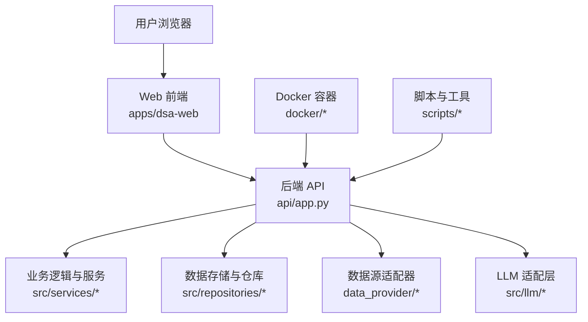
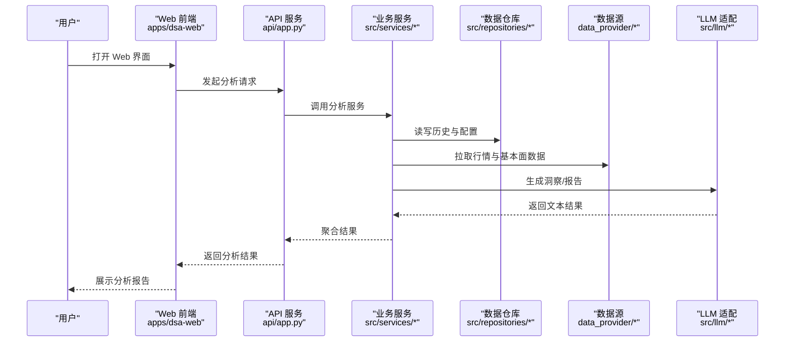
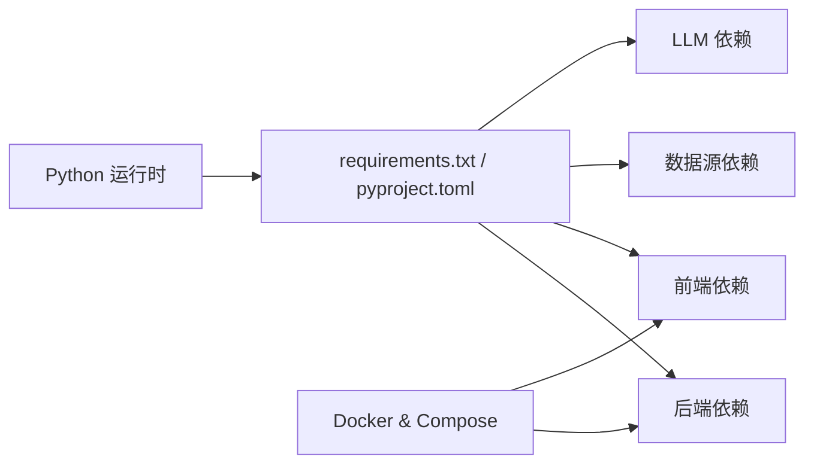

# 快速开始

<cite>
**本文引用的文件**   
- [README.md](file://README.md)
- [pyproject.toml](file://pyproject.toml)
- [requirements.txt](file://requirements.txt)
- [main.py](file://main.py)
- [server.py](file://server.py)
- [webui.py](file://webui.py)
- [docker/Dockerfile](file://docker/Dockerfile)
- [docker/docker-compose.yml](file://docker/docker-compose.yml)
- [docker/entrypoint.sh](file://docker/entrypoint.sh)
- [api/app.py](file://api/app.py)
- [src/config.py](file://src/config.py)
- [scripts/check_env.py](file://scripts/check_env.py)
- [tests/test_api_health.py](file://tests/test_api_health.py)
</cite>

## 目录
1. [简介](#简介)
2. [项目结构](#项目结构)
3. [核心组件](#核心组件)
4. [架构总览](#架构总览)
5. [详细组件分析](#详细组件分析)
6. [依赖关系分析](#依赖关系分析)
7. [性能注意事项](#性能注意事项)
8. [故障排除指南](#故障排除指南)
9. [结论](#结论)
10. [附录](#附录)

## 简介
本快速开始指南帮助你在最短时间内完成 Daily Stock Analysis 的环境准备、本地开发环境搭建与 Docker 容器化部署，并给出首次使用流程、验证方法与常见问题排查。你将学会：
- 确认 Python 版本与系统依赖
- 克隆代码、安装依赖、初始化数据库
- 通过 Docker Compose 一键启动服务
- 访问 Web 界面并完成一次股票分析
- 验证安装成功并进行基础调试

## 项目结构
Daily Stock Analysis 采用前后端分离与多语言混合架构：
- 后端 API（FastAPI）位于 api/ 与 src/
- Web 前端位于 apps/dsa-web/
- 桌面客户端位于 apps/dsa-desktop/
- 机器人模块位于 bot/
- 数据源适配层位于 data_provider/
- 配置与脚本位于 scripts/
- 容器化配置位于 docker/

图表来源
- [api/app.py](file://api/app.py)
- [docker/docker-compose.yml](file://docker/docker-compose.yml)
- [docker/Dockerfile](file://docker/Dockerfile)

章节来源
- [README.md](file://README.md)
- [pyproject.toml](file://pyproject.toml)
- [requirements.txt](file://requirements.txt)

## 核心组件
- 后端入口与路由：api/app.py 负责 FastAPI 应用装配、中间件与路由注册
- 配置管理：src/config.py 集中读取环境变量与配置文件
- 健康检查与测试：tests/test_api_health.py 提供健康检查用例
- 环境检查脚本：scripts/check_env.py 用于校验运行环境与依赖

章节来源
- [api/app.py](file://api/app.py)
- [src/config.py](file://src/config.py)
- [scripts/check_env.py](file://scripts/check_env.py)
- [tests/test_api_health.py](file://tests/test_api_health.py)

## 架构总览
下图展示从 Web 前端到后端 API、再到数据源与 LLM 的调用链路，以及 Docker 容器化部署的关键节点。

图表来源
- [api/app.py](file://api/app.py)
- [src/services/*](file://src/services/)
- [src/repositories/*](file://src/repositories/)
- [data_provider/*](file://data_provider/)
- [src/llm/*](file://src/llm/)

## 详细组件分析

### 环境准备与依赖
- Python 版本要求与依赖声明见 pyproject.toml 与 requirements.txt
- 系统依赖通常包括：Python 解释器、包管理器（pip/pipenv/uv）、可选的构建工具（如 gcc、python-dev）
- 建议创建虚拟环境以避免冲突

章节来源
- [pyproject.toml](file://pyproject.toml)
- [requirements.txt](file://requirements.txt)

### 本地开发环境搭建
步骤概览：
1. 克隆仓库
2. 创建并激活虚拟环境
3. 安装 Python 依赖
4. 初始化数据库（根据项目提供的迁移或初始化脚本）
5. 配置环境变量（如 LLM 提供商密钥、数据源凭据等）
6. 启动后端与前端服务

关键入口：
- 后端主入口：main.py、server.py
- Web 前端：apps/dsa-web（Vite + React）
- 桌面客户端：apps/dsa-desktop（Electron）

章节来源
- [main.py](file://main.py)
- [server.py](file://server.py)
- [webui.py](file://webui.py)

### Docker 容器化部署
- 使用 docker/Dockerfile 构建镜像
- 使用 docker/docker-compose.yml 编排服务（后端、数据库、缓存等）
- entrypoint.sh 作为容器启动入口，执行初始化与健康检查

常用命令：
- 构建与启动：docker compose up --build -d
- 查看日志：docker compose logs -f
- 停止服务：docker compose down

章节来源
- [docker/Dockerfile](file://docker/Dockerfile)
- [docker/docker-compose.yml](file://docker/docker-compose.yml)
- [docker/entrypoint.sh](file://docker/entrypoint.sh)

### 基本使用流程
- 启动服务后，访问 Web 界面（默认端口以配置为准）
- 在“股票分析”页面输入股票代码或名称
- 选择时间窗口与分析策略
- 提交任务并等待结果
- 查看生成的分析报告与可视化图表

章节来源
- [api/app.py](file://api/app.py)
- [src/config.py](file://src/config.py)

### 验证安装成功与调试技巧
- 健康检查接口：可通过 tests/test_api_health.py 中的用例进行验证
- 环境检查：运行 scripts/check_env.py 检查依赖与环境变量
- 日志定位：查看后端日志与容器日志，定位错误堆栈
- 网络连通性：确保数据源与 LLM 服务的网络可达

章节来源
- [tests/test_api_health.py](file://tests/test_api_health.py)
- [scripts/check_env.py](file://scripts/check_env.py)

## 依赖关系分析
- 后端依赖：FastAPI、Pydantic、SQLAlchemy（若使用）、HTTP 客户端库、LLM SDK
- 前端依赖：React、Vite、TailwindCSS、TypeScript
- 数据源依赖：yfinance、akshare、tushare、baostock、efinance 等（按启用情况）
- 容器依赖：Docker、docker-compose

图表来源
- [requirements.txt](file://requirements.txt)
- [pyproject.toml](file://pyproject.toml)
- [docker/docker-compose.yml](file://docker/docker-compose.yml)

章节来源
- [requirements.txt](file://requirements.txt)
- [pyproject.toml](file://pyproject.toml)
- [docker/docker-compose.yml](file://docker/docker-compose.yml)

## 性能注意事项
- 合理设置并发与线程池，避免阻塞 I/O
- 对数据拉取与 LLM 调用进行缓存与重试
- 使用异步处理提升吞吐
- 监控资源使用（CPU、内存、磁盘、网络）

[本节为通用指导，不直接分析具体文件]

## 故障排除指南
常见问题与解决思路：
- 端口占用：修改端口或释放占用进程
- 依赖缺失：重新安装依赖，检查 Python 版本
- 环境变量未生效：检查 .env 或系统环境变量加载顺序
- 数据源不可用：检查网络与凭据，切换备用数据源
- LLM 调用失败：检查密钥与配额，查看限流与错误码
- 数据库连接失败：检查连接串、权限与防火墙

章节来源
- [scripts/check_env.py](file://scripts/check_env.py)
- [tests/test_api_health.py](file://tests/test_api_health.py)

## 结论
通过以上步骤，你可以在本地或容器中快速搭建 Daily Stock Analysis 的运行环境，完成首次股票分析体验。遇到问题时，优先检查环境、依赖、网络与日志，逐步定位并解决。

[本节为总结，不直接分析具体文件]

## 附录
- 参考文档：README.md、DEPLOY.md、FAQ.md
- 示例配置：examples/ 下的 litellm_config.example.yaml
- 贡献指南：CONTRIBUTING.md

章节来源
- [README.md](file://README.md)
- [docs/DEPLOY.md](file://docs/DEPLOY.md)
- [docs/FAQ.md](file://docs/FAQ.md)
- [docs/examples/litellm_config.example.yaml](file://docs/examples/litellm_config.example.yaml)
- [docs/CONTRIBUTING.md](file://docs/CONTRIBUTING.md)