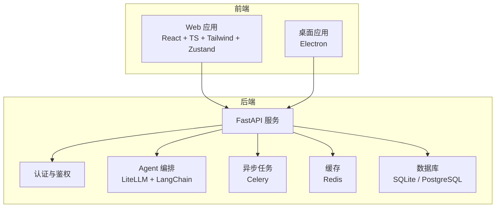
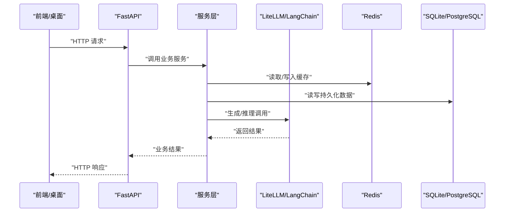
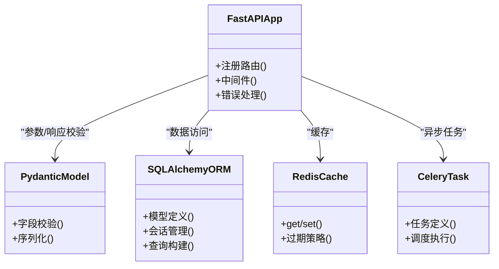
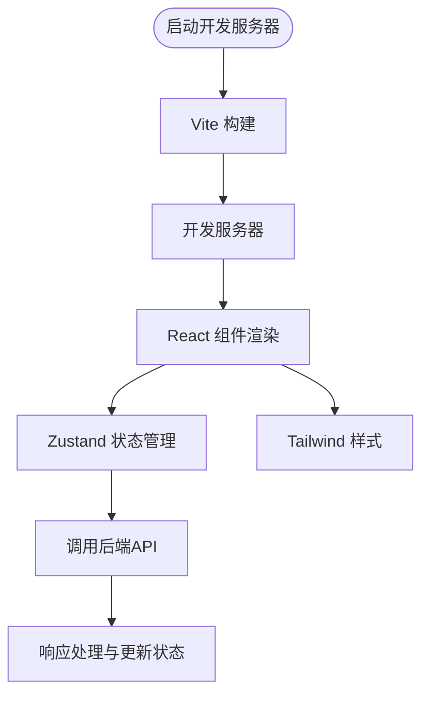
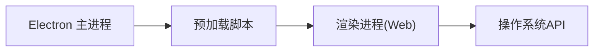
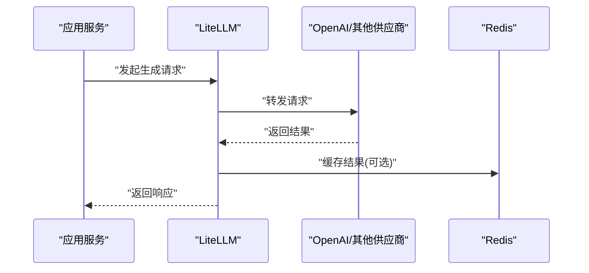
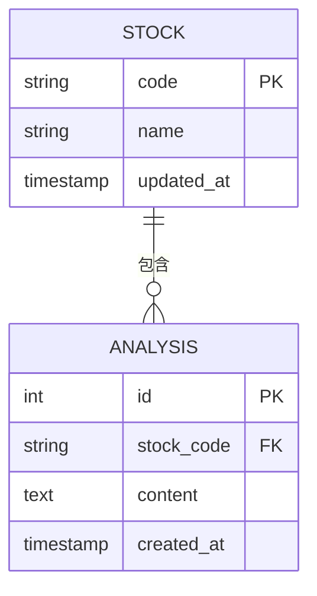

# 技术栈概览

<cite>
**本文引用的文件**   
- [pyproject.toml](file://pyproject.toml)
- [requirements.txt](file://requirements.txt)
- [main.py](file://main.py)
- [server.py](file://server.py)
- [api/app.py](file://api/app.py)
- [api/v1/router.py](file://api/v1/router.py)
- [src/config.py](file://src/config.py)
- [src/storage.py](file://src/storage.py)
- [src/llm/litellm_backend.py](file://src/llm/litellm_backend.py)
- [src/llm/backend_factory.py](file://src/llm/backend_factory.py)
- [src/services/task_queue.py](file://src/services/task_queue.py)
- [apps/dsa-web/package.json](file://apps/dsa-web/package.json)
- [apps/dsa-web/vite.config.ts](file://apps/dsa-web/vite.config.ts)
- [apps/dsa-desktop/package.json](file://apps/dsa-desktop/package.json)
- [apps/dsa-desktop/main.js](file://apps/dsa-desktop/main.js)
- [docker/docker-compose.yml](file://docker/docker-compose.yml)
</cite>

## 目录
1. [简介](#简介)
2. [项目结构](#项目结构)
3. [核心组件](#核心组件)
4. [架构总览](#架构总览)
5. [详细组件分析](#详细组件分析)
6. [依赖关系与兼容性](#依赖关系与兼容性)
7. [性能考量](#性能考量)
8. [故障排查指南](#故障排查指南)
9. [结论](#结论)
10. [附录](#附录)

## 简介
本技术栈概览面向Daily Stock Analysis项目的后端、前端、桌面应用以及AI/ML与数据层，系统性梳理Python/FastAPI、Pydantic、SQLAlchemy、Redis、Celery、React/TypeScript/Tailwind/Zustand/Vite、Electron、LiteLLM/LangChain/OpenAI、SQLite/PostgreSQL等关键技术与选型原因，并给出版本兼容性与依赖关系说明。文档旨在帮助开发者快速理解系统边界、模块职责与集成点，便于扩展与维护。

## 项目结构
- 后端服务：基于FastAPI的REST API，使用Pydantic进行请求/响应校验，SQLAlchemy作为ORM，SQLite默认存储，可选PostgreSQL；通过Redis缓存热点数据，Celery处理异步任务（如定时市场复盘、通知推送）。
- 前端Web：React + TypeScript + Tailwind CSS + Zustand状态管理，Vite构建与开发服务器。
- 桌面应用：Electron封装Web前端，提供原生系统集成能力。
- AI/ML：LiteLLM统一接口抽象多模型供应商，LangChain编排Agent工作流，OpenAI等外部API接入。
- 数据层：SQLite用于本地轻量存储，PostgreSQL用于生产级持久化；Redis用于缓存与消息队列支撑。

**图示来源** 
- [api/app.py](file://api/app.py)
- [apps/dsa-web/package.json](file://apps/dsa-web/package.json)
- [apps/dsa-desktop/package.json](file://apps/dsa-desktop/package.json)
- [src/llm/litellm_backend.py](file://src/llm/litellm_backend.py)
- [src/services/task_queue.py](file://src/services/task_queue.py)
- [src/storage.py](file://src/storage.py)

**章节来源**
- [api/app.py](file://api/app.py)
- [apps/dsa-web/package.json](file://apps/dsa-web/package.json)
- [apps/dsa-desktop/package.json](file://apps/dsa-desktop/package.json)

## 核心组件
- FastAPI应用入口与路由组织：集中注册API路由、中间件与错误处理，保证一致的请求生命周期。
- Pydantic数据模型：前后端共享的数据契约，确保输入输出强类型校验与序列化一致性。
- SQLAlchemy ORM：定义数据模型与关系，支持SQLite与PostgreSQL双后端。
- Redis缓存：热点行情、配置与计算结果缓存，降低数据库压力。
- Celery异步任务：长耗时任务（如批量拉取、复盘生成、通知）解耦主线程。
- LiteLLM统一接口：屏蔽不同LLM供应商差异，实现路由、重试与用量统计。
- LangChain编排：将工具、记忆与策略组合为可复用的Agent流程。
- Web前端：模块化组件与状态管理，提供交互式分析与可视化。
- Electron桌面：打包Web应用并提供原生能力（文件系统、通知等）。

**章节来源**
- [api/app.py](file://api/app.py)
- [api/v1/router.py](file://api/v1/router.py)
- [src/config.py](file://src/config.py)
- [src/storage.py](file://src/storage.py)
- [src/llm/litellm_backend.py](file://src/llm/litellm_backend.py)
- [src/llm/backend_factory.py](file://src/llm/backend_factory.py)
- [src/services/task_queue.py](file://src/services/task_queue.py)

## 架构总览
后端以FastAPI为核心，对外暴露REST API；内部通过服务层与仓储层分离业务逻辑与数据访问；AI能力由LiteLLM与LangChain驱动；缓存与异步任务分别由Redis与Celery承担；数据库采用SQLite或PostgreSQL。

**图示来源** 
- [api/app.py](file://api/app.py)
- [src/llm/litellm_backend.py](file://src/llm/litellm_backend.py)
- [src/storage.py](file://src/storage.py)

## 详细组件分析

### 后端技术栈（Python + FastAPI + Pydantic + SQLAlchemy + Redis + Celery）
- FastAPI：高性能异步框架，自动OpenAPI文档，适合金融数据分析场景的高并发I/O。
- Pydantic：强类型数据校验与序列化，保障API契约稳定。
- SQLAlchemy：声明式ORM，支持多数据库后端，便于从SQLite平滑迁移到PostgreSQL。
- Redis：低延迟缓存与键值存储，提升热点数据访问性能。
- Celery：分布式任务队列，解耦耗时操作，提高服务可用性。

**图示来源** 
- [api/app.py](file://api/app.py)
- [src/storage.py](file://src/storage.py)
- [src/services/task_queue.py](file://src/services/task_queue.py)

**章节来源**
- [api/app.py](file://api/app.py)
- [src/storage.py](file://src/storage.py)
- [src/services/task_queue.py](file://src/services/task_queue.py)

### 前端技术栈（React + TypeScript + Tailwind CSS + Zustand + Vite）
- React + TypeScript：组件化UI与类型安全，提升可维护性。
- Tailwind CSS：原子化样式，快速构建一致界面。
- Zustand：轻量状态管理，简化跨组件状态同步。
- Vite：极速开发与构建，支持现代前端工程化。

**图示来源** 
- [apps/dsa-web/vite.config.ts](file://apps/dsa-web/vite.config.ts)
- [apps/dsa-web/package.json](file://apps/dsa-web/package.json)

**章节来源**
- [apps/dsa-web/package.json](file://apps/dsa-web/package.json)
- [apps/dsa-web/vite.config.ts](file://apps/dsa-web/vite.config.ts)

### 桌面应用技术栈（Electron）
- Electron：将Web前端打包为桌面应用，提供原生系统集成能力（如通知、文件访问）。
- 主进程与渲染进程分离，确保安全与性能。

**图示来源** 
- [apps/dsa-desktop/main.js](file://apps/dsa-desktop/main.js)
- [apps/dsa-desktop/package.json](file://apps/dsa-desktop/package.json)

**章节来源**
- [apps/dsa-desktop/package.json](file://apps/dsa-desktop/package.json)
- [apps/dsa-desktop/main.js](file://apps/dsa-desktop/main.js)

### AI/ML技术栈（LiteLLM + LangChain + OpenAI）
- LiteLLM：统一多模型接口，支持路由、重试、用量统计与成本优化。
- LangChain：编排Agent工作流，整合工具、记忆与策略。
- OpenAI：作为主要LLM供应商之一，提供高质量文本生成与推理。

**图示来源** 
- [src/llm/litellm_backend.py](file://src/llm/litellm_backend.py)
- [src/llm/backend_factory.py](file://src/llm/backend_factory.py)

**章节来源**
- [src/llm/litellm_backend.py](file://src/llm/litellm_backend.py)
- [src/llm/backend_factory.py](file://src/llm/backend_factory.py)

### 数据库技术（SQLite + PostgreSQL）
- SQLite：默认嵌入式数据库，适合本地开发与轻量部署。
- PostgreSQL：生产级关系型数据库，支持高并发与复杂查询。
- SQLAlchemy：抽象数据库差异，便于切换后端。

**图示来源** 
- [src/storage.py](file://src/storage.py)

**章节来源**
- [src/storage.py](file://src/storage.py)

### 消息队列与缓存机制的选择原因
- Redis：低延迟、内存存储，适合缓存热点数据与简单队列场景。
- Celery：成熟的任务队列，支持重试、监控与分布式扩展。
- 选择理由：在保证性能的同时，降低系统复杂度，便于运维与扩展。

**章节来源**
- [src/services/task_queue.py](file://src/services/task_queue.py)

## 依赖关系与兼容性
- Python生态：FastAPI、Pydantic、SQLAlchemy、Redis、Celery等库的版本需与Python版本兼容。
- 前端生态：React、TypeScript、Tailwind、Zustand、Vite需保持版本协同，避免构建冲突。
- AI生态：LiteLLM与LangChain需与所选LLM供应商SDK兼容。
- 数据库：SQLite与PostgreSQL驱动需与SQLAlchemy版本匹配。

建议参考以下配置文件获取精确依赖与版本信息：
- 后端依赖：[pyproject.toml](file://pyproject.toml)、[requirements.txt](file://requirements.txt)
- 前端依赖：[apps/dsa-web/package.json](file://apps/dsa-web/package.json)
- 桌面依赖：[apps/dsa-desktop/package.json](file://apps/dsa-desktop/package.json)
- 容器编排：[docker/docker-compose.yml](file://docker/docker-compose.yml)

**章节来源**
- [pyproject.toml](file://pyproject.toml)
- [requirements.txt](file://requirements.txt)
- [apps/dsa-web/package.json](file://apps/dsa-web/package.json)
- [apps/dsa-desktop/package.json](file://apps/dsa-desktop/package.json)
- [docker/docker-compose.yml](file://docker/docker-compose.yml)

## 性能考量
- 缓存优先：热点数据（如实时行情、配置）优先从Redis读取，减少数据库压力。
- 异步处理：长耗时任务（如批量拉取、报告生成）通过Celery异步执行，提升响应速度。
- 连接池：数据库与Redis连接池配置需根据负载调优。
- 前端优化：代码分割、懒加载与静态资源缓存提升首屏性能。

[本节为通用指导，无需特定文件引用]

## 故障排查指南
- API错误：检查FastAPI中间件与错误处理器日志，确认Pydantic校验失败原因。
- 数据库问题：验证连接字符串、驱动版本与表结构迁移状态。
- 缓存异常：检查Redis连通性与键过期策略。
- 任务失败：查看Celery Worker日志，确认任务依赖与重试策略。
- AI调用失败：检查LiteLLM配置与供应商密钥，确认速率限制与配额。

**章节来源**
- [api/app.py](file://api/app.py)
- [src/storage.py](file://src/storage.py)
- [src/services/task_queue.py](file://src/services/task_queue.py)
- [src/llm/litellm_backend.py](file://src/llm/litellm_backend.py)

## 结论
Daily Stock Analysis项目采用现代化技术栈，兼顾性能、可扩展性与可维护性。后端以FastAPI为核心，结合Pydantic、SQLAlchemy、Redis与Celery构建稳健服务；前端与桌面应用提供丰富交互体验；AI能力通过LiteLLM与LangChain灵活集成多模型供应商。建议在部署时严格遵循依赖版本约束，并根据负载调优缓存与任务队列配置。

[本节为总结性内容，无需特定文件引用]

## 附录
- 环境变量与配置：参考项目根目录与src/config.py中的配置项。
- 部署指南：参考docker/docker-compose.yml与相关文档。
- 开发环境：确保Python、Node.js与包管理器版本满足要求。

**章节来源**
- [src/config.py](file://src/config.py)
- [docker/docker-compose.yml](file://docker/docker-compose.yml)