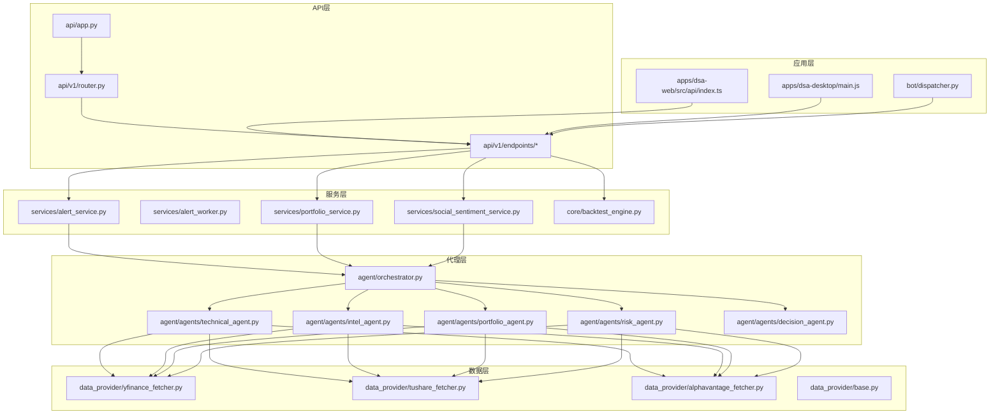
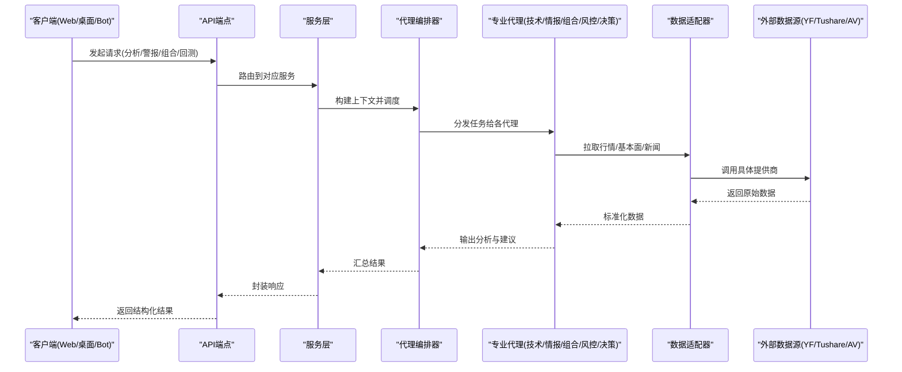
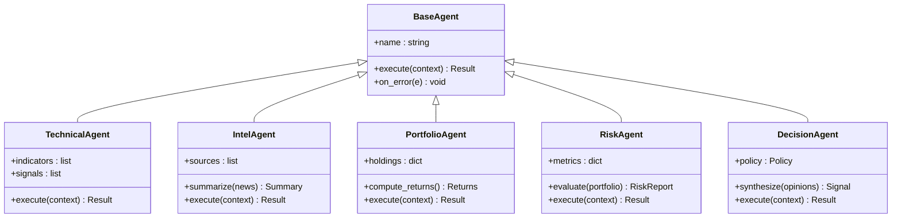
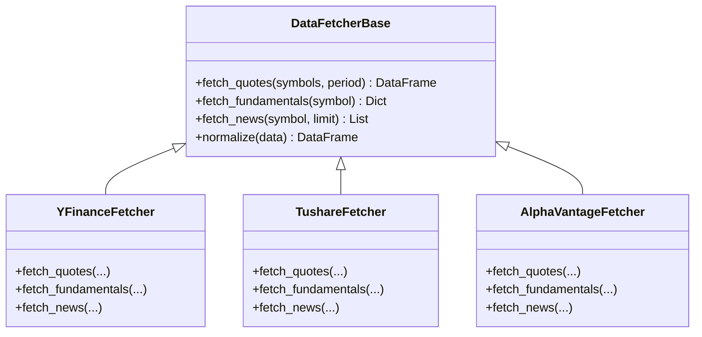
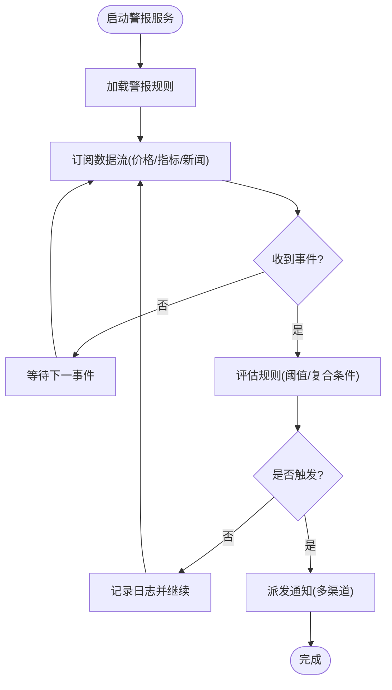
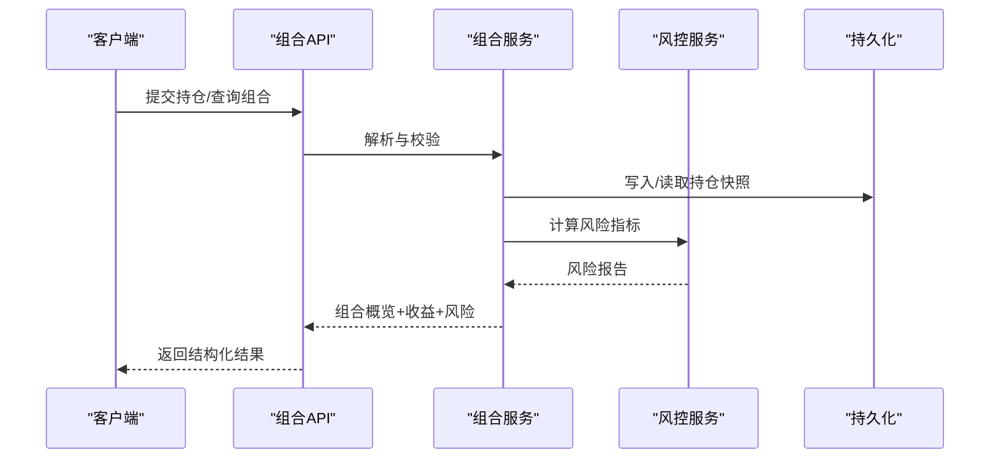
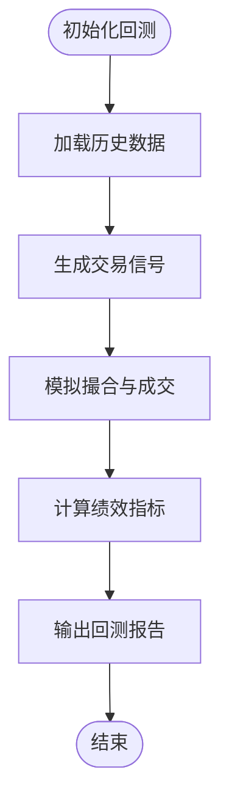
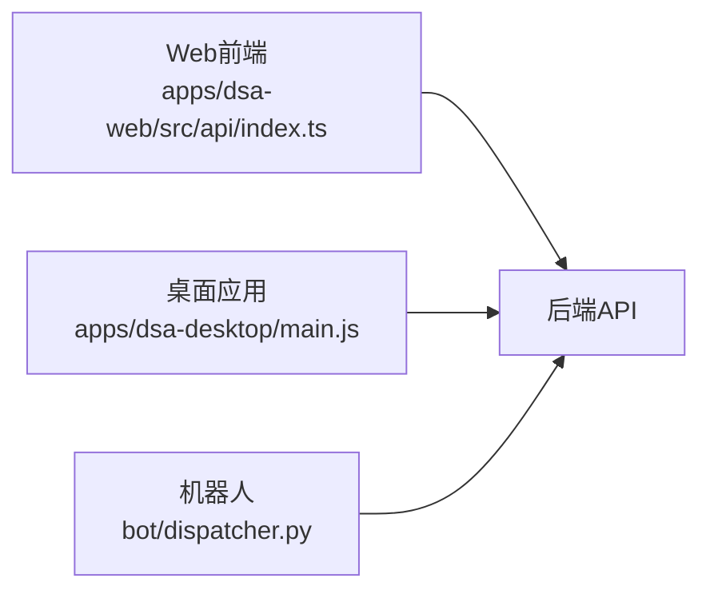
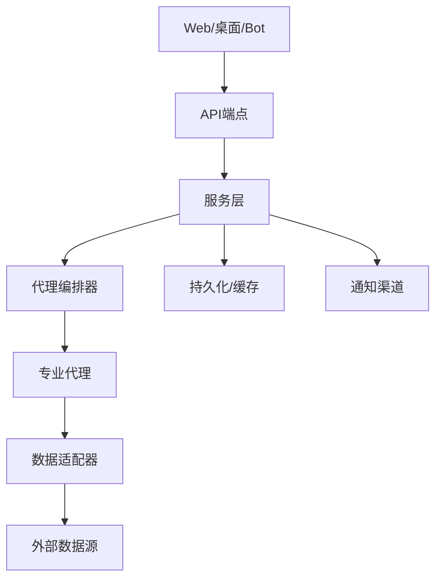

# 核心功能特性

<cite>
**本文引用的文件**   
- [main.py](file://main.py)
- [server.py](file://server.py)
- [api/app.py](file://api/app.py)
- [api/v1/router.py](file://api/v1/router.py)
- [src/agent/orchestrator.py](file://src/agent/orchestrator.py)
- [src/agent/agents/base_agent.py](file://src/agent/agents/base_agent.py)
- [src/agent/agents/technical_agent.py](file://src/agent/agents/technical_agent.py)
- [src/agent/agents/intel_agent.py](file://src/agent/agents/intel_agent.py)
- [src/agent/agents/portfolio_agent.py](file://src/agent/agents/portfolio_agent.py)
- [src/agent/agents/risk_agent.py](file://src/agent/agents/risk_agent.py)
- [src/agent/agents/decision_agent.py](file://src/agent/agents/decision_agent.py)
- [src/agent/tools/data_tools.py](file://src/agent/tools/data_tools.py)
- [src/agent/tools/backtest_tools.py](file://src/agent/tools/backtest_tools.py)
- [src/core/backtest_engine.py](file://src/core/backtest_engine.py)
- [data_provider/yfinance_fetcher.py](file://data_provider/yfinance_fetcher.py)
- [data_provider/tushare_fetcher.py](file://data_provider/tushare_fetcher.py)
- [data_provider/alphavantage_fetcher.py](file://data_provider/alphavantage_fetcher.py)
- [data_provider/base.py](file://data_provider/base.py)
- [src/services/alert_service.py](file://src/services/alert_service.py)
- [src/services/alert_worker.py](file://src/services/alert_worker.py)
- [src/services/alert_indicators.py](file://src/services/alert_indicators.py)
- [src/services/social_sentiment_service.py](file://src/services/social_sentiment_service.py)
- [src/services/portfolio_service.py](file://src/services/portfolio_service.py)
- [src/services/portfolio_risk_service.py](file://src/services/portfolio_risk_service.py)
- [api/v1/endpoints/alerts.py](file://api/v1/endpoints/alerts.py)
- [api/v1/endpoints/portfolio.py](file://api/v1/endpoints/portfolio.py)
- [api/v1/endpoints/backtest.py](file://api/v1/endpoints/backtest.py)
- [apps/dsa-web/src/api/index.ts](file://apps/dsa-web/src/api/index.ts)
- [apps/dsa-desktop/main.js](file://apps/dsa-desktop/main.js)
- [bot/dispatcher.py](file://bot/dispatcher.py)
</cite>

## 目录
1. [简介](#简介)
2. [项目结构](#项目结构)
3. [核心组件](#核心组件)
4. [架构总览](#架构总览)
5. [详细组件分析](#详细组件分析)
6. [依赖关系分析](#依赖关系分析)
7. [性能考量](#性能考量)
8. [故障排查指南](#故障排查指南)
9. [结论](#结论)
10. [附录](#附录)

## 简介
本文件面向Daily Stock Analysis项目的核心功能特性，聚焦以下方面：
- 智能分析引擎的多代理协作架构（技术分析、基本面情报、情绪分析、组合与风控等）
- 多数据源集成能力（YFinance、Tushare、Alpha Vantage等统一接口）
- 实时监控与警报系统（价格监控、技术指标触发、新闻情感分析）
- 投资组合管理（持仓跟踪、风险评估、收益计算）
- 策略回测引擎的架构与性能优化
- 多平台用户界面（Web应用、桌面应用、机器人聊天界面）

## 项目结构
项目采用分层模块化设计：
- API层：FastAPI路由与端点，提供REST接口
- 服务层：业务编排与领域服务（警报、组合、回测、社会情绪等）
- 代理层：多代理协作（技术、情报、组合、风控、决策）
- 数据层：数据获取器（多数据源）、存储与索引
- 应用层：Web前端、Electron桌面、Bot机器人
- 核心引擎：回测引擎、市场日历、管道等

图表来源 
- [api/app.py](file://api/app.py)
- [api/v1/router.py](file://api/v1/router.py)
- [src/agent/orchestrator.py](file://src/agent/orchestrator.py)
- [src/core/backtest_engine.py](file://src/core/backtest_engine.py)
- [data_provider/base.py](file://data_provider/base.py)
- [apps/dsa-web/src/api/index.ts](file://apps/dsa-web/src/api/index.ts)
- [apps/dsa-desktop/main.js](file://apps/dsa-desktop/main.js)
- [bot/dispatcher.py](file://bot/dispatcher.py)

章节来源
- [main.py](file://main.py)
- [server.py](file://server.py)
- [api/app.py](file://api/app.py)
- [api/v1/router.py](file://api/v1/router.py)

## 核心组件
- 多代理协作引擎：由编排器统一调度技术、情报、组合、风控与决策代理，形成“感知-分析-决策”闭环。
- 多数据源适配器：通过统一抽象接口聚合YFinance、Tushare、Alpha Vantage等提供商，屏蔽差异。
- 实时警报系统：基于指标阈值与事件驱动，支持价格、技术指标与新闻情感等多通道触发。
- 投资组合管理：覆盖持仓导入、净值与收益计算、风险度量与预警。
- 策略回测引擎：提供历史数据回放、信号生成、交易模拟与绩效评估。
- 多平台界面：Web前端、Electron桌面、Bot机器人统一调用后端API。

章节来源
- [src/agent/orchestrator.py](file://src/agent/orchestrator.py)
- [data_provider/base.py](file://data_provider/base.py)
- [src/services/alert_service.py](file://src/services/alert_service.py)
- [src/services/portfolio_service.py](file://src/services/portfolio_service.py)
- [src/core/backtest_engine.py](file://src/core/backtest_engine.py)
- [apps/dsa-web/src/api/index.ts](file://apps/dsa-web/src/api/index.ts)
- [apps/dsa-desktop/main.js](file://apps/dsa-desktop/main.js)
- [bot/dispatcher.py](file://bot/dispatcher.py)

## 架构总览
整体架构遵循“API网关 -> 服务编排 -> 代理协作 -> 数据适配 -> 外部数据源”的分层模式。API端点暴露统一接口；服务层负责业务流程编排；代理层实现专业分析能力；数据层提供多源接入；应用层通过HTTP或进程内调用访问API。

图表来源 
- [api/v1/endpoints/alerts.py](file://api/v1/endpoints/alerts.py)
- [api/v1/endpoints/portfolio.py](file://api/v1/endpoints/portfolio.py)
- [api/v1/endpoints/backtest.py](file://api/v1/endpoints/backtest.py)
- [src/services/alert_service.py](file://src/services/alert_service.py)
- [src/services/portfolio_service.py](file://src/services/portfolio_service.py)
- [src/core/backtest_engine.py](file://src/core/backtest_engine.py)
- [src/agent/orchestrator.py](file://src/agent/orchestrator.py)
- [data_provider/base.py](file://data_provider/base.py)

## 详细组件分析

### 智能分析引擎：多代理协作架构
- 编排器负责生命周期管理、上下文传递、并发控制与结果聚合。
- 专业代理包括：
  - 技术分析代理：计算技术指标、识别形态与趋势
  - 情报代理：抓取与解析新闻、公告、研报等基本面信息
  - 组合代理：维护持仓快照、计算收益与权重变化
  - 风控代理：评估VaR、回撤、波动率与集中度风险
  - 决策代理：综合意见给出可执行信号与理由
- 工具层提供数据查询、回测辅助与市场工具，支撑代理执行。

图表来源 
- [src/agent/agents/base_agent.py](file://src/agent/agents/base_agent.py)
- [src/agent/agents/technical_agent.py](file://src/agent/agents/technical_agent.py)
- [src/agent/agents/intel_agent.py](file://src/agent/agents/intel_agent.py)
- [src/agent/agents/portfolio_agent.py](file://src/agent/agents/portfolio_agent.py)
- [src/agent/agents/risk_agent.py](file://src/agent/agents/risk_agent.py)
- [src/agent/agents/decision_agent.py](file://src/agent/agents/decision_agent.py)

章节来源
- [src/agent/orchestrator.py](file://src/agent/orchestrator.py)
- [src/agent/agents/base_agent.py](file://src/agent/agents/base_agent.py)
- [src/agent/agents/technical_agent.py](file://src/agent/agents/technical_agent.py)
- [src/agent/agents/intel_agent.py](file://src/agent/agents/intel_agent.py)
- [src/agent/agents/portfolio_agent.py](file://src/agent/agents/portfolio_agent.py)
- [src/agent/agents/risk_agent.py](file://src/agent/agents/risk_agent.py)
- [src/agent/agents/decision_agent.py](file://src/agent/agents/decision_agent.py)
- [src/agent/tools/data_tools.py](file://src/agent/tools/data_tools.py)
- [src/agent/tools/backtest_tools.py](file://src/agent/tools/backtest_tools.py)

### 多数据源集成：统一接口与适配
- 通过基类抽象统一数据获取接口，各提供商实现具体拉取逻辑。
- 支持YFinance、Tushare、Alpha Vantage等，同时可扩展更多源。
- 数据标准化后供代理与服务使用，保证一致性。

图表来源 
- [data_provider/base.py](file://data_provider/base.py)
- [data_provider/yfinance_fetcher.py](file://data_provider/yfinance_fetcher.py)
- [data_provider/tushare_fetcher.py](file://data_provider/tushare_fetcher.py)
- [data_provider/alphavantage_fetcher.py](file://data_provider/alphavantage_fetcher.py)

章节来源
- [data_provider/base.py](file://data_provider/base.py)
- [data_provider/yfinance_fetcher.py](file://data_provider/yfinance_fetcher.py)
- [data_provider/tushare_fetcher.py](file://data_provider/tushare_fetcher.py)
- [data_provider/alphavantage_fetcher.py](file://data_provider/alphavantage_fetcher.py)

### 实时监控与警报系统
- 警报服务订阅价格、技术指标与新闻情感事件，按规则触发通知。
- 工作进程异步处理高吞吐事件，避免阻塞主流程。
- 指标库提供常用阈值与复合条件判断。

图表来源 
- [src/services/alert_service.py](file://src/services/alert_service.py)
- [src/services/alert_worker.py](file://src/services/alert_worker.py)
- [src/services/alert_indicators.py](file://src/services/alert_indicators.py)
- [src/services/social_sentiment_service.py](file://src/services/social_sentiment_service.py)
- [api/v1/endpoints/alerts.py](file://api/v1/endpoints/alerts.py)

章节来源
- [src/services/alert_service.py](file://src/services/alert_service.py)
- [src/services/alert_worker.py](file://src/services/alert_worker.py)
- [src/services/alert_indicators.py](file://src/services/alert_indicators.py)
- [src/services/social_sentiment_service.py](file://src/services/social_sentiment_service.py)
- [api/v1/endpoints/alerts.py](file://api/v1/endpoints/alerts.py)

### 投资组合管理
- 持仓导入与快照：支持批量导入与增量更新，保持最新持仓视图。
- 收益计算：按日/周/月维度计算收益率、累计收益与基准对比。
- 风险评估：波动率、最大回撤、VaR、行业与个股集中度分析。
- 预警联动：与警报系统集成，对异常波动与风险阈值进行提示。

图表来源 
- [api/v1/endpoints/portfolio.py](file://api/v1/endpoints/portfolio.py)
- [src/services/portfolio_service.py](file://src/services/portfolio_service.py)
- [src/services/portfolio_risk_service.py](file://src/services/portfolio_risk_service.py)

章节来源
- [api/v1/endpoints/portfolio.py](file://api/v1/endpoints/portfolio.py)
- [src/services/portfolio_service.py](file://src/services/portfolio_service.py)
- [src/services/portfolio_risk_service.py](file://src/services/portfolio_risk_service.py)

### 策略回测引擎
- 架构要点：历史数据回放、信号生成、撮合模拟、绩效统计。
- 性能优化：向量化计算、缓存中间结果、并行回放、内存池复用。
- 与代理协作：代理输出的策略信号可直接接入回测管线。

图表来源 
- [src/core/backtest_engine.py](file://src/core/backtest_engine.py)
- [src/agent/tools/backtest_tools.py](file://src/agent/tools/backtest_tools.py)
- [api/v1/endpoints/backtest.py](file://api/v1/endpoints/backtest.py)

章节来源
- [src/core/backtest_engine.py](file://src/core/backtest_engine.py)
- [src/agent/tools/backtest_tools.py](file://src/agent/tools/backtest_tools.py)
- [api/v1/endpoints/backtest.py](file://api/v1/endpoints/backtest.py)

### 多平台用户界面
- Web应用：React/Vite前端，通过API模块调用后端接口，展示仪表盘、警报、组合与回测结果。
- 桌面应用：Electron打包，本地运行并桥接API，提升交互体验。
- 机器人聊天：命令分发器将用户指令转译为API调用，返回结构化结果。

图表来源 
- [apps/dsa-web/src/api/index.ts](file://apps/dsa-web/src/api/index.ts)
- [apps/dsa-desktop/main.js](file://apps/dsa-desktop/main.js)
- [bot/dispatcher.py](file://bot/dispatcher.py)

章节来源
- [apps/dsa-web/src/api/index.ts](file://apps/dsa-web/src/api/index.ts)
- [apps/dsa-desktop/main.js](file://apps/dsa-desktop/main.js)
- [bot/dispatcher.py](file://bot/dispatcher.py)

## 依赖关系分析
- API层依赖服务层，服务层依赖代理编排器与各专业代理。
- 代理依赖数据适配器，适配器再依赖具体数据提供商。
- 警报与组合服务与持久化层交互，并与通知渠道集成。
- 前端与桌面/Bot均通过HTTP调用API，解耦清晰。

图表来源 
- [api/v1/router.py](file://api/v1/router.py)
- [src/agent/orchestrator.py](file://src/agent/orchestrator.py)
- [data_provider/base.py](file://data_provider/base.py)
- [src/services/alert_service.py](file://src/services/alert_service.py)
- [src/services/portfolio_service.py](file://src/services/portfolio_service.py)

章节来源
- [api/v1/router.py](file://api/v1/router.py)
- [src/agent/orchestrator.py](file://src/agent/orchestrator.py)
- [data_provider/base.py](file://data_provider/base.py)
- [src/services/alert_service.py](file://src/services/alert_service.py)
- [src/services/portfolio_service.py](file://src/services/portfolio_service.py)

## 性能考量
- 数据获取：优先使用缓存与批量接口，减少重复请求与网络开销。
- 代理执行：合理设置并发度，避免I/O阻塞；对CPU密集型计算进行向量化。
- 警报系统：异步工作进程处理事件，避免主线程阻塞；规则评估尽量轻量。
- 回测引擎：分块回放、中间结果缓存、内存复用，降低GC压力。
- 前端与桌面：按需加载与懒渲染，减少首屏体积与渲染耗时。

[本节为通用指导，不直接分析具体文件]

## 故障排查指南
- 数据源异常：检查提供商限频、鉴权配置与网络连通性；查看适配器日志与重试策略。
- 代理失败：确认上下文输入完整性、工具权限与依赖服务可用性；定位错误堆栈。
- 警报误报/漏报：复核规则阈值与时间窗口；检查事件流顺序与去重逻辑。
- 组合数据不一致：核对导入格式与字段映射；检查快照更新时序与幂等性。
- 回测结果异常：验证历史数据质量、信号生成逻辑与撮合假设；逐步断点调试。

章节来源
- [src/services/alert_service.py](file://src/services/alert_service.py)
- [src/services/alert_worker.py](file://src/services/alert_worker.py)
- [src/services/portfolio_service.py](file://src/services/portfolio_service.py)
- [src/core/backtest_engine.py](file://src/core/backtest_engine.py)
- [data_provider/base.py](file://data_provider/base.py)

## 结论
Daily Stock Analysis以多代理协作为核心，结合统一数据源适配、实时警报、组合管理与回测引擎，构建了端到端的股票分析平台。通过分层架构与清晰的职责划分，系统在可扩展性、稳定性与性能上具备良好基础。后续可在数据质量治理、模型评估与用户体验方面持续优化。

[本节为总结性内容，不直接分析具体文件]

## 附录
- 快速上手：参考README与部署文档，完成环境准备与基本配置。
- 扩展数据源：继承数据适配器基类，实现统一接口即可接入新提供商。
- 自定义代理：基于基类实现专业分析能力，并通过编排器注册与调度。
- 警报规则：在规则库中定义阈值与复合条件，结合通知渠道实现告警。

[本节为补充说明，不直接分析具体文件]