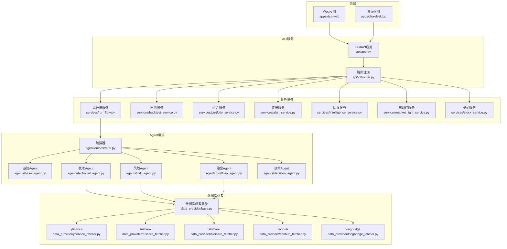
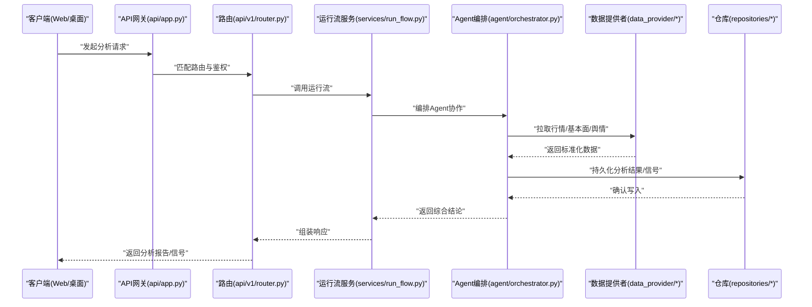
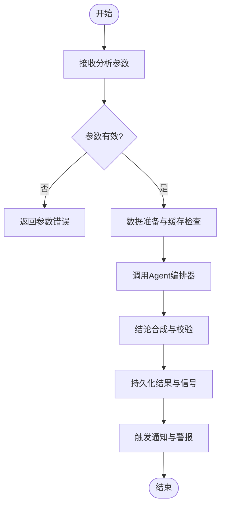
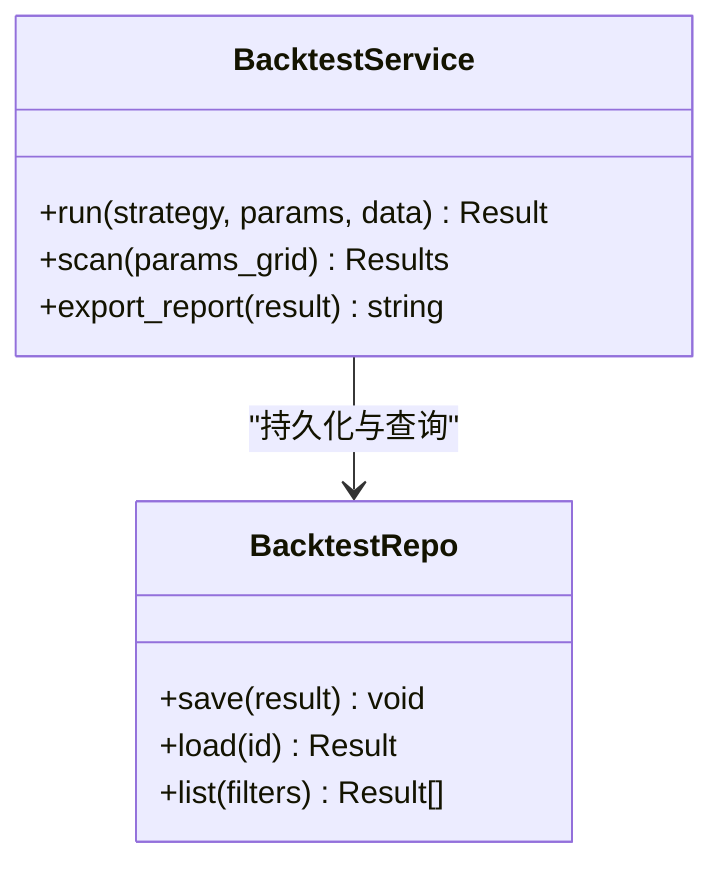
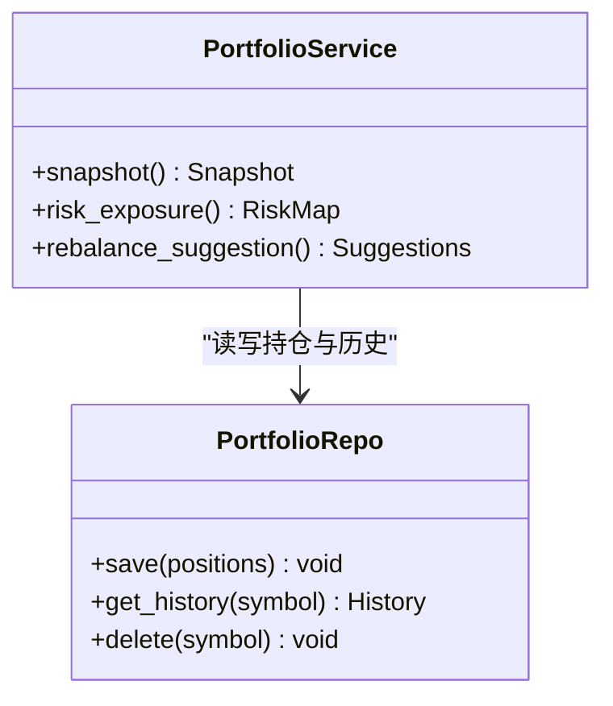
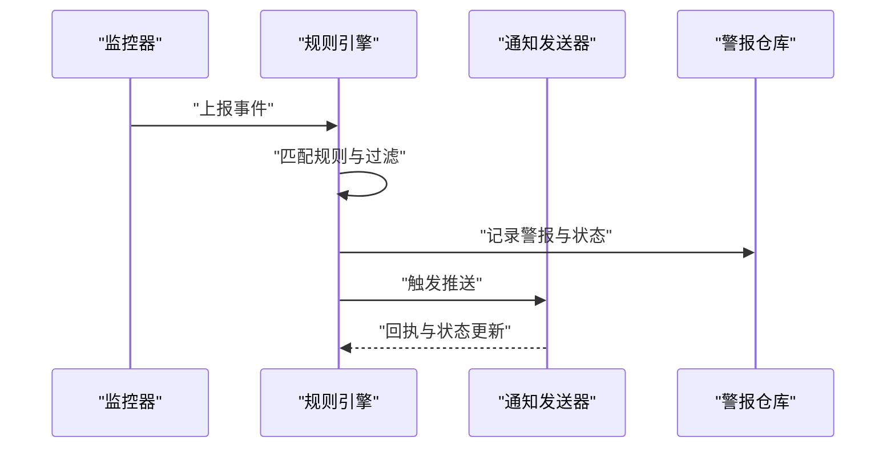
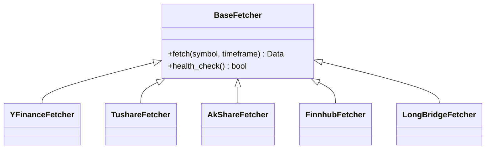
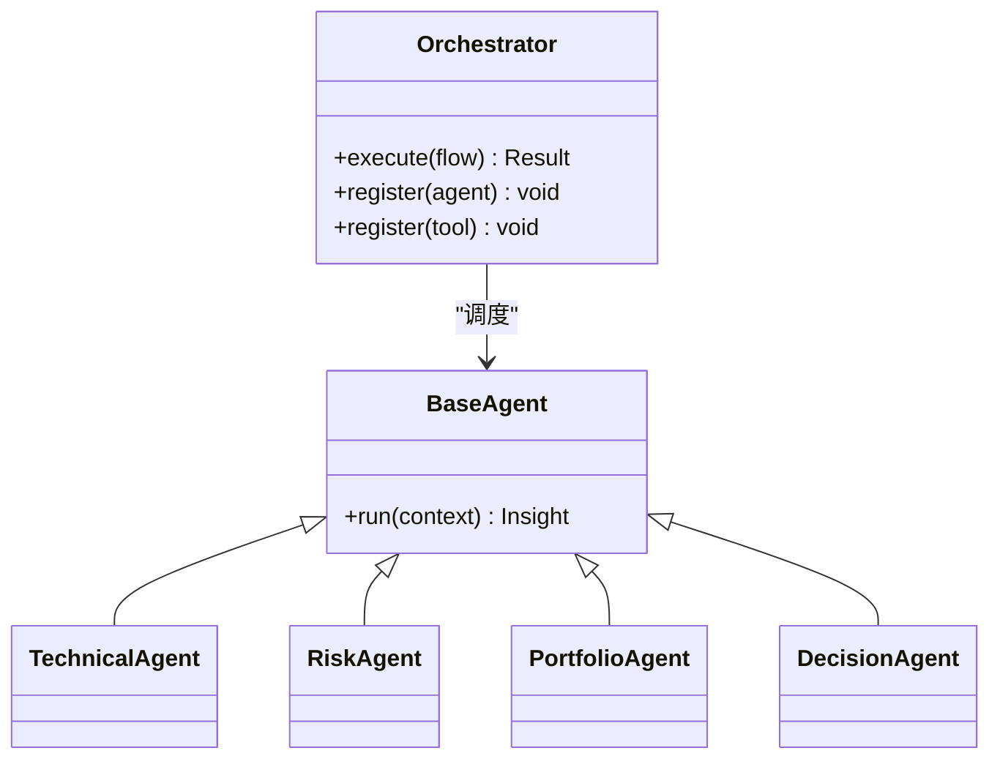
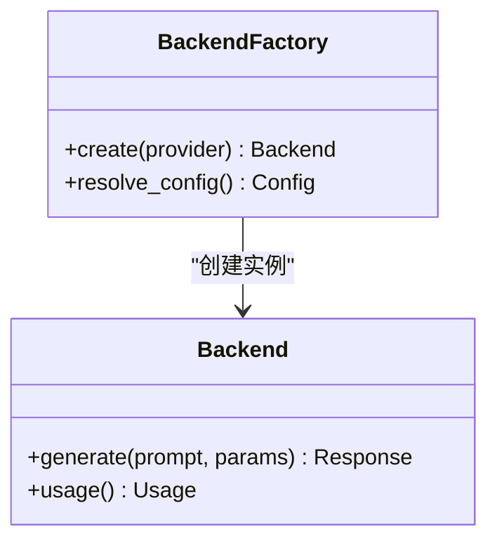
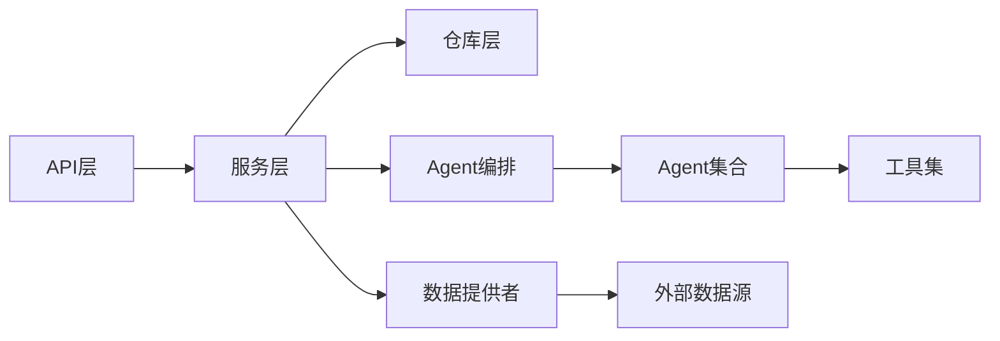

# 项目介绍

<cite>
**本文引用的文件**   
- [README.md](file://daily_stock_analysis/README.md)
- [main.py](file://daily_stock_analysis/main.py)
- [server.py](file://daily_stock_analysis/server.py)
- [webui.py](file://daily_stock_analysis/webui.py)
- [api/app.py](file://daily_stock_analysis/api/app.py)
- [api/v1/router.py](file://daily_stock_analysis/api/v1/router.py)
- [src/config.py](file://daily_stock_analysis/src/config.py)
- [src/scheduler.py](file://daily_stock_analysis/src/scheduler.py)
- [src/services/run_flow.py](file://daily_stock_analysis/src/services/run_flow.py)
- [src/services/alert_service.py](file://daily_stock_analysis/src/services/alert_service.py)
- [src/services/backtest_service.py](file://daily_stock_analysis/src/services/backtest_service.py)
- [src/services/portfolio_service.py](file://daily_stock_analysis/src/services/portfolio_service.py)
- [src/services/intelligence_service.py](file://daily_stock_analysis/src/services/intelligence_service.py)
- [src/services/market_light_service.py](file://daily_stock_analysis/src/services/market_light_service.py)
- [src/services/stock_service.py](file://daily_stock_analysis/src/services/stock_service.py)
- [data_provider/base.py](file://daily_stock_analysis/data_provider/base.py)
- [data_provider/yfinance_fetcher.py](file://daily_stock_analysis/data_provider/yfinance_fetcher.py)
- [data_provider/tushare_fetcher.py](file://daily_stock_analysis/data_provider/tushare_fetcher.py)
- [data_provider/akshare_fetcher.py](file://daily_stock_analysis/data_provider/akshare_fetcher.py)
- [data_provider/finnhub_fetcher.py](file://daily_stock_analysis/data_provider/finnhub_fetcher.py)
- [data_provider/longbridge_fetcher.py](file://daily_stock_analysis/data_provider/longbridge_fetcher.py)
- [src/agent/orchestrator.py](file://daily_stock_analysis/src/agent/orchestrator.py)
- [src/agent/agents/base_agent.py](file://daily_stock_analysis/src/agent/agents/base_agent.py)
- [src/agent/agents/technical_agent.py](file://daily_stock_analysis/src/agent/agents/technical_agent.py)
- [src/agent/agents/risk_agent.py](file://daily_stock_analysis/src/agent/agents/risk_agent.py)
- [src/agent/agents/portfolio_agent.py](file://daily_stock_analysis/src/agent/agents/portfolio_agent.py)
- [src/agent/agents/decision_agent.py](file://aily_stock_analysis/src/agent/agents/decision_agent.py)
- [src/llm/backend_factory.py](file://daily_stock_analysis/src/llm/backend_factory.py)
- [src/repositories/alert_repo.py](file://daily_stock_analysis/src/repositories/alert_repo.py)
- [src/repositories/backtest_repo.py](file://daily_stock_analysis/src/repositories/backtest_repo.py)
- [src/repositories/portfolio_repo.py](file://daily_stock_analysis/src/repositories/portfolio_repo.py)
- [src/repositories/analysis_repo.py](file://daily_stock_analysis/src/repositories/analysis_repo.py)
- [apps/dsa-web/package.json](file://daily_stock_analysis/apps/dsa-web/package.json)
- [apps/dsa-desktop/package.json](file://daily_stock_analysis/apps/dsa-desktop/package.json)
</cite>

## 目录
1. [简介](#简介)
2. [项目结构](#项目结构)
3. [核心组件](#核心组件)
4. [架构总览](#架构总览)
5. [关键组件详解](#关键组件详解)
6. [依赖关系分析](#依赖关系分析)
7. [性能与可扩展性](#性能与可扩展性)
8. [故障排查指南](#故障排查指南)
9. [结论](#结论)
10. [附录](#附录)

## 简介
Daily Stock Analysis 是一个AI驱动的股票智能分析平台，旨在为个人投资者、专业交易员和金融分析师提供一站式市场洞察、策略回测与投资组合优化能力。系统通过多数据源集成、AI代理协作与实时警报机制，解决传统股票分析中信息碎片化、工具割裂、响应滞后与主观偏差等痛点，帮助用户在复杂市场中做出更稳健的决策。

核心价值与使命
- 统一数据与分析：聚合多源行情、基本面与另类数据，形成一致的分析上下文。
- AI协同决策：以多Agent协作模式进行技术面、风险面与组合维度的综合研判。
- 实时预警与执行闭环：从信号发现到通知触达，缩短决策时延。
- 可验证的策略体系：内置回测引擎与评估指标，支持策略迭代与复盘。

目标用户
- 个人投资者：快速理解个股与市场动态，辅助买卖时机判断。
- 专业交易员：获取高频信号、盘口异动与跨市场联动线索。
- 金融分析师：构建研究框架、生成报告与量化验证。

主要应用场景
- 实时市场分析：盘中监控、热点追踪与异常波动预警。
- 投资组合优化：持仓风险评估、集中度分析与再平衡建议。
- 策略回测验证：历史回测、参数扫描与绩效归因。
- 智能研报生成：自动汇总数据与观点，输出结构化报告。

竞争优势与差异化
- 多数据源集成：覆盖A股、港股、美股及指数，兼容多种数据提供商。
- AI代理协作：技术、风险、组合与决策Agent协同推理，提升结论稳健性。
- 实时警报系统：多渠道推送（Webhook、邮件、IM等），事件驱动及时触达。
- 端到端体验：Web桌面双端应用，开箱即用，降低使用门槛。

价值主张
“用AI把分散的数据、工具与经验整合成可执行的洞察，让每一次投资决策都有据可依。”

[本节不直接分析具体文件]

## 项目结构
项目采用前后端分离与模块化设计：
- API服务：基于FastAPI的REST接口，按v1版本化管理，路由清晰。
- 业务层：服务层封装核心能力（运行流、回测、组合、情报、警报等）。
- Agent编排：多Agent协作与工具调用，支撑智能分析流程。
- 数据层：统一数据提供者抽象，适配多家数据源。
- 前端：Web应用与Electron桌面应用，提供可视化交互。
- 调度与配置：定时任务、系统配置与运行时开关。

**图表来源** 
- [api/app.py](file://daily_stock_analysis/api/app.py)
- [api/v1/router.py](file://daily_stock_analysis/api/v1/router.py)
- [src/services/run_flow.py](file://daily_stock_analysis/src/services/run_flow.py)
- [src/services/backtest_service.py](file://daily_stock_analysis/src/services/backtest_service.py)
- [src/services/portfolio_service.py](file://daily_stock_analysis/src/services/portfolio_service.py)
- [src/services/alert_service.py](file://daily_stock_analysis/src/services/alert_service.py)
- [src/services/intelligence_service.py](file://daily_stock_analysis/src/services/intelligence_service.py)
- [src/services/market_light_service.py](file://daily_stock_analysis/src/services/market_light_service.py)
- [src/services/stock_service.py](file://daily_stock_analysis/src/services/stock_service.py)
- [src/agent/orchestrator.py](file://daily_stock_analysis/src/agent/orchestrator.py)
- [src/agent/agents/base_agent.py](file://daily_stock_analysis/src/agent/agents/base_agent.py)
- [src/agent/agents/technical_agent.py](file://daily_stock_analysis/src/agent/agents/technical_agent.py)
- [src/agent/agents/risk_agent.py](file://daily_stock_analysis/src/agent/agents/risk_agent.py)
- [src/agent/agents/portfolio_agent.py](file://daily_stock_analysis/src/agent/agents/portfolio_agent.py)
- [src/agent/agents/decision_agent.py](file://daily_stock_analysis/src/agent/agents/decision_agent.py)
- [data_provider/base.py](file://daily_stock_analysis/data_provider/base.py)
- [data_provider/yfinance_fetcher.py](file://daily_stock_analysis/data_provider/yfinance_fetcher.py)
- [data_provider/tushare_fetcher.py](file://daily_stock_analysis/data_provider/tushare_fetcher.py)
- [data_provider/akshare_fetcher.py](file://daily_stock_analysis/data_provider/akshare_fetcher.py)
- [data_provider/finnhub_fetcher.py](file://daily_stock_analysis/data_provider/finnhub_fetcher.py)
- [data_provider/longbridge_fetcher.py](file://daily_stock_analysis/data_provider/longbridge_fetcher.py)

**章节来源**
- [main.py](file://daily_stock_analysis/main.py)
- [server.py](file://daily_stock_analysis/server.py)
- [webui.py](file://daily_stock_analysis/webui.py)
- [api/app.py](file://daily_stock_analysis/api/app.py)
- [api/v1/router.py](file://daily_stock_analysis/api/v1/router.py)

## 核心组件
- API网关与路由：集中管理HTTP接口，统一鉴权、错误处理与请求校验。
- 运行流服务：编排多步骤分析流程，串联数据获取、Agent推理与结果渲染。
- 回测服务：提供策略回测、绩效统计与可视化指标。
- 组合服务：管理持仓、风险暴露与再平衡建议。
- 警报服务：规则与事件驱动的告警，支持多渠道推送。
- 情报服务：新闻、舆情与另类数据的采集与摘要。
- 市场灯服务：市场状态识别与阶段划分，辅助宏观视角。
- 标的服务：股票代码解析、映射与基础信息查询。
- Agent编排与工具：技术面、风险面、组合面与决策面Agent协作，配合工具集完成数据抓取、计算与报告生成。
- 数据提供者：统一的Fetch接口，屏蔽不同数据源的差异。

**章节来源**
- [src/services/run_flow.py](file://daily_stock_analysis/src/services/run_flow.py)
- [src/services/backtest_service.py](file://daily_stock_analysis/src/services/backtest_service.py)
- [src/services/portfolio_service.py](file://daily_stock_analysis/src/services/portfolio_service.py)
- [src/services/alert_service.py](file://daily_stock_analysis/src/services/alert_service.py)
- [src/services/intelligence_service.py](file://daily_stock_analysis/src/services/intelligence_service.py)
- [src/services/market_light_service.py](file://daily_stock_analysis/src/services/market_light_service.py)
- [src/services/stock_service.py](file://daily_stock_analysis/src/services/stock_service.py)
- [src/agent/orchestrator.py](file://daily_stock_analysis/src/agent/orchestrator.py)
- [data_provider/base.py](file://daily_stock_analysis/data_provider/base.py)

## 架构总览
系统采用分层架构：
- 表现层：Web与桌面应用，负责交互与展示。
- 接口层：FastAPI路由与中间件，统一协议与治理。
- 服务层：业务逻辑封装，面向用例提供服务。
- 编排层：Agent编排与工具调用，实现AI协同。
- 数据层：多数据源适配器与存储仓库。
- 基础设施：调度器、配置管理与日志。

**图表来源** 
- [api/app.py](file://daily_stock_analysis/api/app.py)
- [api/v1/router.py](file://daily_stock_analysis/api/v1/router.py)
- [src/services/run_flow.py](file://daily_stock_analysis/src/services/run_flow.py)
- [src/agent/orchestrator.py](file://daily_stock_analysis/src/agent/orchestrator.py)
- [data_provider/base.py](file://daily_stock_analysis/data_provider/base.py)
- [src/repositories/alert_repo.py](file://daily_stock_analysis/src/repositories/alert_repo.py)
- [src/repositories/backtest_repo.py](file://daily_stock_analysis/src/repositories/backtest_repo.py)
- [src/repositories/portfolio_repo.py](file://daily_stock_analysis/src/repositories/portfolio_repo.py)
- [src/repositories/analysis_repo.py](file://daily_stock_analysis/src/repositories/analysis_repo.py)

## 关键组件详解

### 运行流服务（Run Flow）
- 职责：将数据采集、Agent推理、报告渲染与通知串联为可复用的工作流。
- 特点：支持参数化输入、阶段化执行与失败重试；可与调度器结合实现定时任务。
- 典型流程：输入标的与时间窗口→数据准备→多Agent分析→结论合成→结果持久化→通知触发。

**图表来源** 
- [src/services/run_flow.py](file://daily_stock_analysis/src/services/run_flow.py)
- [src/agent/orchestrator.py](file://daily_stock_analysis/src/agent/orchestrator.py)
- [src/repositories/analysis_repo.py](file://daily_stock_analysis/src/repositories/analysis_repo.py)
- [src/services/alert_service.py](file://daily_stock_analysis/src/services/alert_service.py)

**章节来源**
- [src/services/run_flow.py](file://daily_stock_analysis/src/services/run_flow.py)

### 回测服务（Backtest Service）
- 职责：策略回测、绩效统计、滑点与手续费模拟、结果可视化。
- 特点：支持多策略并行、参数扫描与基准对比；结果可持久化便于复盘。
- 适用场景：策略验证、参数优化与历史复盘。

**图表来源** 
- [src/services/backtest_service.py](file://daily_stock_analysis/src/services/backtest_service.py)
- [src/repositories/backtest_repo.py](file://daily_stock_analysis/src/repositories/backtest_repo.py)

**章节来源**
- [src/services/backtest_service.py](file://daily_stock_analysis/src/services/backtest_service.py)
- [src/repositories/backtest_repo.py](file://daily_stock_analysis/src/repositories/backtest_repo.py)

### 组合服务（Portfolio Service）
- 职责：持仓管理、风险暴露计算、集中度与相关性分析、再平衡建议。
- 特点：支持多资产类别、因子暴露与情景压力测试。
- 适用场景：资产配置、风险控制与合规检查。

**图表来源** 
- [src/services/portfolio_service.py](file://daily_stock_analysis/src/services/portfolio_service.py)
- [src/repositories/portfolio_repo.py](file://daily_stock_analysis/src/repositories/portfolio_repo.py)

**章节来源**
- [src/services/portfolio_service.py](file://daily_stock_analysis/src/services/portfolio_service.py)
- [src/repositories/portfolio_repo.py](file://daily_stock_analysis/src/repositories/portfolio_repo.py)

### 警报服务（Alert Service）
- 职责：规则引擎与事件驱动，支持阈值、形态与跨标的相关性触发。
- 特点：多渠道推送（Webhook、邮件、飞书、钉钉、Discord等），降噪与去重。
- 适用场景：盘中异动、突破信号、组合风险预警。

**图表来源** 
- [src/services/alert_service.py](file://daily_stock_analysis/src/services/alert_service.py)
- [src/repositories/alert_repo.py](file://daily_stock_analysis/src/repositories/alert_repo.py)

**章节来源**
- [src/services/alert_service.py](file://daily_stock_analysis/src/services/alert_service.py)
- [src/repositories/alert_repo.py](file://daily_stock_analysis/src/repositories/alert_repo.py)

### 数据提供者（Data Providers）
- 职责：统一抽象数据获取接口，适配多家数据源（yfinance、tushare、akshare、finnhub、longbridge等）。
- 特点：标准化数据结构、错误降级与缓存策略。
- 适用场景：行情、基本面、资金流向与另类数据接入。

**图表来源** 
- [data_provider/base.py](file://daily_stock_analysis/data_provider/base.py)
- [data_provider/yfinance_fetcher.py](file://daily_stock_analysis/data_provider/yfinance_fetcher.py)
- [data_provider/tushare_fetcher.py](file://daily_stock_analysis/data_provider/tushare_fetcher.py)
- [data_provider/akshare_fetcher.py](file://daily_stock_analysis/data_provider/akshare_fetcher.py)
- [data_provider/finnhub_fetcher.py](file://daily_stock_analysis/data_provider/finnhub_fetcher.py)
- [data_provider/longbridge_fetcher.py](file://daily_stock_analysis/data_provider/longbridge_fetcher.py)

**章节来源**
- [data_provider/base.py](file://daily_stock_analysis/data_provider/base.py)
- [data_provider/yfinance_fetcher.py](file://daily_stock_analysis/data_provider/yfinance_fetcher.py)
- [data_provider/tushare_fetcher.py](file://daily_stock_analysis/data_provider/tushare_fetcher.py)
- [data_provider/akshare_fetcher.py](file://daily_stock_analysis/data_provider/akshare_fetcher.py)
- [data_provider/finnhub_fetcher.py](file://daily_stock_analysis/data_provider/finnhub_fetcher.py)
- [data_provider/longbridge_fetcher.py](file://daily_stock_analysis/data_provider/longbridge_fetcher.py)

### Agent编排与工具（Agent Orchestration & Tools）
- 职责：协调技术、风险、组合与决策Agent，调用工具集完成数据抓取、计算与报告生成。
- 特点：可插拔Agent与工具注册、上下文传递与结果融合。
- 适用场景：智能分析、策略生成与自动化研报。

**图表来源** 
- [src/agent/orchestrator.py](file://daily_stock_analysis/src/agent/orchestrator.py)
- [src/agent/agents/base_agent.py](file://daily_stock_analysis/src/agent/agents/base_agent.py)
- [src/agent/agents/technical_agent.py](file://daily_stock_analysis/src/agent/agents/technical_agent.py)
- [src/agent/agents/risk_agent.py](file://daily_stock_analysis/src/agent/agents/risk_agent.py)
- [src/agent/agents/portfolio_agent.py](file://daily_stock_analysis/src/agent/agents/portfolio_agent.py)
- [src/agent/agents/decision_agent.py](file://daily_stock_analysis/src/agent/agents/decision_agent.py)

**章节来源**
- [src/agent/orchestrator.py](file://daily_stock_analysis/src/agent/orchestrator.py)
- [src/agent/agents/base_agent.py](file://daily_stock_analysis/src/agent/agents/base_agent.py)
- [src/agent/agents/technical_agent.py](file://daily_stock_analysis/src/agent/agents/technical_agent.py)
- [src/agent/agents/risk_agent.py](file://daily_stock_analysis/src/agent/agents/risk_agent.py)
- [src/agent/agents/portfolio_agent.py](file://daily_stock_analysis/src/agent/agents/portfolio_agent.py)
- [src/agent/agents/decision_agent.py](file://daily_stock_analysis/src/agent/agents/decision_agent.py)

### LLM后端工厂（LLM Backend Factory）
- 职责：统一管理大模型后端接入，支持多供应商与路由选择。
- 特点：参数标准化、使用量统计与成本追踪。
- 适用场景：文本生成、摘要与对话式分析。

**图表来源** 
- [src/llm/backend_factory.py](file://daily_stock_analysis/src/llm/backend_factory.py)

**章节来源**
- [src/llm/backend_factory.py](file://daily_stock_analysis/src/llm/backend_factory.py)

## 依赖关系分析
- 模块耦合：服务层依赖仓库与数据提供者；编排层依赖Agent与工具；API层依赖服务层。
- 外部依赖：多家数据提供商与大模型后端，需通过配置与环境变量管理。
- 潜在循环：通过接口抽象与服务拆分避免循环依赖。
- 扩展点：新增数据源或Agent只需实现对应接口并注册。

**图表来源** 
- [api/app.py](file://daily_stock_analysis/api/app.py)
- [api/v1/router.py](file://daily_stock_analysis/api/v1/router.py)
- [src/services/run_flow.py](file://daily_stock_analysis/src/services/run_flow.py)
- [src/agent/orchestrator.py](file://daily_stock_analysis/src/agent/orchestrator.py)
- [data_provider/base.py](file://daily_stock_analysis/data_provider/base.py)

**章节来源**
- [src/config.py](file://daily_stock_analysis/src/config.py)
- [src/scheduler.py](file://daily_stock_analysis/src/scheduler.py)

## 性能与可扩展性
- 并发与异步：API与服务层采用异步处理，提高吞吐与响应速度。
- 缓存策略：数据层引入缓存与预取，减少重复请求与延迟。
- 弹性降级：数据源与健康检查失败时自动切换或回退。
- 水平扩展：无状态服务设计，便于容器化与横向扩容。
- 资源控制：限流、超时与重试策略保障稳定性。

[本节提供通用指导，不直接分析具体文件]

## 故障排查指南
- 启动问题：检查环境变量与配置文件，确认端口占用与依赖服务可用。
- 数据源异常：查看健康检查与日志，启用备用数据源与重试。
- 警报未触发：核对规则配置、事件格式与推送渠道凭证。
- 回测结果异常：检查数据质量、参数范围与基准设置。
- 前端加载失败：确认静态资源路径与构建产物一致性。

**章节来源**
- [src/services/alert_service.py](file://daily_stock_analysis/src/services/alert_service.py)
- [data_provider/base.py](file://daily_stock_analysis/data_provider/base.py)
- [src/services/backtest_service.py](file://daily_stock_analysis/src/services/backtest_service.py)
- [apps/dsa-web/package.json](file://daily_stock_analysis/apps/dsa-web/package.json)
- [apps/dsa-desktop/package.json](file://daily_stock_analysis/apps/dsa-desktop/package.json)

## 结论
Daily Stock Analysis以AI为核心，打通数据、分析与执行的全链路，帮助投资者在复杂市场中获得更快、更准、更可验证的决策支持。其多数据源集成、Agent协作与实时警报构成显著差异化优势，适用于从个人到专业的广泛用户群体。通过持续迭代与生态扩展，平台将持续提升分析深度与实战价值。

[本节总结性内容，不直接分析具体文件]

## 附录
- 安装与部署：参考文档中的部署指南与Docker说明。
- 配置示例：LLM提供商、数据源与通知渠道的环境变量配置。
- 使用手册：Web与桌面应用的入门指南与常用操作。
- 贡献指南：开发规范、测试与发布流程。

[本节为概览性内容，不直接分析具体文件]