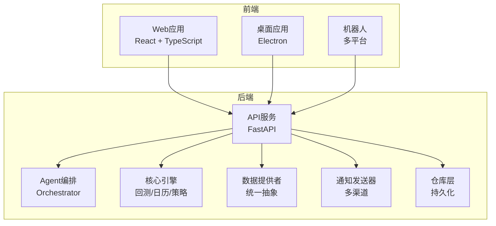
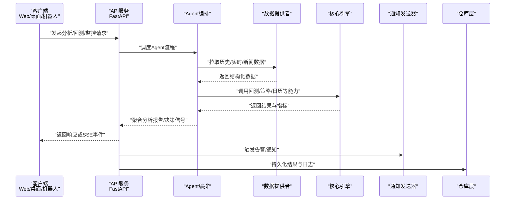
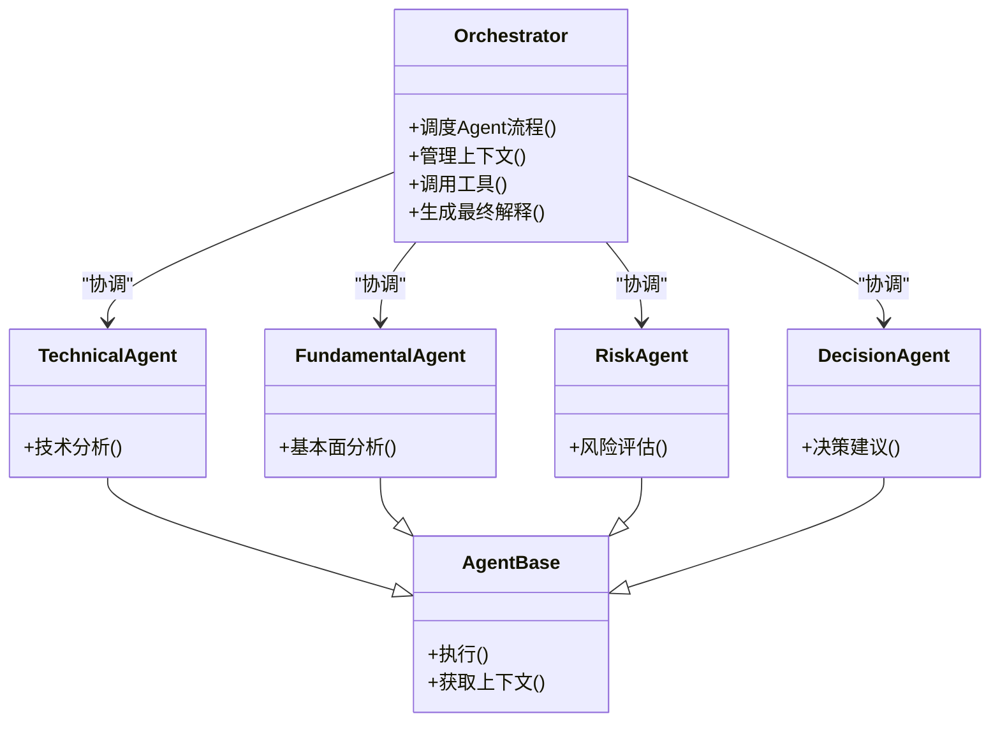
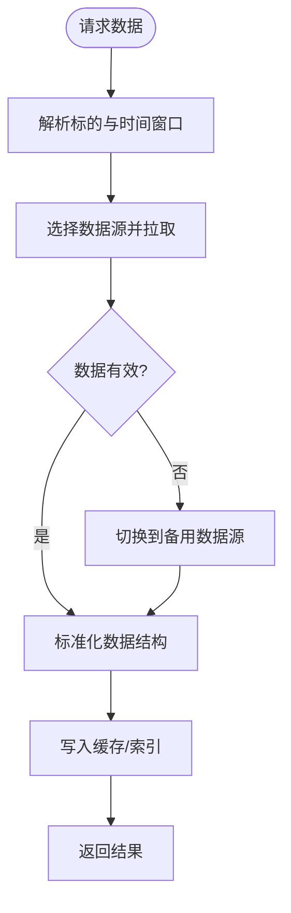
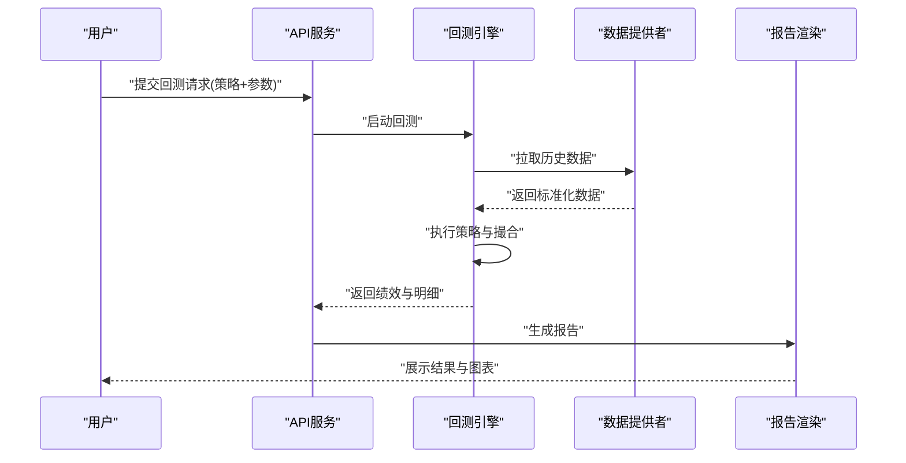
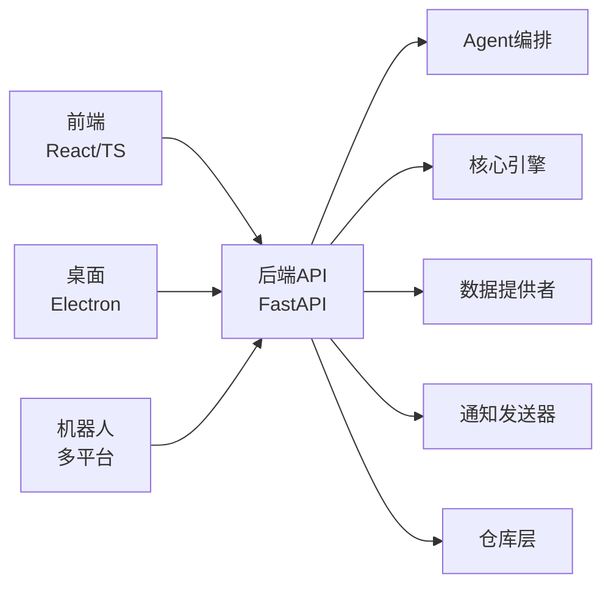

# 项目概述

<cite>
**本文档引用的文件**   
- [main.py](file://main.py)
- [server.py](file://server.py)
- [webui.py](file://webui.py)
- [pyproject.toml](file://pyproject.toml)
- [requirements.txt](file://requirements.txt)
- [api/app.py](file://api/app.py)
- [api/v1/router.py](file://api/v1/router.py)
- [src/agent/orchestrator.py](file://src/agent/orchestrator.py)
- [src/core/backtest_engine.py](file://src/core/backtest_engine.py)
- [data_provider/base.py](file://data_provider/base.py)
- [apps/dsa-web/package.json](file://apps/dsa-web/package.json)
- [apps/dsa-desktop/main.js](file://apps/dsa-desktop/main.js)
- [bot/dispatcher.py](file://bot/dispatcher.py)
- [docker/docker-compose.yml](file://docker/docker-compose.yml)
- [README.md](file://README.md)
</cite>

## 目录
1. [简介](#简介)
2. [项目结构](#项目结构)
3. [核心组件](#核心组件)
4. [架构总览](#架构总览)
5. [详细组件分析](#详细组件分析)
6. [依赖关系分析](#依赖关系分析)
7. [性能考量](#性能考量)
8. [故障排查指南](#故障排查指南)
9. [结论](#结论)
10. [附录：快速开始](#附录快速开始)

## 简介
Daily Stock Analysis 是一个AI驱动的股票智能分析系统，面向个人投资者、量化研究者和交易团队，提供从数据获取、智能分析、策略回测到投资组合管理与实时监控的一体化解决方案。系统通过多数据源集成与LLM能力，结合可插拔的Agent与工具链，实现“数据—分析—决策—执行”的闭环，帮助用户在复杂市场中做出更稳健的投资决策。

核心价值
- 智能分析引擎：基于多Agent协作与技能编排，自动完成市场结构识别、技术面/基本面分析、情绪与新闻情报整合，并输出可解释的分析报告与决策信号。
- 多数据源集成：统一抽象层对接A股、港股、美股及指数等多市场数据，支持历史行情、财务指标、资金流向与实时报价等。
- 实时监控系统：支持盘中/盘后事件触发、告警推送与多渠道通知（邮件、企业微信、飞书、Discord、Telegram等）。
- 投资组合管理：持仓快照、风险度量、组合级告警与导入导出，支持多券商/账户接入扩展。
- 策略回测：内置回测引擎与策略配置，支持多因子、技术指标与事件驱动策略的快速验证与评估。

目标用户与应用场景
- 个人投资者：日常选股、复盘、跟踪持仓与设置条件提醒。
- 量化研究者：策略原型开发、因子挖掘、回测与绩效归因。
- 交易团队：协同工作流、标准化报告、自动化监控与风控。

竞争优势
- 端到端一体化：从数据到决策的全链路打通，减少工具切换与数据孤岛。
- AI增强：LLM驱动的上下文构建、自然语言交互与可解释性输出。
- 可扩展生态：插件化的数据源、Agent技能、通知渠道与Broker接口。
- 跨平台交付：Web应用、桌面客户端与多平台机器人，覆盖多终端使用场景。

## 项目结构
项目采用前后端分离与多端适配的模块化设计：
- 后端API与服务：FastAPI应用、路由与中间件、领域服务、Agent编排、数据提供者、通知发送器、存储仓库等。
- 前端Web应用：React+TypeScript，Vite构建，Tailwind样式，功能模块按页面与组件划分。
- 桌面应用：Electron主进程与渲染进程，打包与更新脚本。
- 机器人：多平台消息分发与命令处理。
- 数据层：统一的数据提供者抽象与具体实现，缓存与索引生成脚本。
- 部署：Docker镜像与编排文件，CI/CD脚本与文档。

图表来源
- [api/app.py](file://api/app.py)
- [apps/dsa-web/package.json](file://apps/dsa-web/package.json)
- [apps/dsa-desktop/main.js](file://apps/dsa-desktop/main.js)
- [bot/dispatcher.py](file://bot/dispatcher.py)

章节来源
- [README.md](file://README.md)
- [pyproject.toml](file://pyproject.toml)
- [requirements.txt](file://requirements.txt)

## 核心组件
- 智能分析引擎（Agent编排）：协调多个专业Agent（技术面、基本面、风险、投资决策等），通过技能编排与工具调用，生成结构化分析与决策信号。
- 多数据源集成：统一数据抽象层，屏蔽不同数据源的差异，提供一致的历史、财务、实时与新闻接口。
- 实时监控系统：定时任务与事件驱动结合，支持阈值告警、市场异动检测与多渠道推送。
- 投资组合管理：组合快照、风险指标计算、告警规则与导入导出。
- 策略回测：回测引擎与策略配置，支持参数扫描、绩效统计与可视化。

章节来源
- [src/agent/orchestrator.py](file://src/agent/orchestrator.py)
- [data_provider/base.py](file://data_provider/base.py)
- [src/core/backtest_engine.py](file://src/core/backtest_engine.py)

## 架构总览
系统采用分层架构与微服务化思想，API网关作为统一入口，内部通过服务与Agent协作完成业务逻辑。数据层通过统一抽象访问多源数据，通知层负责多渠道推送，存储层提供持久化能力。

图表来源
- [api/app.py](file://api/app.py)
- [api/v1/router.py](file://api/v1/router.py)
- [src/agent/orchestrator.py](file://src/agent/orchestrator.py)
- [data_provider/base.py](file://data_provider/base.py)
- [src/core/backtest_engine.py](file://src/core/backtest_engine.py)

## 详细组件分析

### 智能分析引擎（Agent编排）
- 职责：编排多个专业Agent，管理上下文、工具调用与最终解释生成。
- 关键特性：
  - 多Agent协作：技术面、基本面、风险、投资决策等角色分工明确。
  - 技能编排：通过技能注册器与调度器，动态加载与执行技能。
  - 工具表面：为Agent暴露数据分析、搜索、执行等工具接口。
  - 上下文管理：会话状态、运行时事实与记忆机制。
- 优化点：并发控制、缓存热点数据、失败重试与降级策略。

图表来源
- [src/agent/orchestrator.py](file://src/agent/orchestrator.py)

章节来源
- [src/agent/orchestrator.py](file://src/agent/orchestrator.py)

### 多数据源集成
- 职责：统一抽象不同数据源，提供一致的接口用于历史行情、财务指标、实时报价与新闻。
- 关键特性：
  - 抽象基类：定义统一的获取、转换与错误处理接口。
  - 适配器：针对各数据源的具体实现与适配。
  - 容错与降级：多源冗余与超时重试。
- 优化点：批量拉取、增量更新、本地缓存与索引加速。

图表来源
- [data_provider/base.py](file://data_provider/base.py)

章节来源
- [data_provider/base.py](file://data_provider/base.py)

### 实时监控系统
- 职责：定时任务与事件驱动相结合，监测市场异动、组合风险与策略信号，触发告警与通知。
- 关键特性：
  - 任务队列：异步任务调度与优先级管理。
  - 告警规则：阈值、形态与复合条件。
  - 多渠道通知：邮件、企业微信、飞书、Discord、Telegram等。
- 优化点：去重与降噪、批量推送与限流。

章节来源
- [api/v1/endpoints/alerts.py](file://api/v1/endpoints/alerts.py)
- [src/services/alert_service.py](file://src/services/alert_service.py)
- [src/notification_sender/__init__.py](file://src/notification_sender/__init__.py)

### 投资组合管理
- 职责：维护组合快照、风险指标、告警规则与导入导出。
- 关键特性：
  - 快照与历史：组合持仓与净值变化记录。
  - 风险度量：波动率、回撤、集中度等指标。
  - 导入导出：CSV/JSON格式支持与校验。
- 优化点：增量更新、并行计算与缓存命中。

章节来源
- [api/v1/endpoints/portfolio.py](file://api/v1/endpoints/portfolio.py)
- [src/services/portfolio_service.py](file://src/services/portfolio_service.py)

### 策略回测
- 职责：提供回测引擎与策略配置，支持参数扫描、绩效统计与可视化。
- 关键特性：
  - 引擎核心：事件驱动与撮合模拟。
  - 策略配置：YAML/代码混合定义，便于扩展。
  - 结果分析：收益曲线、夏普比率、最大回撤等。
- 优化点：向量化计算、内存管理与并行回测。

图表来源
- [src/core/backtest_engine.py](file://src/core/backtest_engine.py)
- [api/v1/endpoints/backtest.py](file://api/v1/endpoints/backtest.py)

章节来源
- [src/core/backtest_engine.py](file://src/core/backtest_engine.py)
- [api/v1/endpoints/backtest.py](file://api/v1/endpoints/backtest.py)

### Web前端（React + TypeScript）
- 职责：提供交互式界面，涵盖仪表盘、分析、历史、报告、运行流程、决策信号等功能模块。
- 关键特性：
  - 组件化：按功能域组织组件与页面。
  - API封装：统一的HTTP客户端与错误处理。
  - 国际化与主题：多语言与深色模式支持。
- 优化点：懒加载、虚拟列表与缓存策略。

章节来源
- [apps/dsa-web/package.json](file://apps/dsa-web/package.json)
- [apps/dsa-web/src/api/index.ts](file://apps/dsa-web/src/api/index.ts)

### 桌面应用（Electron）
- 职责：提供本地桌面客户端，集成Web UI与本地能力（文件系统、系统通知等）。
- 关键特性：
  - 主进程：应用生命周期管理与安全隔离。
  - 预加载脚本：桥接主进程与渲染进程。
  - 打包与更新：跨平台构建与自动更新。
- 优化点：资源压缩、按需加载与崩溃上报。

章节来源
- [apps/dsa-desktop/main.js](file://apps/dsa-desktop/main.js)
- [apps/dsa-desktop/preload.js](file://apps/dsa-desktop/preload.js)

### 机器人（多平台）
- 职责：在钉钉、飞书、Discord等平台提供命令式交互，支持分析、查询、历史与策略管理等。
- 关键特性：
  - 分发器：统一命令解析与路由。
  - 平台适配：各平台SDK与流式处理。
  - 权限与安全：鉴权与审计。
- 优化点：消息去重、速率限制与离线队列。

章节来源
- [bot/dispatcher.py](file://bot/dispatcher.py)
- [bot/platforms/base.py](file://bot/platforms/base.py)

## 依赖关系分析
- 后端依赖：FastAPI、Pydantic、SQLAlchemy（可选）、Celery/AsyncIO（任务队列）、LLM适配器等。
- 前端依赖：React、TypeScript、Vite、Tailwind、ECharts/Ant Design等。
- 桌面依赖：Electron、Node.js、打包工具。
- 数据依赖：yfinance、Tushare、AkShare、BaoStock、Finnhub、Longbridge等。
- 部署依赖：Docker、Compose、CI/CD流水线。

图表来源
- [api/app.py](file://api/app.py)
- [api/v1/router.py](file://api/v1/router.py)
- [src/agent/orchestrator.py](file://src/agent/orchestrator.py)
- [data_provider/base.py](file://data_provider/base.py)

章节来源
- [pyproject.toml](file://pyproject.toml)
- [requirements.txt](file://requirements.txt)

## 性能考量
- 数据层：批量拉取、增量更新、本地缓存与索引；对高频数据采用流式处理与分页。
- 计算层：向量化计算、并行回测、任务队列与异步I/O；热点结果缓存与失效策略。
- 网络层：连接池、超时与重试、熔断与降级；多数据源冗余与负载均衡。
- 前端层：懒加载、虚拟滚动、图片与资源压缩；WebSocket/SSE实时推送。
- 存储层：读写分离、分库分表、冷热数据分离与归档。

[本节为通用指导，不直接分析具体文件]

## 故障排查指南
- 常见问题定位：
  - 数据源异常：检查网络连通、认证令牌与配额限制；启用备用数据源与重试。
  - LLM调用失败：核对模型配置、密钥与速率限制；启用降级与缓存。
  - 任务堆积：查看队列长度与消费者健康；扩容与限流。
  - 前端报错：检查API路径、CORS与鉴权；查看控制台与网络面板。
- 诊断工具：
  - 健康检查接口与日志采集；分布式追踪与指标收集。
  - 单元测试与集成测试用例；端到端测试与冒烟测试。
- 恢复策略：
  - 快速回滚与灰度发布；熔断与隔离；备份与恢复演练。

章节来源
- [api/v1/endpoints/health.py](file://api/v1/endpoints/health.py)
- [src/services/run_diagnostics.py](file://src/services/run_diagnostics.py)

## 结论
Daily Stock Analysis以AI为核心，构建了从数据到决策的完整闭环，具备强大的可扩展性与跨平台能力。通过统一的数据抽象、灵活的Agent编排与丰富的通知渠道，系统能够满足从个人到团队的多层次需求。建议在生产环境中强化监控与治理，持续优化性能与稳定性，逐步扩展更多数据源与策略类型。

[本节为总结性内容，不直接分析具体文件]

## 附录：快速开始
- 环境准备
  - Python 3.10+，Node.js 18+，Docker（可选）
  - 安装依赖：后端requirements与前端package.json
- 启动后端
  - 配置环境变量（数据源、LLM、通知等）
  - 运行API服务与后台任务
- 启动前端
  - 安装依赖并构建静态资源
  - 本地开发服务器与代理配置
- 桌面应用
  - 安装Electron依赖并打包
  - 运行桌面客户端
- 机器人
  - 配置平台Token与命令路由
  - 启动分发器与平台适配器
- 验证
  - 健康检查与基础API调用
  - 示例分析、回测与告警测试

章节来源
- [README.md](file://README.md)
- [docker/docker-compose.yml](file://docker/docker-compose.yml)
- [main.py](file://main.py)
- [server.py](file://server.py)
- [webui.py](file://webui.py)